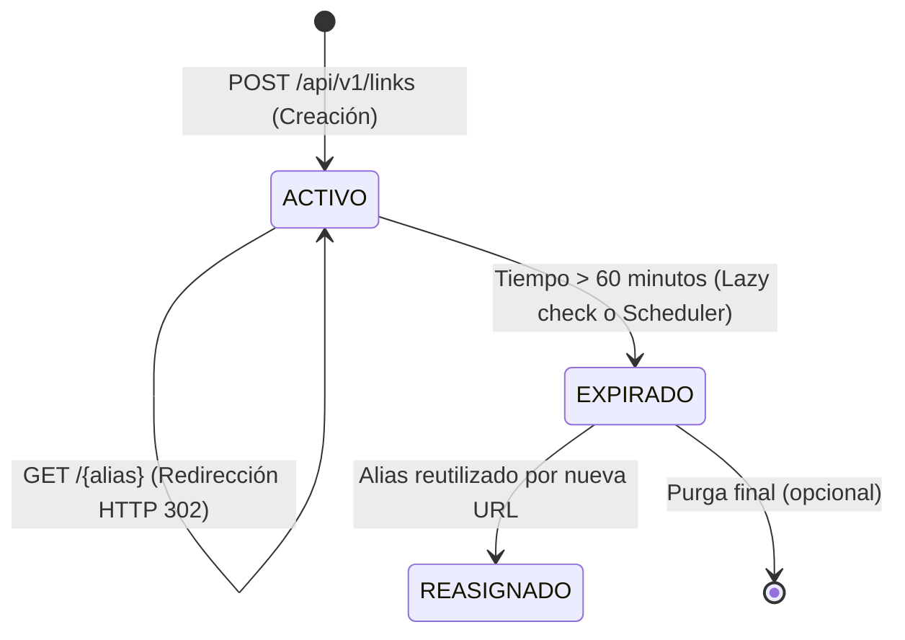
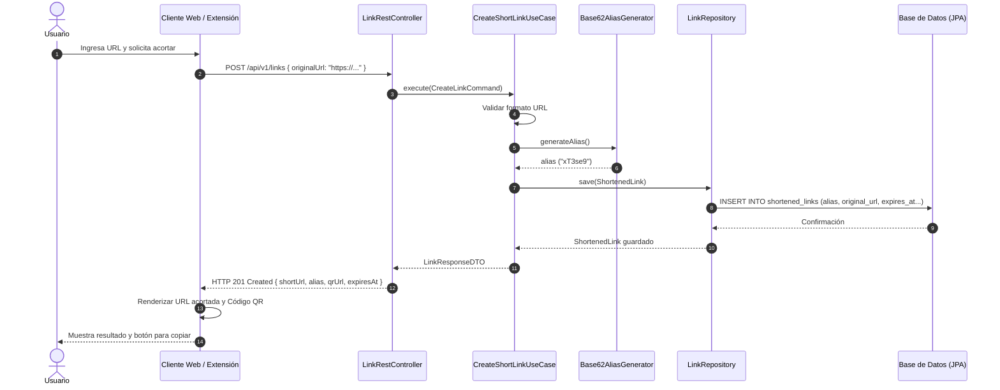
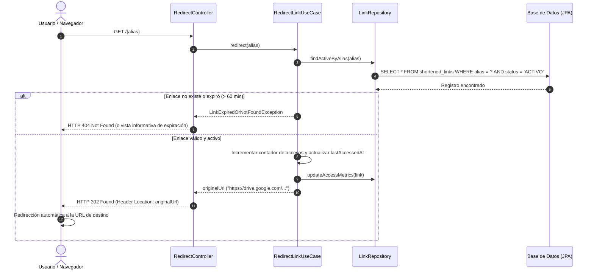
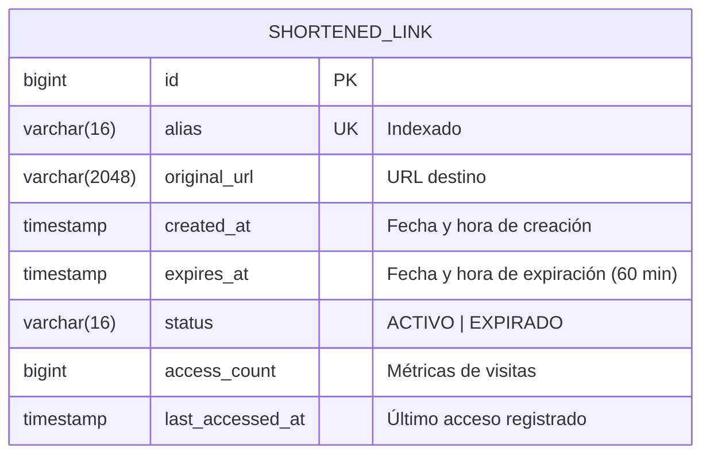

# Documento Maestro: Análisis, Elucidación y Especificación Técnica (Etapa 1)

**Proyecto:** Servicio de Acortamiento y Gestión de Enlaces (*Link Shortener*)  
**Cátedra:** Paradigmas de Programación VI – 5to Año – Ingeniería en Informática  
**Autor / Propuesta:** Martín Crespo  
**Rama de Trabajo:** `dev/martin`  
**Destino:** Base de análisis para consolidar con Sofía (`dev/sofia`) y Agustín (`dev/agustin`)  

---

## 📑 Tabla de Contenidos
1. [Resumen Ejecutivo y Objetivos](#1-resumen-ejecutivo-y-objetivos)
2. [Fase 1: Elucidación y Descubrimiento (Cuestionario al Cliente / Docente)](#2-fase-1-elucidación-y-descubrimiento-cuestionario-al-cliente--docente)
3. [Supuestos Iniciales y Decisiones de Diseño por Defecto](#3-supuestos-iniciales-y-decisiones-de-diseño-por-defecto)
4. [Diseño y Especificación Arquitectónica](#4-diseño-y-especificación-arquitectónica)
   - 4.1. [Patrón de Arquitectura en Capas / Puertos y Adaptadores](#41-patrón-de-arquitectura-en-capas--puertos-y-adaptadores)
   - 4.2. [Modelo de Dominio y Ciclo de Vida del Enlace](#42-modelo-de-dominio-y-ciclo-de-vida-del-enlace)
   - 4.3. [Diagramas de Arquitectura y Secuencia (Mermaid)](#43-diagramas-de-arquitectura-y-secuencia-mermaid)
5. [Contrato de la API REST (Especificación OpenAPI / Swagger)](#5-contrato-de-la-api-rest-especificación-openapi--swagger)
6. [Diseño de Clientes: Web y Extensión de Navegador](#6-diseño-de-clientes-web-y-extensión-de-navegador)
   - 6.1. [Cliente Web](#61-cliente-web)
   - 6.2. [Complemento Chrome & Firefox (Manifest V3)](#62-complemento-chrome--firefox-manifest-v3)
   - 6.3. [Estrategia de Generación de Código QR](#63-estrategia-de-generación-de-código-qr)
7. [Blindaje ante la "Regla del Cliente Incierto" (Preparación para Etapas 2 y 3)](#7-blindaje-ante-la-regla-del-cliente-incierto-preparación-para-etapas-2-y-3)
8. [Estrategia de Persistencia y Base de Datos (JPA / Hibernate)](#8-estrategia-de-persistencia-y-base-de-datos-jpa--hibernate)
9. [Plan de Verificación, Pruebas y Aseguramiento de Calidad (QA)](#9-plan-de-verificación-pruebas-y-aseguramiento-de-calidad-qa)
10. [Planilla de Trazabilidad y Asignación de Roles del Grupo](#10-planilla-de-trazabilidad-y-asignación-de-roles-del-grupo)

---

## 1. Resumen Ejecutivo y Objetivos

El objetivo de la **Etapa 1** es desarrollar un sistema de acortamiento de enlaces (*Link Shortener*) de calidad profesional que resuelva la compartición de URLs largas (ej. enlaces complejos de Google Drive, documentos en la nube) con las siguientes características:
- Generar un alias único, breve y memorizable (`http://{dominio_o_ip}/{alias}`).
- Soportar dos canales de generación: Interfaz Web simple y Extensión/Complemento para Google Chrome y Mozilla Firefox que actúe con un solo clic.
- Generar y renderizar código QR tanto en la web como en la extensión.
- Redireccionar transparentemente a la URL original.
- Expiración estricta de **60 minutos (TTL)** tras los cuales el enlace deja de redireccionar y el alias queda libre para reutilización.
- Persistencia relacional mediante **JPA / Hibernate** y Backend REST con **Java y Spring Boot**.

---

## 2. Fase 1: Elucidación y Descubrimiento (Cuestionario al Cliente / Docente)

Este cuestionario reúne las ambigüedades, zonas grises y detalles no especificados en la consigna original. Su objetivo es presentarlo al Cliente (o resolverlo como equipo) para definir el comportamiento exacto antes de codificar.

### 🕒 Bloque 1: Ciclo de Vida y Expiración (60 Minutos)
1. **Comportamiento HTTP ante enlace caducado:**  
   Cuando un usuario intenta acceder a un enlace que superó los 60 minutos:
   - *Opción A:* ¿Debe retornar un error HTTP `404 Not Found` estándar?
   - *Opción B:* ¿Debe retornar un código HTTP `410 Gone` indicando explícitamente que el recurso existió pero expiró?
   - *Opción C:* ¿Debe renderizar una vista web amigable informando: *"Este enlace acortado ha vencido tras 60 minutos de vigencia"*?
2. **Mecanismo técnico de expiración:**  
   - ¿Se debe evaluar la expiración en tiempo real cuando llega la petición de redirección (*lazy evaluation*: `now > expiresAt`)?
   - ¿O se requiere además una tarea programada en segundo plano (`@Scheduled` cada $N$ minutos) para marcar o limpiar enlaces viejos?
3. **Reasignación y reciclaje del alias:**  
   La consigna señala que el alias *"quedará disponible y podrá ser reasignado"*:
   - ¿El alias vuelve inmediatamente a una cola/pool de aliases reutilizables?
   - ¿O se prefiere un generador aleatorio/incremental donde simplemente la restricción de unicidad solo aplique a los enlaces que estén en estado `ACTIVO`?
4. **Persistencia histórica vs. Eliminación física:**  
   Al vencer los 60 minutos:
   - ¿El registro se borra físicamente de la tabla (`DELETE FROM links WHERE...`)?
   - ¿O se aplica **Soft Delete** (cambio de estado a `EXPIRADO`) para permitir futuras métricas de auditoría?

### 🔀 Bloque 2: Reglas de Negocio y Generación de URLs
5. **Comportamiento ante URL original duplicada:**  
   Si dos usuarios ingresan exactamente la misma URL destino mientras hay un enlace vigente:
   - *Alternativa 1:* ¿Se genera un alias nuevo independiente para cada uno (ambos con su propio contador de 60 minutos)?
   - *Alternativa 2:* ¿Se retorna el alias ya existente, manteniendo su tiempo restante o reiniciando los 60 minutos?
6. **Formato y restricciones del Alias:**  
   - La consigna ejemplifica formatos como `xT3se` (alfanumérico Base62 de 5 caracteres) y `15321` (numérico de 5 dígitos). ¿El sistema debe generar siempre un formato fijo (ej. 6 caracteres Base62 `[a-zA-Z0-9]`), o se permite al usuario ingresar un alias personalizado (*custom slug*) si está disponible?
7. **Validación de la URL destino:**  
   - ¿Se aceptan únicamente esquemas `http://` y `https://`?
   - ¿Se deben bloquear accesos a URLs privadas o locales (`localhost`, `127.0.0.1`, `192.168.x.x`) para evitar ataques de tipo SSRF (*Server-Side Request Forgery*)?
   - ¿Existe un límite máximo de longitud para la URL original (ej. 2048 caracteres)?

### 🚀 Bloque 3: Redirección y Protocolo HTTP
8. **Código de estado de la redirección:**  
   - ¿Se debe utilizar `HTTP 302 Found` (redirección temporal estándar) o `HTTP 307 Temporary Redirect` (preserva el método HTTP)?  
   *(Nota técnica crucial: **No** se debe usar `HTTP 301 Moved Permanently` porque los navegadores lo guardan permanentemente en caché local y no volverían a consultar al servidor, rompiendo la regla de expiración de 60 minutos).*

### 📱 Bloque 4: Clientes (Web y Extensión) y Código QR
9. **Complemento de Navegador (Chrome y Firefox):**  
   - ¿Se desarrollará como extensión WebExtension basada en **Manifest V3** compatible con ambos navegadores?
   - Al indicar *"con solo tocarlo genere y muestre la dirección acortada"*, ¿la extensión debe leer automáticamente la URL de la pestaña activa (`activeTab`) mediante la API de extensiones para no requerir que el usuario pegue nada?
10. **Generación del Código QR:**  
    - ¿El QR debe ser generado por el **Backend** mediante una biblioteca Java (ej. ZXing) y expuesto como un endpoint `/api/links/{alias}/qr` devolviendo un PNG/SVG?
    - ¿O debe generarse en el **Frontend / Extensión** en el lado del cliente mediante una biblioteca JavaScript ligera (`qrcode.js`)?

### 💾 Bloque 5: Infraestructura y Persistencia
11. **Motor de Base de Datos para evaluación:**  
    - La consigna indica motor relacional con JPA/Hibernate. ¿El cliente/docente prefiere una base de datos embebida en memoria/archivo (**HSQLDB** o **H2**, que arranca automáticamente con Spring Boot sin requerir instalar nada extra), o un contenedor Docker con **PostgreSQL / MySQL**?

---

## 3. Supuestos Iniciales y Decisiones de Diseño por Defecto

Mientras el Cliente responde al cuestionario, para no bloquear el avance del grupo se establecen los siguientes **supuestos técnicos de diseño**:

1. **Estrategia de Expiración Híbrida:**  
   - Cada enlace tendrá un timestamp `created_at` y `expires_at = created_at + 60 minutes`.
   - **Lazy check:** Al recibir una solicitud de redirección, se evalúa si `LocalDateTime.now().isAfter(expires_at)`. Si expiró, se deniega la redirección.
   - **Background cleaner:** Un `@Scheduled` ejecutado cada 5 minutos marcará los enlaces expirados y liberará el alias.
2. **Ciclo de vida con Soft Delete y Reasignación:**  
   - Los registros no se borran físicamente. Pasan a estado `EXPIRADO`.
   - La restricción de unicidad (*unique constraint*) se aplica únicamente a aliases en estado `ACTIVO`. Esto permite conservar estadísticas históricas y al mismo tiempo cumplir con la reasignación solicitada.
3. **Formato del Alias:**  
   - Generación automática en **Base62** con longitud de **6 caracteres** (ej. `aB9x2K`), proporcionando más de $62^6 \approx 56.800$ millones de combinaciones únicas, eliminando virtualmente el riesgo de colisiones.
4. **Redirección HTTP 302 Found:**  
   - Se utiliza `302 Found` con encabezado `Location` para obligar al navegador y clientes HTTP a consultar al backend en cada petición.
5. **Generación Dual de Código QR:**  
   - **Endpoint Backend:** `GET /api/v1/links/{alias}/qr` (usando ZXing) para consumo universal o descarga.
   - **Renderizado Frontend:** Generación instantánea en la Web y en la Extensión vía JS para máxima respuesta visual sin sobrecargar el servidor.
6. **Motor Relacional Embebido con Soporte Pluggable:**  
   - Configuración inicial con **HSQLDB** (o **H2** en modo archivo persistente), pero desacoplada mediante Spring Data JPA para poder cambiar a PostgreSQL/MySQL mediante un simple perfil de `application.properties`.

---

## 4. Diseño y Especificación Arquitectónica

### 4.1. Patrón de Arquitectura en Capas / Puertos y Adaptadores

Para cumplir con el requerimiento de alta tolerancia al cambio y prepararse para las Etapas 2 y 3, el backend se estructurará siguiendo los principios de arquitectura limpia:

```
src/main/java/ar/edu/undef/fie/pp6/
│
├── domain/                    # Capa de Dominio (Pura, sin dependencias de frameworks)
│   ├── model/                 # Entidades y Objetos de Valor (ShortenedLink, Alias, UrlTarget)
│   ├── repository/            # Interfaces de persistencia (LinkRepositoryPort)
│   └── service/               # Lógica del dominio (LinkExpirationPolicy, AliasGeneratorStrategy)
│
├── application/               # Capa de Aplicación (Casos de Uso)
│   ├── usecase/               # CreateShortLinkUseCase, RedirectLinkUseCase, GetLinkInfoUseCase
│   └── dto/                   # Request/Response DTOs
│
├── infrastructure/            # Capa de Infraestructura (Adaptadores externos)
│   ├── persistence/           # Entidades JPA, Spring Data Repositories, Mappers
│   ├── rest/                  # RestControllers, GlobalExceptionHandler, Swagger Docs
│   ├── qr/                    # ZXing QR Code Adapter
│   └── scheduler/             # Scheduled tasks para limpieza de links expirados
│
└── config/                    # Configuración de Spring, CORS, OpenAPI, Bean definitions
```

---

### 4.2. Modelo de Dominio y Ciclo de Vida del Enlace

#### Entidad de Dominio: `ShortenedLink`
- `id`: Long (Autoincremental)
- `alias`: String (Longitud 6, único mientras esté ACTIVO)
- `originalUrl`: String (URL destino validada)
- `createdAt`: LocalDateTime
- `expiresAt`: LocalDateTime (`createdAt + 60 minutos`)
- `status`: Enum (`ACTIVO`, `EXPIRADO`, `REASIGNADO`)
- `accessCount`: Long (Contador de clics, preparando Etapa 2)
- `lastAccessedAt`: LocalDateTime (Timestamp del último clic)



---

### 4.3. Diagramas de Arquitectura y Secuencia (Mermaid)

#### Diagrama de Secuencia 1: Acortamiento de Enlace (Web / Extensión)


#### Diagrama de Secuencia 2: Redirección al Enlace Original


#### Diagrama Entidad-Relación (ERD)


---

## 5. Contrato de la API REST (Especificación OpenAPI / Swagger)

### Endpoints Principales:

#### 1. Crear Enlace Acortado
- **Método y Ruta:** `POST /api/v1/links`
- **Request Body (JSON):**
  ```json
  {
    "originalUrl": "https://drive.google.com/drive/folders/1a2b3c4d5e6f7g8h9?usp=sharing"
  }
  ```
- **Response HTTP 201 Created:**
  ```json
  {
    "alias": "xT3se9",
    "shortUrl": "http://192.168.1.50:8080/xT3se9",
    "originalUrl": "https://drive.google.com/drive/folders/1a2b3c4d5e6f7g8h9?usp=sharing",
    "qrCodeUrl": "http://192.168.1.50:8080/api/v1/links/xT3se9/qr",
    "createdAt": "2026-10-05T10:15:00Z",
    "expiresAt": "2026-10-05T11:15:00Z",
    "remainingMinutes": 60
  }
  ```
- **Códigos de Error:**
  - `400 Bad Request`: Formato de URL inválido.
  - `422 Unprocessable Entity`: URL vacía o esquema no soportado.

#### 2. Redirección
- **Método y Ruta:** `GET /{alias}`
- **Response HTTP 302 Found:**
  - `Location: https://drive.google.com/drive/folders/...`
- **Response HTTP 404 Not Found / 410 Gone:**
  - Si el alias no existe o ya superó los 60 minutos.

#### 3. Obtener Código QR (Backend)
- **Método y Ruta:** `GET /api/v1/links/{alias}/qr`
- **Response HTTP 200 OK:**
  - Content-Type: `image/png`
  - Retorna la imagen binaria del código QR que contiene `http://{dominio}/{alias}`.

#### 4. Consultar Estado / Metadatos del Enlace
- **Método y Ruta:** `GET /api/v1/links/{alias}/info`
- **Response HTTP 200 OK:**
  ```json
  {
    "alias": "xT3se9",
    "originalUrl": "https://drive.google.com/...",
    "status": "ACTIVO",
    "expiresAt": "2026-10-05T11:15:00Z",
    "remainingMinutes": 42,
    "accessCount": 15
  }
  ```

---

## 6. Diseño de Clientes: Web y Extensión de Navegador

### 6.1. Cliente Web
- **Tecnología:** HTML5 + Vanilla JS / Tailwind CSS (o Bootstrap) ligero para evitar sobrecarga de dependencias.
- **Componentes:**
  - Campo de entrada `dirección a acortar` con validación en vivo.
  - Botón **ACORTAR**.
  - Tarjeta de resultado animada con:
    - Enlace acortado generado con botón de **Copiar al portapapeles**.
    - Contador regresivo visual del TTL (ej: *"Expira en 59m 40s"*).
    - Código QR renderizado en vivo para escanear con móvil.

### 6.2. Complemento Chrome & Firefox (Manifest V3)
- **Estructura del Complemento:**
  - `manifest.json`: Compatible con Manifest V3 (`action`, `permissions: ["activeTab"]`).
  - `popup.html` y `popup.js`:
    - Al hacer clic en el ícono de la extensión, `popup.js` ejecuta:
      ```javascript
      chrome.tabs.query({ active: true, currentWindow: true }, function(tabs) {
          const currentUrl = tabs[0].url;
          // Llama automáticamente a la API REST sin requerir copiar/pegar
          acortarUrl(currentUrl);
      });
      ```
    - Muestra inmediatamente la URL corta, el botón de copiar y el código QR.

### 6.3. Estrategia de Generación de Código QR
- **En el Cliente Web y Extensión:** Se utiliza la biblioteca ligera `qrcode.min.js` para renderizar el código QR en un `<canvas>` o `` de forma instantánea.
- **En el Backend:** Se implementa el adaptador con `com.google.zxing:core` y `javase` para servir el QR directamente desde el servidor como imagen descargable.

---

## 7. Blindaje ante la "Regla del Cliente Incierto" (Preparación para Etapas 2 y 3)

Dado que el docente/cliente introducirá cambios o nuevos requerimientos en las Etapas 2 y 3 sin previo aviso, el diseño incorpora los siguientes patrones y puntos de extensión:

1. **Patrón Strategy para Generación de Alias (`AliasGeneratorStrategy`):**
   - Si en la Etapa 2 el cliente pide alias personalizados (*custom slugs*), códigos QR temáticos o algoritmos de hashing diferentes (ej. Murmur3, CRC32, secuencias numéricas), solo se implementa una nueva estrategia sin modificar el caso de uso central.
2. **Patrón Observer / Eventos de Dominio (`LinkAccessedEvent`):**
   - Cuando se produce una redirección, se publica un evento asíncrono con Spring Events (`@EventListener`).
   - Esto permite que si en la Etapa 2 o 3 el cliente pide estadísticas avanzadas (geolocalización de IPs, navegadores, logs detallados), solo se agregue un nuevo listener sin tocar la lógica de redirección.
3. **Estrategia de Expiración desacoplada (`ExpirationPolicy`):**
   - Si el cliente decide cambiar el tiempo de expiración (ej. configurable por usuario, enlaces permanentes, o enlaces que expiran por cantidad de clics), la política de expiración está aislada en una interfaz.

---

## 8. Estrategia de Persistencia y Base de Datos (JPA / Hibernate)

1. **Entidad JPA:**
   - Índices explícitos: `@Index(name = "idx_link_alias", columnList = "alias")` para asegurar búsquedas de redirección en $O(1)$.
   - Auditoría automática: `@CreationTimestamp` para garantizar timestamps fidedignos.
2. **Compatibilidad Multi-Base:**
   - Tipos de datos estándar SQL (`VARCHAR`, `TIMESTAMP`, `BIGINT`) compatibles de manera idéntica entre **HSQLDB**, **H2** y **PostgreSQL**.
   - Propiedades de conexión externalizadas mediante perfiles de Spring:
     - `application-dev.properties` (HSQLDB/H2 local).
     - `application-prod.properties` (PostgreSQL/MySQL si se requiere para entrega final).

---

## 9. Plan de Verificación, Pruebas y Aseguramiento de Calidad (QA)

Siguiendo el mandato de calidad de 5to año de ingeniería:

1. **Pruebas Unitarias (JUnit 5 + Mockito):**
   - Verificación del algoritmo de generación de alias (unicidad, caracteres válidos).
   - Verificación de la política de expiración (links activos vs links con más de 60 minutos).
   - Validación de URLs destino válidas e inválidas.
2. **Pruebas de Integración (Spring Boot Test + MockMvc):**
   - Test de creación de enlace: `POST /api/v1/links` retorna 201 y cuerpo correcto.
   - Test de redirección exitosa: `GET /{alias}` retorna 302 y header `Location`.
   - Test de redirección expirada: Forzar fecha posterior a `expiresAt` y verificar 404/410.
3. **Pruebas de Concurrencia:**
   - Simular peticiones simultáneas de acortamiento para verificar ausencia de condiciones de carrera en la generación del alias.

---

## 10. Planilla de Trazabilidad y Asignación de Roles del Grupo

Para coordinar con Sofía y Agustín según la dinámica pedagógica de la cátedra:

| Rol de la Cátedra | Integrante Propuesto | Responsabilidad Clave |
| :--- | :--- | :--- |
| **Operador** | Martín Crespo (`dev/martin`) | Conserva los prompts, guía el diseño arquitectónico y modela los casos de uso. |
| **Probador** | Sofía (`dev/sofia`) | Define y ejecuta las pruebas unitarias/integración, aporta evidencias y verifica cobertura QA. |
| **Observador** | Agustín (`dev/agustin`) | Completa la planilla de seguimiento, identifica decisiones implícitas y controla tiempos de entrega. |

*(Esta asignación es una propuesta inicial para consensuar en la puesta en común grupal).*

---
*Fin del Documento Maestro de Análisis – Rama `dev/martin`*
