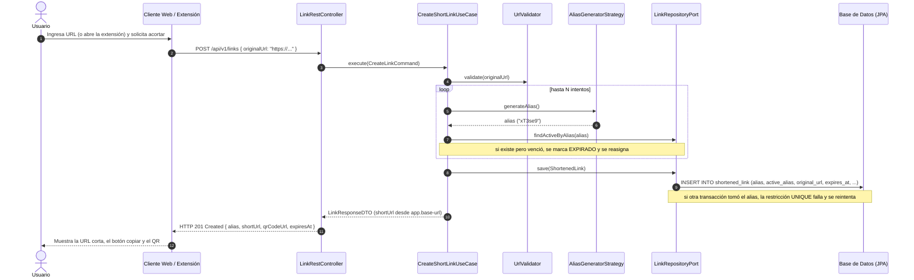
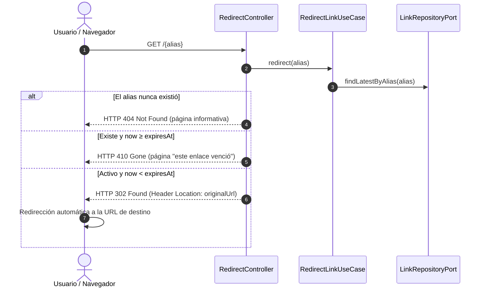
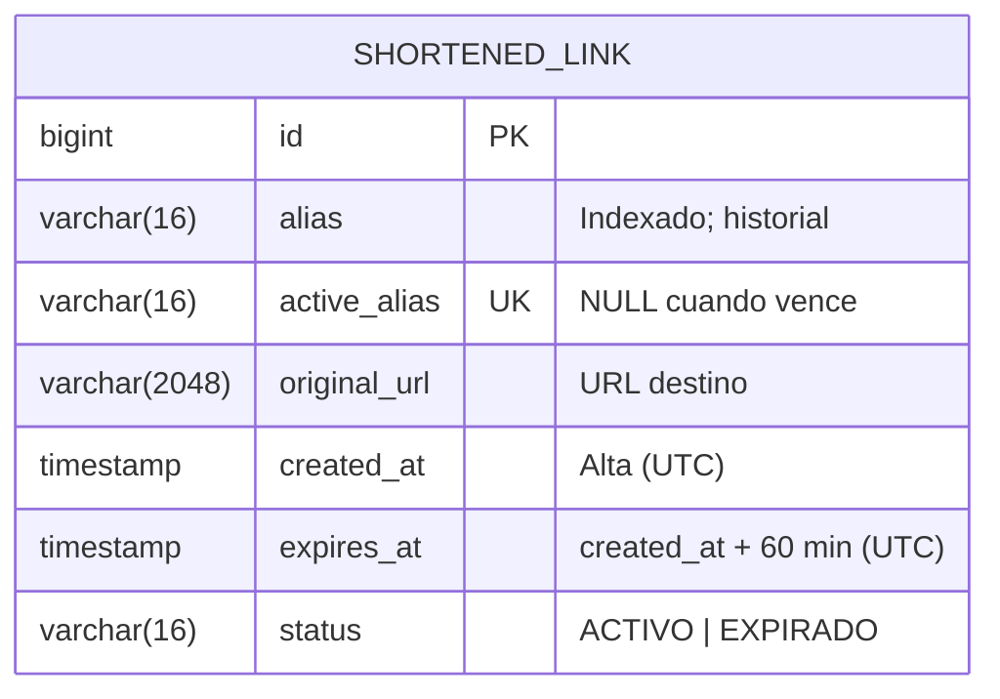

# Documento Maestro: Análisis, Elucidación y Especificación Técnica (Etapa 1)

**Proyecto:** Servicio de Acortamiento y Gestión de Enlaces (*Link Shortener*)  
**Cátedra:** Paradigmas de Programación VI – 5to Año – Ingeniería en Informática  
**Autor / Propuesta:** Martín Crespo  
**Rama de Trabajo:** `dev/martin`  
**Destino:** Propuesta individual, para analizar junto con las de Sofía (`dev/sofia`) y Agustín (`dev/agustin`) en la puesta en común del grupo

> **Convención de este documento.** Lo que no está decidido se marca `❓ Pendiente de definir`. Cada pregunta trae una **recomendación** y la **alternativa descartada** con su motivo. No se da por hecha ninguna cifra, endpoint ni comportamiento que no esté escrito acá.

---

## 📑 Tabla de Contenidos
1. [Resumen Ejecutivo y Objetivos](#1-resumen-ejecutivo-y-objetivos)
2. [Fase 1: Elucidación y Descubrimiento (Cuestionario al Cliente / Docente)](#2-fase-1-elucidación-y-descubrimiento-cuestionario-al-cliente--docente)
3. [Supuestos Iniciales y Decisiones de Diseño por Defecto](#3-supuestos-iniciales-y-decisiones-de-diseño-por-defecto)
4. [Invariantes del Sistema](#4-invariantes-del-sistema)
5. [Diseño y Especificación Arquitectónica](#5-diseño-y-especificación-arquitectónica)
6. [Contrato de la API REST (Especificación OpenAPI / Swagger)](#6-contrato-de-la-api-rest-especificación-openapi--swagger)
7. [Diseño de Clientes: Web y Extensión de Navegador](#7-diseño-de-clientes-web-y-extensión-de-navegador)
8. [Estrategia de Persistencia y Base de Datos (JPA / Hibernate)](#8-estrategia-de-persistencia-y-base-de-datos-jpa--hibernate)
9. [Blindaje ante la "Regla del Cliente Incierto" (Preparación para Etapas 2 y 3)](#9-blindaje-ante-la-regla-del-cliente-incierto-preparación-para-etapas-2-y-3)
10. [Plan de Verificación, Pruebas y Aseguramiento de Calidad (QA)](#10-plan-de-verificación-pruebas-y-aseguramiento-de-calidad-qa)
11. [Plan de Trabajo por Pasos](#11-plan-de-trabajo-por-pasos)
12. [Reglas de Trabajo con la IA](#12-reglas-de-trabajo-con-la-ia)
13. [Planilla de Roles del Grupo y Forma de Trabajo](#13-planilla-de-roles-del-grupo-y-forma-de-trabajo)
14. [Backlog de Recortes](#14-backlog-de-recortes)
15. [Puntos Abiertos](#15-puntos-abiertos)

---

## 1. Resumen Ejecutivo y Objetivos

El objetivo de la **Etapa 1** es desarrollar un acortador de enlaces (*Link Shortener*) de calidad profesional, que resuelva la compartición de URLs largas (por ejemplo, enlaces complejos de Google Drive o documentos en la nube). El sistema tiene que:

- Generar un alias único, breve y memorizable: `http://{dominio_o_ip}/{alias}`.
- Ofrecer dos canales de generación: una **interfaz web** simple y una **extensión para Google Chrome y Mozilla Firefox** que acorte con un solo clic.
- Generar y mostrar un **código QR** de la dirección acortada, tanto en la web como en la extensión.
- **Redirigir** de forma transparente a la URL original.
- Hacer que el enlace **venza a los 60 minutos (TTL)**: después deja de redirigir y el alias queda libre para reutilizarse.
- Persistir con **JPA/Hibernate** sobre un motor relacional, con un backend REST en **Java + Spring Boot**.

**Criterio rector:** como el cliente va a cambiar requerimientos en las etapas 2 y 3, todo lo que pueda cambiar (generación del alias, vencimiento, QR, motor de base) queda **detrás de una interfaz**. Un cambio futuro debe resolverse agregando una clase y configuración, no reescribiendo.

---

## 2. Fase 1: Elucidación y Descubrimiento (Cuestionario al Cliente / Docente)

Este cuestionario reúne las ambigüedades y los detalles que la consigna no especifica. Se presenta al Cliente para definir el comportamiento exacto antes de codificar. Mientras no haya respuesta, el grupo avanza con la **recomendación** de cada pregunta (§3). La columna "Respuesta" registra lo que decida el Cliente.

### 🕒 Bloque 1: Ciclo de Vida y Expiración (60 Minutos)

| # | Pregunta | Recomendación | Alternativa descartada y motivo | Respuesta |
|---|---|---|---|---|
| P1 | ¿Qué responde un enlace vencido? ¿`404 Not Found`, `410 Gone` o una vista amigable? | `410 Gone` si el alias existió y venció, `404` si nunca existió; al navegador se le muestra una **página HTML amigable** con ese código | Un único 404: oculta al usuario que el enlace existió y venció | ❓ |
| P2 | ¿La expiración se evalúa en tiempo real al recibir la redirección, o hace falta además una tarea programada? | **Se evalúa siempre al leer** (es la fuente de verdad). Una tarea `@Scheduled` es **opcional**, solo para ordenar los registros | Depender del scheduler: entre dos corridas, un enlace vencido seguiría redirigiendo | ❓ |
| P3 | Al vencer, ¿el alias vuelve a un pool de reutilizables, o la unicidad aplica solo a los enlaces activos? | **La unicidad aplica solo a los enlaces activos**; el generador aleatorio puede volver a elegir un alias liberado | Pool de alias: agrega una estructura que mantener sin un beneficio claro | ❓ |
| P4 | Al vencer, ¿se borra el registro o se aplica *soft delete*? | **Soft delete**: el registro pasa a `EXPIRADO` y queda como historial | Borrado físico: pierde la base para métricas o auditoría futuras | ❓ |
| P5 | ¿Los 60 minutos son fijos o pueden variar por enlace o por usuario? | Fijos, configurables con `app.link.ttl=60m` | TTL en el request: no lo pide la consigna (queda en §9) | ❓ |

### 🔀 Bloque 2: Reglas de Negocio y Generación de URLs

| # | Pregunta | Recomendación | Alternativa descartada y motivo | Respuesta |
|---|---|---|---|---|
| P6 | Si dos usuarios acortan la misma URL mientras hay un enlace vigente, ¿se crea un alias nuevo o se devuelve el existente? | **Alias nuevo**, cada uno con sus propios 60 minutos | Devolver el existente: obliga a decidir si se reinicia el plazo y acopla dos pedidos independientes | ❓ |
| P7 | ¿Formato fijo del alias, o se permite un alias personalizado (*custom slug*)? | Generación automática **Base62 `[a-zA-Z0-9]` de 6 caracteres**; largo y alfabeto configurables | Alias personalizado: no lo pide la consigna (queda en el backlog, BL-002) | ❓ |
| P8 | ¿Qué es una URL destino válida? | Solo `http://` y `https://`, con host, de **2048 caracteres como máximo**, y que **no apunte al propio acortador** (evita bucles de redirección) | Bloquear IPs privadas "por SSRF": no aplica, porque el servidor **nunca descarga** la URL destino; solo la devuelve en el header `Location` | ❓ |
| P9 | ¿Se esperan estadísticas (contador de clics, último acceso) en la Etapa 1? | No. Queda el punto de extensión (§9) y el ítem BL-001 | Agregarlo ya: es funcionalidad no pedida | ❓ |

### 🚀 Bloque 3: Redirección y Protocolo HTTP

| # | Pregunta | Recomendación | Alternativa descartada y motivo | Respuesta |
|---|---|---|---|---|
| P10 | ¿Código de redirección: `302 Found` o `307 Temporary Redirect`? | **`302 Found`** | **`301`**: los navegadores lo guardan en caché y no vuelven a consultar al servidor, lo que rompe la expiración de 60 minutos. `307` no aporta nada, porque la redirección es siempre un `GET` | ❓ |

### 📱 Bloque 4: Clientes (Web y Extensión) y Código QR

| # | Pregunta | Recomendación | Alternativa descartada y motivo | Respuesta |
|---|---|---|---|---|
| P11 | ¿La extensión es una WebExtension **Manifest V3** compatible con Chrome y Firefox? | Sí, con un solo código para los dos navegadores | Dos extensiones separadas: duplica el mantenimiento | ❓ |
| P12 | ¿"Con solo tocarlo" significa leer automáticamente la URL de la pestaña activa? | Sí: al abrir el popup se acorta la pestaña activa (`activeTab`), sin pegar nada | Que el usuario pegue la URL: contradice "con solo tocarlo" | ❓ |
| P13 | ¿El QR se genera en el backend (ZXing) o en el cliente (JS)? | **En el backend**, en un único endpoint que consumen la web y la extensión | Generarlo en los dos lados: dos implementaciones que pueden dar resultados distintos y que hay que probar por separado | ❓ |
| P14 | ¿El QR solo se muestra o también se descarga? | Se muestra, y se puede descargar como PNG | — | ❓ |

### 💾 Bloque 5: Infraestructura y Persistencia

| # | Pregunta | Recomendación | Alternativa descartada y motivo | Respuesta |
|---|---|---|---|---|
| P15 | ¿Base embebida (**HSQLDB** o **H2**) o un contenedor Docker con **PostgreSQL/MySQL**? | **HSQLDB** (o H2) en modo archivo, que arranca con Spring Boot sin instalar nada; se cambia a PostgreSQL/MySQL solo por configuración | Docker + PostgreSQL desde el inicio: agrega infraestructura que la consigna no pide | ❓ |
| P16 | ¿El sistema se publica con un dominio o con una IP? ¿Con HTTPS? | La URL base sale de la configuración (`app.base-url`), así sirve cualquiera de las dos. Dominio y HTTPS: `❓ Pendiente de definir` | Armar la URL corta a partir del request: depende de proxies y headers (ver I4) | ❓ |
| P17 | ¿Hace falta usuario/login en la Etapa 1? | No | — | ❓ |

---

## 3. Supuestos Iniciales y Decisiones de Diseño por Defecto

Mientras el Cliente responde, el grupo avanza con estos **supuestos técnicos**. Los que son difíciles de revertir se registran como ADR (§9.2).

1. **El vencimiento se evalúa siempre al leer.**
   - Cada enlace tiene `createdAt` y `expiresAt = createdAt + 60 minutos`.
   - Cada redirección compara el instante actual con `expiresAt`. Si venció, **no redirige**, haya corrido o no cualquier tarea en segundo plano.
   - Un `@Scheduled` **opcional** (cada 5 minutos) marca en lote los vencidos como `EXPIRADO`. Solo ordena los datos; la corrección no depende de él.
2. **El intervalo de validez es semiabierto: `[createdAt, expiresAt)`.** En el instante exacto `expiresAt`, el enlace **ya venció**. Sin esta definición, "60 minutos" admite dos interpretaciones y los tests del borde quedarían ambiguos.
3. **Se usan `Instant` (UTC) y un `Clock` inyectable** en lugar de `LocalDateTime.now()`. Así no hay ambigüedad de zona horaria, y los tests pueden simular que "pasaron 61 minutos" sin esperar.
4. **Soft delete y reasignación.** Los registros no se borran: pasan a `EXPIRADO`. Lo que se reasigna es **el alias**, no el registro, así que alcanza con dos estados (`ACTIVO`, `EXPIRADO`).
5. **La base de datos garantiza la unicidad del alias activo** (§8). La verificación previa en el servicio no alcanza ante dos pedidos simultáneos.
6. **El alias es Base62 de 6 caracteres** (por ejemplo `aB9x2K`). Son 62⁶ ≈ 56.800 millones de combinaciones; con un vencimiento de 60 minutos, el conjunto de alias activos es chico y las colisiones son improbables. Igual se manejan con reintentos.
7. **La redirección es un `302 Found`**, con el header `Location`.
8. **El QR se genera solo en el backend**, con ZXing: `GET /api/v1/links/{alias}/qr`. La web y la extensión muestran esa imagen.
9. **La base es embebida y se cambia por configuración.** Se arranca con **HSQLDB** (o **H2**) en modo archivo, desacoplada con Spring Data JPA. Pasar a PostgreSQL/MySQL es cambiar el perfil de `application.properties`.

---

## 4. Invariantes del Sistema

Una **invariante** es una regla cuyo incumplimiento es un incidente, no un bug menor. Cada una debe **fallar cerrado** (ante la duda, no redirige), vivir en **la capa más baja posible** y tener **un test que la rompa a propósito** (§10.4).

| ID | Invariante | Dónde se sostiene | Casos que la prueban (§10.2) |
|---|---|---|---|
| **I1** | Un enlace **nunca redirige si `now ≥ expiresAt`**, haya corrido o no la tarea programada | Método de dominio `isExpired(Instant now)`, evaluado en cada lectura | TC-03, TC-04 |
| **I2** | **Como máximo un enlace activo por alias**, incluso con pedidos simultáneos | Restricción `UNIQUE` en la base (§8) + reintento en el caso de uso | TC-31 |
| **I3** | La redirección **nunca es un 301** | `RedirectController` | TC-32 |
| **I4** | La URL corta (y por lo tanto el QR) se arma **siempre desde `app.base-url`**, nunca desde los headers de la petición | Caso de uso de creación / mapper de respuesta | TC-33, TC-34 |
| **I5** | **Ningún secreto en el repositorio** (credenciales, archivos `.env`) | Variables de entorno + `.gitignore` + revisión antes de cada commit | Revisión de `git status` |

**Límite documentado de I1:** depende de que el reloj del servidor esté bien. Un reloj atrasado alarga la vida de los enlaces. Por eso, tener el reloj sincronizado (NTP) es un requisito de despliegue.

---

## 5. Diseño y Especificación Arquitectónica

### 5.1. Patrón de Arquitectura en Capas / Puertos y Adaptadores

El backend sigue los principios de arquitectura limpia. **Regla de dependencias:** `infrastructure → application → domain`. El dominio no conoce Spring MVC, ni ZXing, ni el motor de base.

```
src/main/java/ar/edu/undef/fie/pp6/
│
├── domain/                    # Capa de Dominio (sin dependencias de frameworks)
│   ├── model/                 # ShortenedLink, LinkStatus, Alias, UrlTarget
│   ├── repository/            # Puerto de persistencia (LinkRepositoryPort)
│   ├── service/               # LinkExpirationPolicy, AliasGeneratorStrategy, UrlValidator, QrCodeGeneratorPort
│   └── exception/             # InvalidUrlException, LinkNotFoundException, LinkExpiredException, AliasExhaustedException
│
├── application/               # Capa de Aplicación (Casos de Uso)
│   ├── usecase/               # CreateShortLinkUseCase, RedirectLinkUseCase, GetLinkInfoUseCase
│   └── dto/                   # Request/Response DTOs (nunca se exponen entidades)
│
├── infrastructure/            # Capa de Infraestructura (Adaptadores externos)
│   ├── persistence/           # Entidades JPA, Spring Data Repositories, Mappers
│   ├── rest/                  # RestControllers, RedirectController, GlobalExceptionHandler
│   ├── qr/                    # Adaptador ZXing
│   └── scheduler/             # Tarea opcional que marca enlaces vencidos
│
└── config/                    # Spring, CORS, OpenAPI, Clock, propiedades (@ConfigurationProperties)
```

Los clientes viven fuera del backend: la web en `src/main/resources/static/` (la sirve Spring Boot) y la extensión en `browser-extension/`.

---

### 5.2. Modelo de Dominio y Ciclo de Vida del Enlace

#### Entidad de Dominio: `ShortenedLink`

| Campo | Tipo | Nota |
|---|---|---|
| `id` | Long | Autoincremental |
| `alias` | String (6) | Se conserva siempre, para el historial. Indexado |
| `activeAlias` | String (6), nullable | Igual a `alias` mientras el enlace está activo; **`NULL` al vencer**. Tiene restricción `UNIQUE` (§8) |
| `originalUrl` | String (2048) | URL destino validada |
| `createdAt` | Instant | Alta (UTC) |
| `expiresAt` | Instant | `createdAt + 60 minutos`, calculado por `LinkExpirationPolicy` |
| `status` | Enum `ACTIVO` / `EXPIRADO` | |

**Métodos de dominio:**
- `isExpired(Instant now)` devuelve `!now.isBefore(expiresAt)`.
- `expire()` pone `status = EXPIRADO` y `activeAlias = null`.

La regla "¿está vencido?" vive en la entidad, no en el controller.

**Reasignación:** al generar un alias, solo cuentan como colisión los enlaces **activos y no vencidos**. Si el alias elegido pertenece a un enlace que ya venció pero todavía figura como `ACTIVO` (la tarea programada no pasó), ese enlace se marca `EXPIRADO` **en la misma transacción** y el alias se reasigna.

```mermaid
stateDiagram-v2
    [*] --> ACTIVO : POST /api/v1/links (Creación)
    ACTIVO --> ACTIVO : GET /{alias} con now < expiresAt (302)
    ACTIVO --> EXPIRADO : now ≥ expiresAt (al leer, al reasignar el alias o por la tarea opcional)
    EXPIRADO --> [*] : El registro queda como historial; el alias vuelve a estar libre
```



---

### 5.3. Diagramas de Arquitectura y Secuencia (Mermaid)

#### Diagrama de Secuencia 1: Acortamiento de Enlace (Web / Extensión)


#### Diagrama de Secuencia 2: Redirección al Enlace Original


#### Diagrama Entidad-Relación (ERD)

Entidades declaradas: **1** (`SHORTENED_LINK`).



---

## 6. Contrato de la API REST (Especificación OpenAPI / Swagger)

Se documenta con OpenAPI/Swagger. Todas las fechas viajan en **UTC, ISO-8601**. Los errores tienen un formato uniforme (ProblemDetail, RFC 7807): `type`, `title`, `status`, `detail`.

| Método y ruta | Qué hace | Respuestas |
|---|---|---|
| `POST /api/v1/links` | Crea un enlace acortado | `201` · `400` URL inválida · `503` sin alias disponibles tras N intentos |
| `GET /{alias}` | Redirección | `302` · `404` · `410` |
| `GET /api/v1/links/{alias}/qr` | Imagen PNG del QR de la URL corta | `200 image/png` · `404` · `410` |
| `GET /api/v1/links/{alias}/info` | Estado y metadatos del enlace | `200` · `404` |

#### 1. Crear Enlace Acortado — `POST /api/v1/links`
- **Request:**
  ```json
  { "originalUrl": "https://drive.google.com/drive/folders/1a2b3c4d5e6f7g8h9?usp=sharing" }
  ```
- **Response 201 Created** (`192.168.1.50:8080` es solo un ejemplo; el host sale de `app.base-url`):
  ```json
  {
    "alias": "xT3se9",
    "shortUrl": "http://192.168.1.50:8080/xT3se9",
    "originalUrl": "https://drive.google.com/drive/folders/1a2b3c4d5e6f7g8h9?usp=sharing",
    "qrCodeUrl": "http://192.168.1.50:8080/api/v1/links/xT3se9/qr",
    "createdAt": "2026-10-05T10:15:00Z",
    "expiresAt": "2026-10-05T11:15:00Z"
  }
  ```
- **Errores:** `400 Bad Request` para cualquier URL inválida (vacía, sin esquema, esquema no soportado, sin host, más de 2048 caracteres, apunta al propio acortador). Se unificó en 400; distinguir 400 de 422 no aportaba información útil al cliente.
- **Sin "minutos restantes" en la respuesta:** el cliente los calcula a partir de `expiresAt`. Así el dato no queda viejo apenas se envía.

#### 2. Redirección — `GET /{alias}`
- **302 Found**, con `Location: <originalUrl>`.
- **404 Not Found** si el alias nunca existió; **410 Gone** si venció. Ambos devuelven una página HTML simple.
- El alias se restringe con la expresión regular `[A-Za-z0-9]{1,16}`. Así la ruta no choca con `/api/**` ni con los archivos estáticos de la web.

#### 3. Obtener Código QR — `GET /api/v1/links/{alias}/qr`
- **200 OK**, `Content-Type: image/png`. La imagen codifica **exactamente** la `shortUrl` (I4).
- Tamaño opcional con `?size=256`, acotado a un rango: `❓ Pendiente de definir`.

#### 4. Consultar Estado / Metadatos — `GET /api/v1/links/{alias}/info`
- **200 OK:**
  ```json
  {
    "alias": "xT3se9",
    "originalUrl": "https://drive.google.com/...",
    "status": "ACTIVO",
    "createdAt": "2026-10-05T10:15:00Z",
    "expiresAt": "2026-10-05T11:15:00Z"
  }
  ```

---

## 7. Diseño de Clientes: Web y Extensión de Navegador

### 7.1. Cliente Web
- **Tecnología:** HTML5 + JavaScript sin framework, con un CSS liviano (Tailwind o Bootstrap) para evitar dependencias pesadas. Lo sirve el propio Spring Boot y usa **rutas relativas** (`/api/v1/links`).
- **Componentes:**
  - Campo *dirección a acortar*, con validación en vivo.
  - Botón **ACORTAR**.
  - Tarjeta de resultado con el enlace acortado, un botón **Copiar al portapapeles**, una cuenta regresiva calculada desde `expiresAt` (por ejemplo *"Expira en 59m 40s"*) y el **QR** (un `` que apunta a `qrCodeUrl`, con botón para descargarlo).
- **Estados obligatorios de la pantalla:** inicial · cargando · error de validación (400, con el mensaje del servidor) · sin alias disponibles (503) · resultado. Ningún error muestra trazas técnicas.
- **Accesibilidad mínima:** `lang="es"`, un `<label>` asociado al campo, mensajes de estado con `role="status"` y un texto alternativo en el QR.

### 7.2. Complemento Chrome & Firefox (Manifest V3)
- **`manifest.json`:** Manifest V3 (`action`, `permissions: ["activeTab", "storage"]`, `host_permissions` hacia el backend), con `browser_specific_settings.gecko` para Firefox. Un solo código para los dos navegadores.
- **`popup.html` / `popup.js`:** al hacer clic en el ícono, toma la URL de la pestaña activa y llama a la API sin que el usuario pegue nada:
  ```javascript
  chrome.tabs.query({ active: true, currentWindow: true }, function(tabs) {
      const currentUrl = tabs[0].url;
      acortarUrl(currentUrl); // POST /api/v1/links y render del resultado
  });
  ```
- Muestra inmediatamente la URL corta, el botón copiar y el QR.
- **Pestañas que no se pueden acortar** (`chrome://`, `about:`): el backend responde 400 y el popup lo explica.
- **La URL del backend es configurable** (`storage`). Así la misma extensión apunta al entorno local o al publicado.
- **CORS:** el backend habilita `/api/**` para los orígenes de la extensión (`chrome-extension://…`, `moz-extension://…`).

### 7.3. Estrategia de Generación de Código QR
- **Una sola implementación, en el backend:** un adaptador con `com.google.zxing:core` + `javase` detrás del puerto `QrCodeGeneratorPort`.
- La web y la extensión muestran la imagen del endpoint. No hay una segunda implementación en JavaScript, para tener **una sola fuente de verdad** y un solo lugar que probar.
- Un test **decodifica el PNG** y verifica que el contenido sea igual a la `shortUrl`.

---

## 8. Estrategia de Persistencia y Base de Datos (JPA / Hibernate)

1. **Entidad JPA:**
   - Índice explícito `@Index(name = "idx_link_alias", columnList = "alias")` para las búsquedas de redirección y del historial.
   - Los timestamps se toman del `Clock` inyectado, no de la base, para que el vencimiento sea testeable.
2. **Unicidad del alias activo (invariante I2):**
   - Un índice único condicional ("único solo si `status = ACTIVO`") **no es portable**: ni HSQLDB ni H2 soportan índices parciales.
   - Solución: la columna **`active_alias` con restricción `UNIQUE`**. Vale `alias` mientras el enlace está activo y `NULL` al vencer. El SQL estándar admite varios `NULL` en una columna única, así que los vencidos no chocan entre sí.
   - Si dos pedidos simultáneos eligen el mismo alias, un `INSERT` falla (`DataIntegrityViolationException`) y el caso de uso reintenta con otro alias.
   - **A verificar en el Paso 1:** que el motor elegido acepte múltiples `NULL` en la restricción única. Se comprueba con un test contra el motor real.
3. **Compatibilidad entre motores:** tipos SQL estándar (`VARCHAR`, `TIMESTAMP`, `BIGINT`), compatibles con **HSQLDB**, **H2** y **PostgreSQL**.
4. **Perfiles de Spring:**
   - `application-dev.properties`: HSQLDB/H2 local en modo archivo.
   - `application-prod.properties`: PostgreSQL/MySQL si se requiere para la entrega final. Las credenciales salen de **variables de entorno**, nunca del repositorio (I5).
5. **Configuración obligatoria:** con el perfil `prod`, si falta `app.base-url` o alguna variable de la base, la aplicación **no arranca** (`@Validated`). Es mejor fallar al iniciar que generar enlaces con un dominio equivocado.
6. **Esquema:** `ddl-auto=update` en la Etapa 1. Migraciones versionadas (Flyway/Liquibase) cuando el esquema empiece a cambiar entre etapas (BL-003).

---

## 9. Blindaje ante la "Regla del Cliente Incierto" (Preparación para Etapas 2 y 3)

### 9.1. Patrones y puntos de extensión

| Patrón | Dónde | Qué cambio futuro absorbe |
|---|---|---|
| **Strategy** | `AliasGeneratorStrategy` | Alias personalizados, numéricos, o algoritmos distintos (Murmur3, CRC32, secuencias): una estrategia nueva sin tocar el caso de uso |
| **Strategy** | `LinkExpirationPolicy` | TTL configurable por usuario, enlaces permanentes, vencimiento por cantidad de clics |
| **Observer / Eventos de dominio** — *punto de extensión, no se implementa en la Etapa 1* | La redirección publicaría `LinkAccessedEvent` (Spring Events, `@EventListener`) | Estadísticas (geolocalización, navegadores, logs): un listener nuevo sin tocar la redirección |
| **Puertos y adaptadores** | `LinkRepositoryPort`, `QrCodeGeneratorPort`, `UrlValidator` | Cambiar de motor de base, de librería de QR o de reglas de validación sin tocar los casos de uso |
| **DTOs** | `application/dto` | Cambiar el JSON sin tocar la entidad, y viceversa |
| **`Clock` inyectable** | Casos de uso y política de expiración | Probar el vencimiento sin esperar |
| **Versionado de la API** | `/api/v1` | Un cambio incompatible se publica como `/api/v2` sin romper la extensión ya instalada |

### 9.2. Protocolo cuando llega un cambio

| Situación | Qué se hace | Qué **no** se hace |
|---|---|---|
| El requisito cambia antes de implementar | Se actualiza **primero** este documento, después el código | Implementar igual y "arreglar después" |
| Cambia durante la implementación | Se interrumpe, se actualiza la especificación y se retoma desde el punto del cambio | Parchear el código sin tocar la especificación |
| Una decisión registrada resultó incorrecta | **ADR nuevo que reemplaza al anterior**; el viejo queda marcado "Superado por ADR-NNNN" | Editar o borrar el ADR viejo |
| Aparece una ambigüedad que cambia un criterio | Pregunta nueva `Pn` con recomendación, y se espera la decisión | Que la IA lo resuelva a su criterio |

Se registra un **ADR** (`docs/adr/NNNN-slug.md`: contexto, decisión, alternativas, consecuencias, estado) cuando la decisión es **difícil de revertir, sorprendente sin contexto y fruto de un trade-off real**. ADR iniciales propuestos:
- ADR-0001: el vencimiento se evalúa al leer, con intervalo semiabierto.
- ADR-0002: la unicidad del alias activo se resuelve con `active_alias UNIQUE`.
- ADR-0003: el QR se genera solo en el backend.
- ADR-0004: base embebida con perfiles para cambiar de motor.

---

## 10. Plan de Verificación, Pruebas y Aseguramiento de Calidad (QA)

### 10.1. Capas de verificación

| Capa | Herramienta | Qué atrapa que las otras no |
|---|---|---|
| Unitarias | JUnit 5 + Mockito, `Clock` fijo | Generación de alias, política de expiración, validación de URL |
| Integración | Spring Boot Test + MockMvc, `@DataJpaTest` | Contrato HTTP, códigos de estado, consultas |
| **Contra el motor real** | Tests de repositorio sobre el **mismo motor que se va a usar en producción** | Restricción `UNIQUE`, `NULL` múltiples, comportamiento que una base en memoria distinta no reproduce |
| **Concurrencia** | Dos hilos / dos transacciones reales en paralelo | Que la invariante I2 resista pedidos simultáneos (una validación secuencial no lo prueba) |
| **En navegador real** | `❓ Pendiente de definir` (por ejemplo Playwright) para la web; la extensión, como mínimo con verificación manual con captura en Chrome y en Firefox | CORS, render del QR, botón copiar: lo que un test de backend no ve |
| **Mutaciones** | A mano, en cada paso que toque una invariante | Tests que pasan sin poder fallar |
| **Verificación real** | `curl -I`, consultas a la base, escanear el QR con un celular | Lo que ningún test modela |

**Cobertura:** JaCoCo como indicador. **No reemplaza** a las mutaciones: un test que no puede fallar suma cobertura y no protege nada.

### 10.2. Matriz de casos de prueba (partición de equivalencia + valores límite)

**Semántica de bordes**, escrita antes de los casos: el enlace es válido en `[createdAt, expiresAt)`; en `createdAt + 60:00.000` **ya venció**. URL: longitud máxima de 2048 caracteres, inclusive.

Cada ID se mapea **1 a 1** con un test llamado `tcNN_descripcion`, agrupado por requisito (`@Nested` + `@DisplayName`). Los huecos de numeración son intencionales.

#### Grupo A — Vencimiento y redirección (TTL = 60 min, `Clock` fijo)
| ID | Escenario | Instante de la petición | Resultado esperado | Justificación |
|---|---|---|---|---|
| TC-01 | Recién creado | `createdAt` | **302** a `originalUrl` | Borde inferior válido |
| TC-02 | Justo antes de vencer | `createdAt + 59:59.999` | **302** | Valor límite: máximo − 1 |
| TC-03 | Instante exacto de vencimiento | `createdAt + 60:00.000` | **410** | Valor límite; intervalo semiabierto (I1) |
| TC-04 | Vencido | `createdAt + 61:00` | **410**, aunque la tarea programada no haya corrido | I1 no depende del scheduler |
| TC-05 | Alias que nunca existió | — | **404** | Clase inválida: inexistente |

#### Grupo B — Validación de la URL destino
| ID | Escenario | Entrada | Resultado esperado | Justificación |
|---|---|---|---|---|
| TC-10 | URL `https` típica | `https://drive.google.com/...` | **201** | Clase válida |
| TC-11 | URL `http` | `http://ejemplo.com` | **201** | Clase válida (segundo esquema) |
| TC-12 | Esquema no soportado | `ftp://ejemplo.com` | **400** | Clase inválida: esquema |
| TC-13 | Texto sin esquema | `hola mundo` | **400** | Clase inválida: no es URL |
| TC-14 | Vacía o nula | `""` / `null` | **400** | Clase inválida: vacío |
| TC-15 | Longitud máxima | URL de 2048 caracteres | **201** | Valor límite |
| TC-16 | Longitud máxima + 1 | URL de 2049 caracteres | **400** | Valor límite: máximo + 1 |
| TC-17 | Apunta al propio acortador | `{app.base-url}/xT3se9` | **400** | Evita bucles de redirección |
| TC-18 | Esquema sin host | `https://` | **400** | Clase inválida: sin host |

#### Grupo C — Generación y reasignación del alias
| ID | Escenario | Estado previo | Resultado esperado | Justificación |
|---|---|---|---|---|
| TC-20 | Formato del alias | Vacío | 6 caracteres de `[a-zA-Z0-9]` | Supuesto 6 (§3) |
| TC-21 | Colisión con un enlace activo | Alias X activo | Se reintenta y se devuelve otro alias | I2 |
| TC-22 | El alias pertenece a un enlace vencido no marcado | Alias X vencido, `status = ACTIVO` | Se reasigna X; el enlace viejo queda `EXPIRADO` en la misma transacción | Reasignación (consigna) |
| TC-23 | Se agotan los reintentos | Generador que siempre colisiona | **503** | `AliasExhaustedException` |
| TC-24 | Misma URL dos veces | URL U activa | Dos alias distintos, cada uno con sus 60 min | P6 |

#### Grupo D — Invariantes y atomicidad
| ID | Escenario | Acción | Verificación posterior |
|---|---|---|---|
| TC-30 | Rechazo sin efectos | `POST` con URL inválida | La cantidad de filas no cambió |
| TC-31 | Alias simultáneo | Dos transacciones reales insertan el mismo alias activo en paralelo | Exactamente **una** fila activa con ese alias (I2) |
| TC-32 | Nunca 301 | Redirección de un enlace activo | El status es 302, nunca 301 (I3) |
| TC-33 | URL corta independiente del request | `POST` con un header `Host` distinto | `shortUrl` empieza con `app.base-url` (I4) |
| TC-34 | El QR codifica la URL corta | `GET .../qr` y decodificación con ZXing | El contenido es igual a `shortUrl` (I4) |

**Total: 24 IDs** (contados: A = 5, B = 9, C = 5, D = 5). Aparte quedan el test de carga de contexto y los de controller que no son casos de negocio.

### 10.3. Criterios de aceptación de la Etapa 1
1. Una URL válida devuelve 201 con un alias único y `expiresAt = createdAt + 60 min`.
2. Una URL inválida devuelve 400 con un mensaje claro.
3. `GET /{alias}` sobre un enlace activo devuelve 302 a la URL original.
4. `GET /{alias}` a los 60:00 o más devuelve 410, y el alias vuelve a estar disponible.
5. Un alias inexistente devuelve 404.
6. El QR decodificado es igual a la URL corta, y escaneado con un celular lleva a la URL original.
7. La API nunca devuelve entidades JPA.
8. La extensión, cargada en Chrome y en Firefox, acorta la pestaña activa con un clic y muestra el enlace, el QR y el botón copiar.

### 10.4. Pruebas de mutación de las invariantes
En cada paso que toque una invariante, se **rompe la regla a propósito**, se corren los tests y se comprueba que **alguno falla**. Después se restaura el archivo **desde una copia**, no con `git checkout`, para no perder cambios sin commitear.

| Invariante | Mutación | Debe fallar |
|---|---|---|
| I1 | `!now.isBefore(expiresAt)` → `now.isAfter(expiresAt)` | TC-03 |
| I1 | Ignorar `isExpired` en `RedirectLinkUseCase` | TC-03, TC-04 |
| I2 | Quitar la restricción `UNIQUE` de `active_alias` | TC-31 |
| I3 | Cambiar 302 por 301 | TC-32 |
| I4 | Armar `shortUrl` desde el request | TC-33 |

Si una mutación sobrevive, la regla **no está protegida**, diga lo que diga la cobertura.

### 10.5. Definición de "terminado"
Un paso no está terminado porque compila y los tests dan verde. Está terminado cuando tiene **todas** sus evidencias:

| Código | Evidencia |
|---|---|
| **T** | Tests en verde, incluidos los `TC-xx` del paso, con la salida real del build |
| **M** | Mutaciones de las invariantes que toca el paso, todas detectadas |
| **E2E** | Prueba en navegador (pasos de web y extensión), con captura |
| **V** | Verificación contra la app levantada (curl, consulta a la base, QR escaneado) |
| **A** | Aceptación de **un integrante que no construyó el paso**: "OK" + nombre + fecha |
| **D** | Documentación (y ADR, si corresponde) actualizada |

Si falta una evidencia, el paso queda **⛔ Bloqueado (motivo)**, nunca ✅. Estados: ⬜ Pendiente · 🔶 En curso · ✅ Cerrado · ⛔ Bloqueado · ❓ Requiere decisión.

Nada se declara "terminado" a secas: se escribe **"completo en `<entorno>`, pendiente `<lista>`"**.

---

## 11. Plan de Trabajo por Pasos

Fechas: `❓ Pendiente de definir` con el grupo. **No se arranca un paso sin el anterior cerrado** con sus evidencias (§10.5). Cada paso es un commit propio.

| Paso | Entregable | Evidencia de cierre |
|---|---|---|
| 0 | Proyecto base Spring Boot, dependencias, paquetes de §5.1, perfiles `dev`/`prod`, propiedades, `Clock`, `.gitignore`, ADR-0001 a 0004 | Test de carga de contexto; la app levanta con el perfil `dev` |
| 1 | Dominio + persistencia: `ShortenedLink`, puerto y adaptador JPA, `active_alias UNIQUE` | `@DataJpaTest`; test contra el motor real de los `NULL` múltiples |
| 2 | Validación de URL, estrategia de alias y política de expiración | TC-10 a TC-18, TC-20; mutación de I1 |
| 3 | Caso de uso de creación + `POST /api/v1/links` + `/info` + manejo de errores + Swagger | TC-21 a TC-24, TC-30, TC-31, TC-33; mutaciones de I2 e I4 |
| 4 | Redirección `GET /{alias}` (302/404/410) | TC-01 a TC-05, TC-32; mutaciones de I1 e I3; verificación con `curl -I` |
| 5 | QR con ZXing | TC-34; QR escaneado con un celular |
| 6 | Cliente web | Prueba en navegador por cada estado de §7.1, con capturas |
| 7 | Extensión Chrome/Firefox + CORS | Carga en modo desarrollador en ambos navegadores, con capturas |
| 8 | Publicación en el entorno de entrega (`❓ Pendiente de definir`: servidor, dominio, HTTPS) | La web, la redirección y el QR funcionan en el entorno publicado; `prod` no arranca sin sus variables |
| 9 | QA final: cobertura, tarea programada opcional, README, guion de demo | Checklist de §10.3 con la evidencia de cada criterio |

---

## 12. Reglas de Trabajo con la IA

Aplican a **cualquier asistente de IA** que use el grupo.

### 12.1. Reglas
1. **Solo el paso pedido.** La IA no adelanta pasos ni agrega funcionalidades no pedidas.
2. **Plan antes de código:** primero lista qué va a crear o modificar y por qué; después escribe.
3. **Test primero (TDD):** por cada caso `TC-xx`, primero el test en rojo, después el código mínimo para pasarlo a verde, y al final el refactor. Un caso por vez.
4. **Prohibido modificar un test existente para ocultar un error de producción.** El test es el contrato.
5. **No inventar** cifras, endpoints, nombres ni comportamientos que no estén en este documento. Si algo es ambiguo, se usa la recomendación del cuestionario (§2). Si no está ahí, la IA formula una pregunta `Pn` con su recomendación y espera.
6. **Si una salida contradice un ADR, lo dice explícitamente;** nunca lo pisa en silencio.
7. **Reporte honesto:** salida real del build, tests en rojo con su salida, y separación entre lo verificado (lo ejecutó) y lo supuesto.
8. **Parada al final de cada paso:** "Paso N completo en `<entorno>`, pendiente `<lista>`. ¿Avanzo?", y espera la aprobación.
9. **Regla de las 2 correcciones:** si comete el mismo error dos veces seguidas, se corta la sesión, se identifica qué contexto faltaba y se reformula el pedido incluyéndolo.

### 12.2. Plantilla de prompt por paso

```text
CONTEXTO: <consigna + secciones relevantes de este documento + estado del paso anterior>
OBJETIVO: <qué tiene que quedar resuelto al final del paso>
RESTRICCIONES: invariantes I1–I5; reglas de §12.1; no tocar <lo que no corresponde>
PATRÓN: <archivo o clase existente que hay que seguir como modelo>
VERIFICACIÓN: casos TC-xx del paso en verde + mutaciones indicadas + salida del build
ALCANCE: <qué queda explícitamente afuera de este paso>
```

### 12.3. Prompt de revisión (lo usa quien verifica, no quien construyó)

```text
Revisá el diff del Paso N contra este documento y las invariantes I1–I5.
MODO SOLO REPORTE: no corrijas nada. Para cada hallazgo indicá archivo:línea, qué regla
o caso TC-xx afecta, y si lo verificaste leyendo el código o es una sospecha.
Buscá también lo que FALTA: criterios sin test, invariantes sin mutación, estados de UI
sin captura.
```

Después de la revisión, el grupo hace un **triage** de cada hallazgo antes de corregir nada: corregir · descartar con evidencia · llevar al backlog · aceptar porque falla hacia el lado seguro.

---

## 13. Planilla de Roles del Grupo y Forma de Trabajo

### 13.1. Roles

| Rol de la Cátedra | Integrante Propuesto | Responsabilidad Clave | Qué **no** hace |
| :--- | :--- | :--- | :--- |
| **Operador** | Martín Crespo (`dev/martin`) | Conserva los prompts, guía el diseño arquitectónico, modela los casos de uso y conduce a la IA. Es quien construye | No acepta su propio paso |
| **Probador** | Sofía (`dev/sofia`) | Verificadora independiente: define y ejecuta las pruebas, hace las mutaciones y la verificación real, corre el prompt de revisión. Acepta o bloquea cada paso con fecha | No escribe código de producción |
| **Observador** | Agustín (`dev/agustin`) | Completa la planilla de seguimiento, identifica decisiones implícitas (y las convierte en preguntas `Pn` o en ADR), controla los tiempos y mantiene el backlog | No acepta un paso que él mismo construyó |

**Reglas:** quien construye no acepta; quien verifica no construye; la aceptación final de la etapa la da el **Cliente** (docente).

*(Esta asignación es una propuesta inicial para consensuar en la puesta en común grupal.)*

### 13.2. Reglas de repositorio
1. **Un commit por paso**, con un mensaje que lo identifique (por ejemplo `feat(paso-3): caso de uso de creación y API REST (TC-21..24, TC-30, TC-31, TC-33)`).
2. **Agregar archivos por ruta**; nunca `git add .` ni `git add -A`. Revisar `git status` antes de cada commit.
3. **Nunca secretos en el repo** (I5).
4. Nada de `push --force` ni de saltear hooks.
5. A `main` llega solo lo **aceptado** (§10.5), mediante un pull request.

---

## 14. Backlog de Recortes

Todo lo que queda afuera de la Etapa 1 se registra con un ID, para que nadie lo dé por hecho.

| ID | Qué queda afuera | Motivo | Riesgo si no se hace | Destino |
|---|---|---|---|---|
| BL-001 | Contador de accesos y fecha del último acceso | La consigna no lo pide; queda el punto de extensión `LinkAccessedEvent` | Ninguno en la Etapa 1 | Si el Cliente pide estadísticas |
| BL-002 | Alias personalizado (*custom slug*) | No lo pide la consigna | Ninguno | Etapa 2/3 si se pide |
| BL-003 | Migraciones versionadas (Flyway/Liquibase) | `ddl-auto=update` alcanza para una tabla | Cambios de esquema con datos reales | Antes del primer cambio de esquema publicado |
| BL-004 | Generación del QR en el cliente (JS) | Duplica la lógica del backend | Ninguno | Descartado salvo que se pida un QR sin conexión |

IDs correlativos, nunca reutilizados. Un ítem cerrado se marca, no se borra.

---

## 15. Puntos Abiertos

1. **Entorno de entrega:** servidor, dominio o IP, y HTTPS (P16, Paso 8).
2. **Motor definitivo:** HSQLDB o H2 (P15); y si se publica con otro motor, repetir los tests contra ese motor.
3. **Herramienta de pruebas en navegador** para la web, y cómo se prueba la extensión más allá de la verificación manual.
4. **Fechas** de cada paso.
5. **Quién lleva el cuestionario al Cliente** y cuándo; las respuestas se registran en §2.

---
*Fin del Documento Maestro de Análisis – Propuesta individual de Martín Crespo – Rama `dev/martin`*
