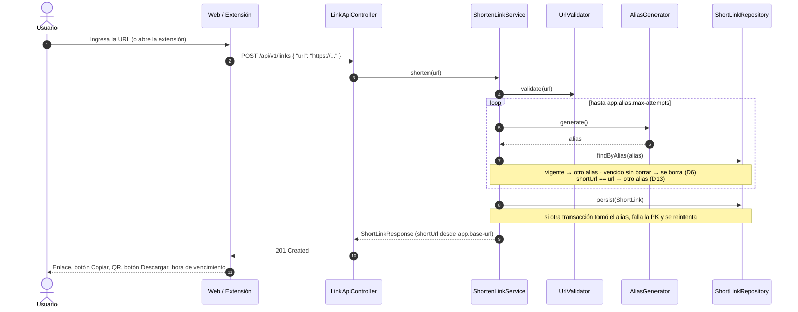
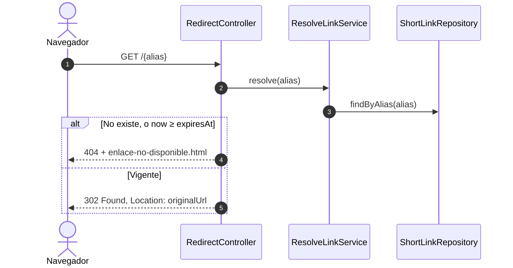
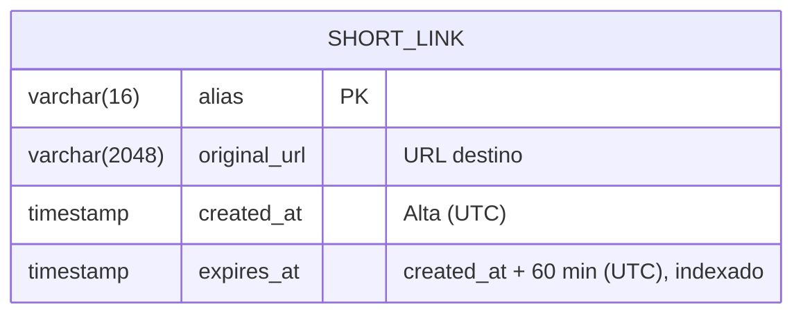
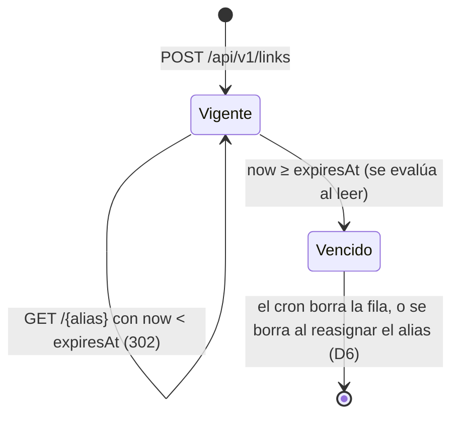

# Contexto del Proyecto – Link Shortener (TP PP6, Etapa 1)

**Proyecto:** Servicio de Acortamiento y Gestión de Enlaces (*Link Shortener*)
**Cátedra:** Paradigmas de Programación VI – 5to Año – Ingeniería en Informática (FIE)
**Equipo:** Martín Crespo (`dev/martin`) · Sofía Ramirez (`dev/sofia`) · Agustín Gimenez (`dev/agustin`)
**Repositorio:** https://github.com/martincrespo77/PP6-TPGrupo2
**Versión del documento:** v0.1 – consolidación inicial (07/10/2026)

> **Qué es este documento.** Es la **base única de contexto** del proyecto. Consolida la consigna (`TP_PP6_v1.0.md`), la minuta con las respuestas del cliente y las tres propuestas individuales (`ANALISIS_Y_ESPECIFICACION_ETAPA_1.md` de Martín, `propuesta-etapa1_agus.md` de Agustín y `propuesta-etapa1_sofia.md` de Sofía). Lo leen los integrantes y **cualquier asistente de IA** antes de trabajar. Si algo no está acá, no está decidido.

---

## 📑 Tabla de Contenidos

0. [Cómo usar este documento](#0-cómo-usar-este-documento)
1. [Datos del proyecto](#1-datos-del-proyecto)
2. [Requerimientos de la consigna (Etapa 1)](#2-requerimientos-de-la-consigna-etapa-1)
3. [Respuestas del Cliente (cerradas)](#3-respuestas-del-cliente-cerradas)
4. [Decisiones de diseño consolidadas](#4-decisiones-de-diseño-consolidadas)
5. [Divergencias entre propuestas y cómo se resolvieron](#5-divergencias-entre-propuestas-y-cómo-se-resolvieron)
6. [Preguntas abiertas](#6-preguntas-abiertas)
7. [Invariantes del sistema](#7-invariantes-del-sistema)
8. [Arquitectura](#8-arquitectura)
9. [Modelo de dominio y ciclo de vida del enlace](#9-modelo-de-dominio-y-ciclo-de-vida-del-enlace)
10. [Contrato de la API REST](#10-contrato-de-la-api-rest)
11. [Clientes: web y extensión](#11-clientes-web-y-extensión)
12. [Persistencia y configuración](#12-persistencia-y-configuración)
13. [Entornos y despliegue](#13-entornos-y-despliegue)
14. [Preparación para las Etapas 2 y 3](#14-preparación-para-las-etapas-2-y-3)
15. [Plan de verificación y QA](#15-plan-de-verificación-y-qa)
16. [Plan de trabajo por pasos](#16-plan-de-trabajo-por-pasos)
17. [Bitácora y registro de prompts](#17-bitácora-y-registro-de-prompts)
18. [Reglas de trabajo con la IA y prompts](#18-reglas-de-trabajo-con-la-ia-y-prompts)
19. [Roles del grupo y reglas de repositorio](#19-roles-del-grupo-y-reglas-de-repositorio)
20. [Backlog de recortes](#20-backlog-de-recortes)

---

## 0. Cómo usar este documento

### 0.1. Jerarquía de fuentes

Ante una contradicción, manda la fuente de mayor jerarquía:

1. **Consigna** (`TP_PP6_v1.0.md`).
2. **Respuestas del Cliente** (§3, códigos `C#`). Son cerradas: solo cambian si el Cliente las cambia.
3. **Decisiones del equipo** (§4, códigos `D#`). Se pueden revisar con el protocolo de §14.3.
4. **Recomendaciones** marcadas `🟡 A confirmar en grupo`. El equipo avanza con ellas mientras no haya otra decisión.

### 0.2. Convenciones

- `❓ Pendiente`: no está decidido. Ni la IA ni nadie lo da por hecho.
- `🟡 A confirmar en grupo`: hay una recomendación y el equipo avanza con ella, pero falta el OK de la puesta en común.
- **Origen** de cada decisión: `[M]` Martín · `[A]` Agustín · `[S]` Sofía · `[C#]` respuesta del Cliente · `[Nuevo]` surgió al consolidar.
- No se da por hecha ninguna cifra, endpoint ni comportamiento que no esté escrito acá.

---

## 1. Datos del proyecto

| Ítem | Valor | Origen |
|---|---|---|
| Entrega Etapa 1 | **12/10/2026** | [A][S][C17] |
| Entrega Etapa 2 (nuevos requerimientos) | 26/10/2026 | [A][S] |
| Entrega Etapa 3 (nuevos requerimientos) | 27/11/2026 | [S] |
| Contenido de la entrega Etapa 1 | Repositorio + paquete de la extensión + **registro de prompts**. Formato exacto: `❓ Pendiente` (Q1) | [C17] |
| Qué se evalúa | La **minuta de elucidación** y las **decisiones de diseño** | [C19] |
| Continuidad | Las Etapas 2 y 3 parten del código propio de la Etapa 1 (no hay código oficial del docente) | [C19] |
| Idioma | Solo español (documentación e interfaz). Código en inglés | [C19][A][S] |
| Stack obligatorio | Java, Spring Boot, JPA/Hibernate, API REST, cliente web | Consigna |
| Java | **25** (confirmado por el Cliente) | [C16] |
| Build | Gradle | [A][S] |
| Spring Boot / Gradle | Versión compatible con Java 25. **Se verifica en el Paso 0** (ver §5, R11) | [S] |
| Proyecto de referencia del profesor | `SpringBootProject`: Gradle, Spring Boot 3.4.3, Java 21, HSQLDB modo servidor, `@Service` con `EntityManager` + HQL, consola `jpql-console-starter` | [A][S] |

---

## 2. Requerimientos de la consigna (Etapa 1)

Resumen literal de `TP_PP6_v1.0.md`:

1. **Acortamiento:** recibir una URL válida y generar `http://{dominio_o_ip}/{alias}` con un alias único, **tan corto y memorizable como sea posible**.
2. **Dos canales:** una **página web** con un campo *dirección a acortar* y un botón **ACORTAR**, y un **complemento para Chrome y Firefox** que con solo tocarlo genere y muestre la dirección acortada.
3. **QR:** la web y el complemento muestran un código QR de la dirección acortada.
4. **Vigencia:** la URL acortada vale **60 minutos**. Después deja de redirigir, **queda disponible y puede ser reasignada**.
5. **Redirección** transparente vía HTTP/HTTPS a la URL original.
6. **Persistencia** con JPA/Hibernate sobre un motor relacional.
7. **Arquitectura cliente-servidor:** backend REST en Java + Spring Boot; cliente web que consume la API.

**Metodología por etapa:** elucidación → diseño y especificación (dominio, capas, OpenAPI, prompts) → implementación asistida por IA → QA (pruebas unitarias e integración, buenas prácticas REST y JPA).

**Regla del "Cliente Incierto":** las Etapas 2 y 3 traen cambios desconocidos. Se evalúa si el diseño los absorbe **sin reescrituras masivas** [C20].

**Criterio rector del diseño** (las tres propuestas coinciden): hacer lo mínimo que pide la consigna, pero **aislar detrás de una interfaz todo lo que el Cliente podría cambiar**: generación del alias, vencimiento, validación de URL, QR y motor de base. Un cambio futuro se resuelve con **una clase nueva más configuración**.

---

## 3. Respuestas del Cliente (cerradas)

Obtenidas en la elucidación (minuta registrada por Sofía). **Tienen prioridad sobre cualquier suposición de las propuestas.**

| # | Tema | Respuesta del Cliente |
|---|---|---|
| C1 | URL válida | Solo formato (regex), solo `http`/`https`. No se verifica que el sitio responda. **Se aceptan URLs al propio dominio del acortador, IPs privadas y localhost** |
| C2 | Alias | Automático por ahora, dejando abierta la posibilidad de uno personalizado. Los caracteres los define el equipo; debe ser fácil de recordar |
| C3 | Misma URL acortada dos veces | Alias distintos (distinto momento de creación y vencimiento) |
| C4 | Palabras reservadas | Las define el equipo |
| C5 | Vigencia | 60 minutos desde la creación, exactos. Sin extender ni período de gracia |
| C6 | Alias vencido | Página informativa, con redirección a nuestra página para crear un enlace nuevo |
| C7 | Accesos | Sin límite de accesos por enlace y sin contador |
| C8 | Cliente web | Muestra solo el enlace recién generado, sin historial |
| C9 | Usuarios | Sin usuarios por ahora. A futuro podría haberlos, para que cada uno gestione sus URLs |
| C10 | Extensión | Acorta la pestaña activa, usa la misma API, se instala solo en local (sin tiendas). En pestañas no http/https: botón deshabilitado con aviso. **La URL de la API no es configurable por ahora** |
| C11 | QR | PNG **descargable, con el alias como nombre de archivo**. Se genera donde sea mejor. **Sin copia automática** al portapapeles |
| C12 | Despliegue | **Local por ahora**; después, un VPS de un compañero. Para esta entrega alcanza en local |
| C13 | Disponibilidad | 24/7 mientras haya enlaces vigentes. **Los enlaces se conservan si el servicio se reinicia** |
| C14 | Seguridad y privacidad | **Sin HTTPS**, sin autenticación (API pública), sin requisitos de privacidad (uso similar a notes.io). Si el usuario cierra la pantalla sin copiar el enlace o descargar el QR, no puede recuperarlos |
| C15 | Tráfico | Bajo: app interna por el momento |
| C16 | Tecnología | Java 25. Motor de base y navegadores soportados: los define el equipo. Sin restricciones de infraestructura |
| C17 | Entrega | Repositorio, paquete de la extensión y registro de prompts. Fecha: 12/10/2026. Formato: desconocido |
| C18 | Calidad | Documentación básica de código. Versionado de API (`/api/v1`) deseable. Logging deseable si no complica. **Registro de prompts obligatorio**. Cobertura mínima: no definida |
| C19 | Evaluación y continuidad | Se evalúan la minuta de elucidación y las decisiones de diseño. Las Etapas 2 y 3 parten del código de la Etapa 1. Se puede volver a consultar decisiones previas. Idioma: solo español |
| C20 | Evolución | El Cliente no adelanta qué va a cambiar: se evalúa qué tan escalable es el diseño |

---

## 4. Decisiones de diseño consolidadas

### 4.1. Ciclo de vida y vencimiento

| # | Decisión | Motivo | Origen |
|---|---|---|---|
| D1 | `expiresAt = createdAt + 60 min`. El TTL vive en configuración (`app.link.ttl=60m`), fijo para todos los enlaces | C5; un TTL variable queda como punto de extensión | [M][A][S][C5] |
| D2 | **El vencimiento se evalúa siempre al leer**, comparando `expiresAt` con el `Clock`. Ninguna tarea programada es necesaria para que un enlace deje de redirigir | Entre dos corridas de una tarea, un enlace vencido seguiría redirigiendo | [M][A][S] |
| D3 | **Intervalo semiabierto `[createdAt, expiresAt)`**: en el instante exacto `expiresAt` el enlace **ya venció** | Sin esta definición, "60 minutos" admite dos lecturas y los tests de borde son ambiguos | [M] |
| D4 | Se usan `Instant` (UTC) y un **`Clock` inyectable**; nunca `LocalDateTime.now()` | Sin ambigüedad de zona horaria; los tests simulan "pasaron 61 minutos" sin esperar | [M][A][S] |
| D5 | **Los enlaces vencidos se borran físicamente** con una tarea programada (`@Scheduled`, cron configurable `app.cleanup.cron`, diaria por defecto). No hay historial | C7, C8 y C14: no hay contador, ni historial, ni requisitos de auditoría. Base chica y menos complejidad. 🟡 A confirmar en grupo (R1) | [S] |
| D6 | **Reasignación inmediata:** si el alias generado choca con una fila **vencida que el cron todavía no borró**, esa fila se borra **en la misma transacción** y el alias se reasigna. Si choca con una fila **vigente**, se genera otro alias | La consigna dice que el alias vencido "queda disponible y puede ser reasignado"; esto lo cumple sin esperar al cron. 🟡 A confirmar en grupo (R1) | [M][A] adaptado a [S] |
| D7 | Alias vencido o inexistente: **`404` con la misma página** ("Este enlace expiró o no existe") y un botón hacia la web para crear un enlace nuevo | C6. Con borrado físico, vencido e inexistente son indistinguibles. 🟡 A confirmar en grupo (R2) | [S][C6] |

### 4.2. Alias

| # | Decisión | Motivo | Origen |
|---|---|---|---|
| D8 | **5 caracteres**, alfabeto de **minúsculas y dígitos sin caracteres ambiguos** (sin `0`, `o`, `1`, `l`, `i`): 31 caracteres, 31⁵ ≈ **28,6 millones** de combinaciones. Largo y alfabeto configurables (`app.alias.length`, `app.alias.alphabet`) | C2 ("fácil de recordar"): corto, sin confusiones al dictarlo o copiarlo a mano. Sobra espacio para el tráfico esperado (C15) | [S] (base de [A]) |
| D9 | Generación aleatoria con `SecureRandom`, detrás de la estrategia `AliasGenerator` | Strategy: un alias personalizado o numérico es una clase nueva | [M][A][S] |
| D10 | **Palabras reservadas** configurables (`app.alias.reserved`): `api`, `admin`, `static`, `assets`, `error`, `expired`, `health`, `actuator`, `swagger`, `favicon.ico`, `index`. El generador nunca devuelve una | C4. Con el alfabeto de D8 y largo 5 ninguna es generable hoy, pero la regla protege ante un cambio de largo/alfabeto y ante el futuro alias personalizado | [S] |
| D11 | Colisión: se genera otro alias, **máximo 10 intentos** (`app.alias.max-attempts`); agotados, **`503`** con mensaje claro | Evita un bucle infinito | [M][A][S] |
| D12 | **Misma URL dos veces → dos alias distintos**, cada uno con sus 60 minutos | C3 | [M][A][S][C3] |
| D13 | **Bucle sobre sí mismo:** si la `shortUrl` a generar es igual a la URL destino, se descarta ese alias y se genera otro | C1 acepta URLs del propio dominio; esto evita el único caso de redirección infinita | [S] |
| D14 | Cadena A → B con B vencido: se acepta; el destino final deja de ser alcanzable. Se documenta | Consecuencia esperable de C1 | [S] |
| D15 | El alias en la ruta se restringe con la regex `[A-Za-z0-9]{1,16}` | No choca con `/api/**` ni con archivos estáticos (`/app.js` tiene punto) | [M][A][S] |

### 4.3. Validación de URL

| # | Decisión | Motivo | Origen |
|---|---|---|---|
| D16 | Válida = **solo `http://` o `https://`, con host, ≤ 2048 caracteres**, por formato (regex). No se consulta el destino | C1 | [S][C1] |
| D17 | **Se aceptan** URLs del propio acortador, de `localhost` y de IPs privadas | C1. El servidor nunca descarga la URL destino (solo la devuelve en `Location`), así que no hay riesgo de SSRF | [S][C1] (corrige [M] y [A]) |
| D18 | URL sin esquema (`drive.google.com/...`): **`400`** con el mensaje "La dirección debe empezar con http:// o https://". Sin normalización: se guarda tal cual | Coherente con la regex de C1 y lo más simple | [S] |
| D19 | Todos los errores de validación responden **`400`** (no se distingue 422) | Distinguir 400 de 422 no aporta información útil al cliente | [M] |

### 4.4. Redirección, QR y respuesta de la API

| # | Decisión | Motivo | Origen |
|---|---|---|---|
| D20 | Redirección **`302 Found`** con header `Location`. **Nunca `301`** | Un 301 queda en la caché del navegador y seguiría redirigiendo después del vencimiento. `307` no aporta nada (la redirección es siempre `GET`) | [M][A][S] |
| D21 | **El QR se genera solo en el backend** (ZXing), en un único endpoint que consumen la web y la extensión | Una sola implementación y un solo lugar que probar | [M][A][S] |
| D22 | Descarga del QR con `?download=true` → `Content-Disposition: attachment; filename="{alias}.png"` | C11. El atributo HTML `download` no funciona entre orígenes distintos (caso de la extensión) | [S][C11] |
| D23 | La `shortUrl` (y por lo tanto el QR) se arma **siempre desde `app.base-url`**, nunca desde los headers de la petición | Independiente de proxies y headers; pasar de local al VPS no toca código | [M][A][S] |
| D24 | La respuesta de creación incluye `expiresAt` **y** `secondsRemaining` | Los clientes calculan la cuenta regresiva con `secondsRemaining`, que no depende del reloj del dispositivo | [S] (ver R6) |
| D25 | Prefijo **`/api/v1`** | C18 lo considera deseable; un cambio incompatible sale como `/api/v2` sin romper la extensión instalada | [M][S][C18] |
| D26 | Errores con formato uniforme **ProblemDetail (RFC 7807)** vía `GlobalExceptionHandler` | Errores HTTP homogéneos; una excepción nueva es un `@ExceptionHandler` más | [M][A][S] |
| D27 | **Ningún endpoint lista enlaces.** No hay `GET /api/v1/links/{alias}` de metadatos en la Etapa 1 | C8 y C14: el enlace es el único "secreto". Los clientes solo usan la respuesta de creación | [S] (ver R5) |
| D28 | **Nunca se exponen entidades JPA** en la API: solo DTOs | Desacopla el JSON de la entidad | [M][A][S] |

### 4.5. Persistencia, configuración y operación

| # | Decisión | Motivo | Origen |
|---|---|---|---|
| D29 | **HSQLDB en modo archivo** (`./data/shortener`) | C13 (los enlaces sobreviven a un reinicio), sin servidor aparte, mismo motor que el ejemplo del profesor | [A][S] ([M] proponía HSQLDB o H2) |
| D30 | El **alias es la clave primaria** de `short_link`: la base garantiza la unicidad | Con borrado físico no hacen falta columnas extra (`active_alias`) ni índices parciales | [S] (reemplaza la solución de [M]) |
| D31 | Acceso a datos con **`EntityManager` + JPQL parametrizado, detrás del puerto `ShortLinkRepository`** | Estilo del proyecto del profesor; el puerto permite cambiar la implementación. 🟡 A confirmar en grupo (R8) | [A][S] |
| D32 | La creación usa **`persist`**, nunca `merge` | Con el alias como PK, un `merge` sobrescribiría en silencio un enlace vigente (ver I2) | [Nuevo] |
| D33 | Configuración con `@ConfigurationProperties` + `@Validated` (`AppProperties`). Si falta `app.base-url`, la app **no arranca** | Mejor fallar al iniciar que generar enlaces con un dominio equivocado | [M][A][S] |
| D34 | Un único `application.properties`; `app.base-url` se sobrescribe con la variable de entorno `APP_BASE_URL` al pasar al VPS | C12: solo hay un entorno en esta entrega. 🟡 A confirmar en grupo (R10) | [S] |
| D35 | Esquema con `ddl-auto=update` en la Etapa 1; migraciones versionadas cuando el esquema cambie (BL-003) | Una tabla no justifica Flyway todavía | [M][A] |
| D36 | **Logging SLF4J básico:** creación, redirección, 404 y cantidad de filas borradas por el cron | C18 (deseable si no complica) | [S] |
| D37 | Se mantiene la consola `jpql-console-starter` para mostrar consultas en la defensa | Herramienta del profesor | [A][S] |

### 4.6. Clientes

| # | Decisión | Motivo | Origen |
|---|---|---|---|
| D38 | Web en **HTML + JS sin framework**, servida por Spring Boot desde `static/`, con rutas relativas | Menos complejidad; mismo HTML en local y en el VPS | [M][A][S] |
| D39 | La web muestra **solo el último enlace generado**, en español, y se ve bien en móvil | C8, C19; D16 de [S] | [S] |
| D40 | Botón **Copiar** manual en web y extensión; sin copia automática | C11 | [M][A][S][C11] |
| D41 | Si el enlace vence con la pantalla abierta, la tarjeta pasa a estado **"vencido"** (enlace y QR deshabilitados) | Deja claro que el enlace ya no sirve | [S] |
| D42 | Extensión **WebExtension Manifest V3**, un solo código para Chrome y Firefox (`browser_specific_settings.gecko`) | Un solo mantenimiento | [M][A][S] |
| D43 | Al abrir el popup se acorta **la pestaña activa** sin pegar nada. En pestañas no http/https: botón **ACORTAR deshabilitado** con el aviso "Esta página no se puede acortar (solo http/https)" | C10 | [S][C10] |
| D44 | La URL de la API de la extensión es una **constante en `config.js`** (`http://localhost:8080`), sin página de opciones | C10 ("no configurable por ahora"). Al pasar al VPS se cambia y se reempaqueta | [S][C10] |
| D45 | CORS habilitado en `/api/**` para orígenes `chrome-extension://…` y `moz-extension://…` | La extensión llama desde otro origen | [M][A][S] |
| D46 | Navegadores: Chrome y Firefox actuales de escritorio | C16 (los define el equipo) | [S] |

---

## 5. Divergencias entre propuestas y cómo se resolvieron

Las filas marcadas 🟡 son recomendaciones con las que el equipo **avanza** hasta que la puesta en común diga otra cosa.

| # | Tema | Martín | Agustín | Sofía | Resolución |
|---|---|---|---|---|---|
| R1 | Enlaces vencidos | Soft delete `EXPIRADO` + historial | Marcar `EXPIRED` + historial | **Borrado con cron** | 🟡 **Borrado con cron** (D5) + **reasignación inmediata** al chocar con una fila vencida (D6). Motivo: C7, C8 y C14 eliminan la necesidad de historial; D6 cumple el "podrá ser reasignada" de la consigna. Costo: si en la Etapa 2 piden historial o estadísticas, hay que pasar a archivar (ver §14.2) |
| R2 | Respuesta de un alias vencido | `410` + página | `410` + página | **`404` único** + página | 🟡 **`404` único** (D7): con borrado físico no se pueden distinguir. Q5 lo valida con el Cliente |
| R3 | URL al propio acortador | Se rechaza (`400`) | Se rechaza | Se acepta | **Se acepta**: lo dijo el Cliente (C1). El bucle se evita con D13 |
| R4 | Alias | Base62, 6 caracteres | Base62 sin ambiguos, 5 | Minúsculas + dígitos sin ambiguos, 5 (31 símbolos) | **D8 (Sofía)**: es la más memorizable (C2) y ya es una decisión del equipo registrada en la minuta |
| R5 | Endpoint de metadatos `GET /api/v1/links/{alias}[/info]` | Sí | Sí | No | **No en la Etapa 1** (D27): ningún cliente lo usa (C8). Queda en BL-005 |
| R6 | "Tiempo restante" en la respuesta | No (el cliente lo calcula desde `expiresAt`) | No | `secondsRemaining` | **Se incluye** (D24): resuelve el desfase entre el reloj del servidor y el del dispositivo, que el argumento de Martín no cubría. El cliente lo cuenta desde el momento en que recibe la respuesta |
| R7 | Unicidad del alias | `id` autoincremental + columna `active_alias UNIQUE` | `id` + alias único entre activos | **Alias como PK** | **Alias como PK** (D30): con borrado físico, la solución de Martín ya no hace falta |
| R8 | Acceso a datos | Spring Data JPA | `EntityManager` + JPQL tras interfaz | `EntityManager` + JPQL tras interfaz | 🟡 **`EntityManager` + JPQL tras el puerto** (D31): alineado al profesor, 2 de 3 propuestas |
| R9 | Entornos | Perfiles `dev`/`prod` | `staging` local + **prod en `https://paradigmas6.agustingimenez.ar`** | Local; VPS futuro sin HTTPS | **Local en esta entrega** (C12), **sin HTTPS** (C14). El dominio de Agustín queda como candidato para el VPS (E3) |
| R10 | Perfiles de Spring | `dev`/`prod` | `staging`/`prod` | Un archivo + `APP_BASE_URL` | 🟡 **Un archivo + variable de entorno** (D34). Se agrega un perfil `vps` solo si el despliegue lo necesita |
| R11 | Versión de Java/Spring Boot | — | Java 21 + Spring Boot 3.4.3 (ejemplo) | Java 25 | **Java 25** (C16). Spring Boot 3.4.3 no lo soporta oficialmente. En el Paso 0 se verifica y se registra en la bitácora la versión de Spring Boot y de Gradle compatibles (candidatos: la última 3.5.x o 4.0.x de Spring Boot; Gradle 9.1 o superior) |
| R12 | Extensión: URL del backend | Configurable (`storage`) | Página de opciones | Constante en `config.js` | **Constante** (D44): lo dijo el Cliente (C10) |
| R13 | Cobertura | Indicador; lo importante son las mutaciones | ≥ 80 % | ≥ 70 % | 🟡 **≥ 70 % en `domain` + `application`** como indicador, **más** pruebas de mutación de las invariantes (§15.4). Q2 lo consulta |
| R14 | Rigor de QA | Invariantes, matriz EP/BVA, mutaciones, definición de "terminado" | Tests + checklist | Tests + checklist | **Se adopta el esquema de Martín** (§7, §15), adaptado a las decisiones de esta sección |
| R15 | Documentación por paso | ADR + documento | `BITACORA.md` | `BITACORA.md` **+ registro de prompts** | **`BITACORA.md` con registro de prompts** (obligatorio por C18) + **ADR** para las decisiones difíciles de revertir (§14.3) |
| R16 | Paquete raíz | `ar.edu.undef.fie.pp6` | `com.pp6.shortener` | `com.pp6.shortener` (a acordar) | `❓ Pendiente` (E6). Recomendación: `ar.edu.undef.fie.pp6.shortener` |
| R17 | QR fuera de rango de tamaño | — | Acotado 128..1024 | Acotado 128..1024 | Rango 128..1024 px, `size=256` por defecto. Fuera de rango: `❓ Pendiente` (E7). Recomendación: `400`, porque ajustarlo en silencio esconde el error |
| R18 | Regla de `git add` | Nunca `git add .` | — | — | El `README.md` actual usa `git add .`. **Se adopta la regla de Martín** y hay que actualizar el README (§19.2) |

---

## 6. Preguntas abiertas

### 6.1. Para el Cliente (con la suposición con la que se avanza)

| # | Pregunta | Suposición por defecto |
|---|---|---|
| Q1 | ¿Cuál es el formato de entrega de la Etapa 1? | Repositorio git, `.zip` de la extensión y carpeta `docs/` con la bitácora y el registro de prompts |
| Q2 | ¿Hay una cobertura mínima de pruebas esperada? | ≥ 70 % en `domain` + `application` |
| Q3 | ¿Hay un formato específico para el registro de prompts? | `docs/BITACORA.md`, una entrada por paso con los prompts usados (§17) |
| Q4 | ¿Alcanza con entregar la extensión sin firmar, cargada en modo desarrollador? (En Firefox la carga es temporal y se pierde al reiniciar el navegador) | Sí. El README explica cómo cargarla en ambos navegadores |
| Q5 | ¿Valida las decisiones propias D5 (borrado con cron), D7 (`404` único) y D20 (`302`)? | Se presentan como supuestos en la minuta y se pueden revisar |
| Q6 | "Página informativa **con redirección** a nuestra página" (C6): ¿alcanza con un botón, o debe redirigir sola después de unos segundos? | Botón "Crear un enlace nuevo"; sin redirección automática |
| Q7 | Si alguien escribe el alias en mayúsculas (`XT3SE`), ¿debe funcionar? | Sí: como el alfabeto es solo minúsculas, el alias se normaliza a minúsculas antes de buscarlo. 🟡 A confirmar |

### 6.2. Para el equipo

| # | Pregunta | Suposición por defecto |
|---|---|---|
| E1 | ¿Qué hay en el VPS (SO, Java 25, Docker)? ¿Quién tiene acceso y hace el deploy? | Linux con Java 25; el dueño del VPS hace el deploy (Agustín se ofreció como responsable) |
| E2 | ¿Qué versión de Spring Boot y de Gradle soporta Java 25? | Se verifica antes de cerrar el Paso 0 (R11) |
| E3 | ¿El VPS usa dominio o IP? ¿Puerto 80 u 8080? | Candidato: `paradigmas6.agustingimenez.ar`. Sin HTTPS (C14); puerto 8080 salvo que haya proxy |
| E4 | ¿Los alias quedan en la raíz del dominio (`/xt3se`)? | Sí, dominio o IP dedicados al TP |
| E5 | ¿Deploy manual o automático? | Manual con script; fuera del alcance de la Etapa 1 |
| E6 | Nombre del paquete raíz | `ar.edu.undef.fie.pp6.shortener` (R16) |
| E7 | QR con `size` fuera de 128..1024 | `400` (R17) |
| E8 | Herramienta de pruebas en navegador | Verificación manual con capturas en la Etapa 1; Playwright si sobra tiempo |
| E9 | ¿Swagger UI y logs SQL activos en el VPS? | Activos en local; en el VPS se decide al desplegar |
| E10 | Reparto de roles y fechas por paso | Propuesta en §16 y §19 |
| E11 | Confirmar las recomendaciones 🟡 de §5 (R1, R2, R8, R10, R13) | Se avanza con ellas |

---

## 7. Invariantes del sistema

Una **invariante** es una regla cuyo incumplimiento es un incidente, no un bug menor. Cada una debe **fallar cerrado** (ante la duda, no redirige), vivir en **la capa más baja posible** y tener **un test que la rompa a propósito** (§15.4).

| ID | Invariante | Dónde se sostiene | Casos que la prueban |
|---|---|---|---|
| **I1** | Un enlace **nunca redirige si `now ≥ expiresAt`**, haya corrido o no el cron | Método de dominio `isExpired(Instant now)`, evaluado en cada lectura | TC-03, TC-04 |
| **I2** | **Como máximo un enlace por alias**, incluso con pedidos simultáneos; una creación **nunca sobrescribe** un enlace vigente | Alias como PK + `persist` (nunca `merge`) + reintento ante `DataIntegrityViolationException` | TC-21, TC-31 |
| **I3** | La redirección **nunca es un 301** | `RedirectController` | TC-32 |
| **I4** | La `shortUrl` y el QR se arman **siempre desde `app.base-url`**, nunca desde los headers de la petición | Servicio de creación / mapper de respuesta | TC-33, TC-50 |
| **I5** | **Ningún secreto en el repositorio** (credenciales, `.env`) | Variables de entorno + `.gitignore` + revisión de `git status` antes de cada commit | Revisión |
| **I6** | **El cron nunca borra un enlace vigente** | Consulta `deleteExpiredBefore(now)` con condición `expiresAt <= now` | TC-41, TC-42 |
| **I7** | **Ningún endpoint lista enlaces** ni devuelve una URL destino sin conocer su alias | Contrato de la API (§10) | TC-36 |

**Límite documentado de I1:** depende de que el reloj del servidor esté bien. Un reloj atrasado alarga la vida de los enlaces; tener el reloj sincronizado (NTP) es un requisito de despliegue.

---

## 8. Arquitectura

### 8.1. Vista general

```text
[Página web]   [Extensión Chrome/Firefox]
       \               /
        \   HTTP/JSON /
         v           v
  ┌───────────── Backend Spring Boot ─────────────┐
  │ web        : controllers REST + redirección   │
  │ application: casos de uso (servicios)         │
  │ domain     : entidad + interfaces (puertos)   │
  │ infra      : JPA, alias, QR, validación, cron │
  └───────────────────────┬───────────────────────┘
                          v
                HSQLDB modo archivo (JPA/Hibernate)
```

**Regla de dependencias:** `web → application → domain ← infrastructure`. El dominio no conoce Spring MVC, ni ZXing, ni HSQLDB.

### 8.2. Paquetes

Paquete raíz provisorio: `<raíz>` = `ar.edu.undef.fie.pp6.shortener` (`❓ Pendiente`, E6).

```text
<raíz>
├── ShortenerApplication.java
├── config/            AppProperties (@ConfigurationProperties + @Validated), ClockConfig, CorsConfig
├── domain/
│   ├── model/         ShortLink (@Entity)
│   ├── port/          AliasGenerator, ExpirationPolicy, UrlValidator, QrCodeGenerator, ShortLinkRepository
│   └── exception/     InvalidUrlException, LinkNotAvailableException, AliasExhaustedException
├── application/       ShortenLinkService, ResolveLinkService, ExpiredLinksCleanupService
├── infrastructure/
│   ├── persistence/   JpaShortLinkRepository (EntityManager + JPQL)
│   ├── alias/         RandomAliasGenerator
│   ├── expiration/    FixedTtlExpirationPolicy
│   ├── validation/    RegexUrlValidator
│   ├── qr/            ZxingQrCodeGenerator
│   └── scheduling/    ExpiredLinksCleanupJob (@Scheduled)
└── web/
    ├── api/           LinkApiController + dto/ (ShortenRequest, ShortLinkResponse)
    ├── redirect/      RedirectController
    └── error/         GlobalExceptionHandler (ProblemDetail RFC 7807)

src/main/resources/static/   index.html, app.js, styles.css, enlace-no-disponible.html
browser-extension/           manifest.json, popup.html, popup.js, config.js
docs/                        BITACORA.md, adr/, minutas/
```

> **Nota sobre `ShortLink` con `@Entity` en `domain/model`:** es una concesión pragmática compartida por las tres propuestas (una sola tabla, estilo del profesor). Si en una etapa futura el modelo crece, se separa en entidad de dominio + entidad JPA con un mapper.

### 8.3. Diagrama de secuencia: acortamiento



### 8.4. Diagrama de secuencia: redirección



---

## 9. Modelo de dominio y ciclo de vida del enlace

### 9.1. Entidad `ShortLink` (tabla `short_link`)

| Campo | Tipo | Nota |
|---|---|---|
| `alias` | String(16) | **Clave primaria**. La base garantiza la unicidad (I2) |
| `originalUrl` | String(2048) | URL destino, guardada tal cual |
| `createdAt` | Instant | Alta (UTC), tomada del `Clock` |
| `expiresAt` | Instant | `createdAt + TTL`, calculado por `ExpirationPolicy`. **Indexado** para el cron |

**Método de dominio:** `isExpired(Instant now)` devuelve `!now.isBefore(expiresAt)`. La regla "¿está vencido?" vive en la entidad, no en el controller.



### 9.2. Ciclo de vida



- "Vencido" **no es un estado guardado**: se deduce de `expiresAt` en cada lectura (D2).
- Mientras la fila vencida no se borra, responde igual que un alias inexistente (`404`, D7).

### 9.3. Privacidad

El enlace es el único "secreto": no hay cuentas y ningún endpoint lista enlaces (I7). Nadie debería acortar información sensible (C14). La comparación con notes.io es la referencia que dio el Cliente.

---

## 10. Contrato de la API REST

Se documenta con **springdoc-openapi / Swagger UI**. Fechas en **UTC, ISO-8601**. Errores en **ProblemDetail** (`type`, `title`, `status`, `detail`).

| Método y ruta | Qué hace | Respuestas |
|---|---|---|
| `POST /api/v1/links` | Crea un enlace acortado | `201` · `400` URL inválida · `503` sin alias tras N intentos |
| `GET /{alias}` | Redirección | `302` · `404` (página "Este enlace expiró o no existe") |
| `GET /api/v1/links/{alias}/qr?size=256&download=false` | PNG del QR de la `shortUrl` | `200 image/png` · `404` si no existe o venció · `400` `size` fuera de rango (E7) |
| `GET /` | Página web (estática) | `200` |

### 10.1. `POST /api/v1/links`

**Request:**

```json
{ "url": "https://drive.google.com/drive/folders/1a2b3c4d5e6f7g8h9?usp=sharing" }
```

**Response `201 Created`** (`http://localhost:8080` sale de `app.base-url`):

```json
{
  "alias": "xt3se",
  "shortUrl": "http://localhost:8080/xt3se",
  "originalUrl": "https://drive.google.com/drive/folders/1a2b3c4d5e6f7g8h9?usp=sharing",
  "createdAt": "2026-10-08T12:00:00Z",
  "expiresAt": "2026-10-08T13:00:00Z",
  "secondsRemaining": 3600,
  "qrUrl": "http://localhost:8080/api/v1/links/xt3se/qr"
}
```

- `400`: vacía o nula, sin esquema, esquema no soportado, sin host, más de 2048 caracteres. Mensaje claro en `detail`.
- `503`: se agotaron los `app.alias.max-attempts` intentos.

### 10.2. `GET /{alias}`

- Ruta restringida a `[A-Za-z0-9]{1,16}` (D15). El alias se normaliza a minúsculas antes de buscarlo (Q7, 🟡).
- Vigente: **`302 Found`** con `Location: <originalUrl>`.
- No existe o venció: **`404`** con `enlace-no-disponible.html` ("Este enlace expiró o no existe" + botón "Crear un enlace nuevo").

### 10.3. `GET /api/v1/links/{alias}/qr`

- `200`, `Content-Type: image/png`. La imagen codifica **exactamente** la `shortUrl` (I4).
- `size` entre 128 y 1024 (por defecto 256).
- `download=true` agrega `Content-Disposition: attachment; filename="{alias}.png"` (D22).
- `404` si el alias no existe o venció.

---

## 11. Clientes: web y extensión

### 11.1. Cliente web

- HTML5 + JavaScript sin framework, CSS liviano propio. Servido desde `static/`, con rutas relativas (`/api/v1/links`). Todo en español. Se ve bien en móvil.
- **Componentes:** campo *Dirección a acortar* (con `<label>`), botón **ACORTAR**, y una tarjeta de resultado con:
  - el enlace corto y el botón **Copiar**;
  - el **QR** (`` apuntando a `qrUrl`, con texto alternativo) y el botón **Descargar QR** (`{alias}.png`);
  - la **hora de vencimiento** en hora local.
- Muestra **solo el último enlace generado** (C8).
- **Estados obligatorios:** inicial · cargando · error de validación (`400`, con el mensaje del servidor) · sin alias disponibles (`503`) · resultado · **vencido** (un `setTimeout` calculado con `secondsRemaining` deshabilita el enlace y el QR y avisa). Ningún error muestra trazas técnicas.
- **Accesibilidad mínima:** `lang="es"`, `<label>` asociado al campo, mensajes de estado con `role="status"`.

### 11.2. Extensión Chrome y Firefox (Manifest V3)

- `manifest.json` Manifest V3 (`action`, `permissions: ["activeTab"]`, `host_permissions` hacia el backend) con `browser_specific_settings.gecko`. Un solo código.
- Al abrir el popup toma la URL de la pestaña activa (`tabs.query({ active: true, currentWindow: true })`):
  - si es `http`/`https`, llama a `POST /api/v1/links` y muestra enlace, QR, hora de vencimiento, **Copiar** y **Descargar QR**, con el mismo estado "vencido" que la web;
  - si no lo es (`chrome://`, `about:`, nueva pestaña), muestra **ACORTAR** deshabilitado y el aviso "Esta página no se puede acortar (solo http/https)".
- La URL de la API es una constante en `config.js` (`http://localhost:8080`).
- Se instala en **modo desarrollador** (Chrome) y como **complemento temporal** (Firefox). Se entrega como carpeta y `.zip`.

---

## 12. Persistencia y configuración

### 12.1. Persistencia

- HSQLDB en modo archivo (`./data/shortener`), excluido por `.gitignore`.
- Tipos SQL estándar (`VARCHAR`, `TIMESTAMP`), compatibles con HSQLDB, H2 y PostgreSQL: cambiar de motor es cambiar configuración y driver.
- Índice explícito sobre `expires_at` para el borrado del cron.
- Los timestamps salen del `Clock` inyectado, nunca de la base.
- Puerto `ShortLinkRepository`: `persist`, `findByAlias`, `deleteByAlias`, `deleteExpiredBefore(Instant)` (devuelve la cantidad borrada).

### 12.2. Propiedades (`application.properties`)

| Propiedad | Valor por defecto | Origen |
|---|---|---|
| `app.base-url` | `http://localhost:8080` (en el VPS, `APP_BASE_URL`) | D23, D34 |
| `app.link.ttl` | `60m` | D1 |
| `app.alias.length` | `5` | D8 |
| `app.alias.alphabet` | `abcdefghjkmnpqrstuvwxyz23456789` (31 caracteres) | D8 |
| `app.alias.reserved` | `api,admin,static,assets,error,expired,health,actuator,swagger,favicon.ico,index` | D10 |
| `app.alias.max-attempts` | `10` | D11 |
| `app.cleanup.cron` | diario (por ejemplo `0 0 3 * * *`) | D5 |
| `spring.datasource.url` | `jdbc:hsqldb:file:./data/shortener` | D29 |
| `spring.jpa.hibernate.ddl-auto` | `update` | D35 |
| `spring.jpa.show-sql` | `true` en local | [A][S] |

---

## 13. Entornos y despliegue

| | Local (Etapa 1) | VPS (futuro) |
|---|---|---|
| URL | `http://localhost:8080` | `http://{ip_o_dominio}` (E3) |
| Configuración | `application.properties` | Mismo archivo; `APP_BASE_URL` por variable de entorno |
| Base | HSQLDB modo archivo `./data/shortener` | Igual, en un directorio que sobreviva a los redeploys |
| HTTPS | No | No (C14) |
| Datos | Descartables | No se pierden entre deploys |
| Empaquetado | `gradlew bootJar` (JAR único) | Igual; `Dockerfile` opcional |

- Pasar de local al VPS **no toca código**: solo `app.base-url` y la constante de la extensión.
- El cron requiere `@EnableScheduling`.
- Si en el futuro hay un proxy delante, se agrega `server.forward-headers-strategy=framework`; igual la `shortUrl` no depende del proxy (I4).
- El **despliegue en el VPS queda fuera de la Etapa 1** (C12). Si se hace, conviene hacerlo apenas funcione la redirección, para detectar temprano los problemas de infraestructura [A].

---

## 14. Preparación para las Etapas 2 y 3

### 14.1. Patrones y puntos de extensión

| Patrón / principio | Dónde | Qué cambio futuro absorbe |
|---|---|---|
| **Strategy** | `AliasGenerator` | Alias personalizado, numérico o secuencial: una clase nueva y una línea de config |
| **Strategy** | `ExpirationPolicy` | TTL por enlace o por usuario, enlaces permanentes, vencimiento por cantidad de usos |
| **Strategy** (+ Decorator) | `UrlValidator` | Lista negra de dominios, más esquemas, filtros anti-abuso |
| **Puertos y adaptadores** | `ShortLinkRepository`, `QrCodeGenerator` | Cambiar de base o de librería de QR sin tocar los servicios |
| **DTO** | `web/api/dto` | Cambiar el JSON sin tocar la entidad, y viceversa |
| **`Clock` inyectable** | Servicios, política de expiración y cron | Probar el vencimiento sin esperar |
| **Configuración externa** | `AppProperties` | Dominio, TTL, alias, palabras reservadas y cron sin recompilar |
| **Manejador global de errores** | `GlobalExceptionHandler` | Una excepción nueva es un `@ExceptionHandler` más |
| **Versionado de la API** | `/api/v1` | Un cambio incompatible sale como `/api/v2` |
| **Eventos de dominio** (punto de extensión, no se implementa) | `ResolveLinkService` publicaría `LinkAccessedEvent` | Estadísticas: un listener nuevo sin tocar la redirección |
| SOLID (SRP, OCP, DIP) | Todo el diseño | Extender agregando clases, no modificando las existentes |

### 14.2. Cambios probables ("volantazos")

| Cambio probable | Dónde impacta | Qué hay que hacer |
|---|---|---|
| Alias personalizado | `AliasGenerator` + DTO | Campo opcional en el request; validar disponibilidad y palabras reservadas |
| TTL por enlace o enlaces permanentes | `ExpirationPolicy` + DTO | Nueva implementación y campo opcional. `expiresAt` nulo = permanente (el cron solo borra los no nulos) |
| Extender o renovar un enlace | Caso de uso nuevo | `PATCH` que actualiza `expiresAt` |
| Eliminar un enlace manualmente | Endpoint nuevo | `DELETE /api/v1/links/{alias}` |
| Usuarios / "mis enlaces" | Entidad `User`, columna `ownerId` nullable | Spring Security; los servicios no cambian su lógica. **Ojo:** el cron borra; un historial por usuario exige archivar en vez de borrar (revisar D5) |
| Estadísticas de clics | Entidad `ClickEvent`, evento en `ResolveLinkService` | Un evento por redirección + endpoint de reportes. Definir qué pasa con los eventos cuando se borra el enlace (revisar D5) |
| Vencimiento por cantidad de usos / un solo uso | `ExpirationPolicy` + contador | Sin tocar los controllers |
| Enlaces con contraseña | Campo en `ShortLink` + página intermedia | Cambio acotado en `ResolveLinkService` |
| Rate limiting / anti-abuso / lista negra | `UrlValidator` o filtro web | Implementación nueva o decorador |
| Previsualizar el destino | `RedirectController` | Página intermedia opcional |
| QR personalizado o SVG | `QrCodeGenerator` | Implementación nueva + parámetro |
| Dominio propio y HTTPS | `app.base-url` + reverse proxy | Configuración, sin código |
| Cambiar a PostgreSQL/MySQL | Configuración + driver | Nada de código (JPA) |
| Varias instancias del servicio | Cron y alias | La PK ya evita duplicados; el cron debe correr en una sola instancia (lock) |
| Otro cliente (app móvil, bot) | Ninguno | La API ya es el contrato |
| Autenticación con tokens | Filtro de seguridad | Spring Security, sin tocar los servicios |
| Otros idiomas | Cliente web | Archivo de textos por idioma |

### 14.3. Protocolo cuando llega un cambio

| Situación | Qué se hace | Qué **no** se hace |
|---|---|---|
| El requisito cambia antes de implementar | Se actualiza **primero** este documento, después el código | Implementar y "arreglar después" |
| Cambia durante la implementación | Se interrumpe, se actualiza la especificación y se retoma desde el punto del cambio | Parchear el código sin tocar la especificación |
| Una decisión registrada resultó incorrecta | **ADR nuevo que reemplaza al anterior**; el viejo queda "Superado por ADR-NNNN" | Editar o borrar el ADR viejo |
| Aparece una ambigüedad que cambia un criterio | Pregunta nueva (`Q#` o `E#`) con recomendación, y se espera la decisión | Que la IA lo resuelva a su criterio |
| Un cambio del Cliente afecta una decisión `D#` | Se marca la decisión y se consulta de nuevo al Cliente (C19 lo permite) | Asumir que la decisión vieja sigue valiendo |

Se registra un **ADR** (`docs/adr/NNNN-slug.md`: contexto, decisión, alternativas, consecuencias, estado) cuando la decisión es **difícil de revertir, sorprendente sin contexto y fruto de un trade-off real**. ADR iniciales:

- **ADR-0001:** el vencimiento se evalúa al leer, con intervalo semiabierto (D2, D3).
- **ADR-0002:** borrado físico de vencidos con cron y reasignación inmediata (D5, D6), en lugar de soft delete.
- **ADR-0003:** alias como clave primaria y creación con `persist` (D30, D32).
- **ADR-0004:** QR generado solo en el backend (D21).
- **ADR-0005:** HSQLDB en modo archivo, cambiable por configuración (D29).
- **ADR-0006:** `404` único para vencido e inexistente (D7).

---

## 15. Plan de verificación y QA

### 15.1. Capas de verificación

| Capa | Herramienta | Qué atrapa que las otras no |
|---|---|---|
| Unitarias | JUnit 5 + Mockito, `Clock` fijo | Alias, política de expiración, validación de URL, servicios |
| Integración | `@SpringBootTest` + MockMvc, `@DataJpaTest` | Contrato HTTP, códigos de estado, consultas JPQL |
| Contra el motor real | Tests de repositorio sobre HSQLDB modo archivo | Comportamiento de la PK, del índice y de la persistencia entre reinicios |
| Concurrencia | Dos hilos / dos transacciones reales | Que I2 resista pedidos simultáneos |
| En navegador | Manual con capturas en Chrome y Firefox (Playwright opcional, E8) | CORS, render del QR, Copiar, estado "vencido" |
| Mutaciones | A mano, en cada paso que toque una invariante | Tests que pasan sin poder fallar |
| Verificación real | `curl -I`, consulta a la base, QR escaneado con un celular | Lo que ningún test modela |

**Cobertura:** JaCoCo, objetivo ≥ 70 % en `domain` + `application` (R13). **No reemplaza** a las mutaciones: un test que no puede fallar suma cobertura y no protege nada.

### 15.2. Matriz de casos de prueba (partición de equivalencia + valores límite)

**Semántica de bordes:** el enlace es válido en `[createdAt, expiresAt)`; en `createdAt + 60:00.000` **ya venció**. URL: máximo 2048 caracteres, inclusive.

Cada ID se mapea **1 a 1** con un test `tcNN_descripcion`, agrupado por requisito (`@Nested` + `@DisplayName`). Los huecos de numeración son intencionales.

#### Grupo A — Vencimiento y redirección (TTL = 60 min, `Clock` fijo)

| ID | Escenario | Instante / entrada | Resultado esperado | Justificación |
|---|---|---|---|---|
| TC-01 | Recién creado | `createdAt` | **302** a `originalUrl` | Borde inferior válido |
| TC-02 | Justo antes de vencer | `createdAt + 59:59.999` | **302** | Máximo − 1 |
| TC-03 | Instante exacto de vencimiento | `createdAt + 60:00.000` | **404** | Intervalo semiabierto (I1) |
| TC-04 | Vencido con la fila todavía presente | `createdAt + 61:00`, cron sin correr | **404** | I1 no depende del cron |
| TC-05 | Alias que nunca existió | — | **404**, **misma página** que TC-04 | D7 |
| TC-06 | Alias en mayúsculas | `XT3SE` con `xt3se` vigente | **302** | Q7 (🟡) |

#### Grupo B — Validación de la URL destino

| ID | Escenario | Entrada | Resultado esperado | Justificación |
|---|---|---|---|---|
| TC-10 | `https` típica | `https://drive.google.com/...` | **201** | Clase válida |
| TC-11 | `http` | `http://ejemplo.com` | **201** | Segundo esquema |
| TC-12 | Esquema no soportado | `ftp://ejemplo.com` | **400** | Clase inválida: esquema |
| TC-13 | Sin esquema / texto suelto | `drive.google.com/x` · `hola mundo` | **400** con el mensaje de D18 | D18 |
| TC-14 | Vacía o nula | `""` / `null` | **400** | Clase inválida: vacío |
| TC-15 | Longitud máxima | 2048 caracteres | **201** | Valor límite |
| TC-16 | Longitud máxima + 1 | 2049 caracteres | **400** | Máximo + 1 |
| TC-17 | Apunta al propio acortador | `{app.base-url}/abcde` | **201** | C1 |
| TC-18 | Esquema sin host | `https://` | **400** | Clase inválida: sin host |
| TC-19 | Localhost o IP privada | `http://localhost:3000` · `http://192.168.1.10/x` | **201** | C1 |

#### Grupo C — Generación y reasignación del alias

| ID | Escenario | Estado previo | Resultado esperado | Justificación |
|---|---|---|---|---|
| TC-20 | Formato | — | 5 caracteres del alfabeto de 31 | D8 |
| TC-21 | Colisión con un vigente | Alias X vigente | Se reintenta; X **no se modifica** | I2 |
| TC-22 | Colisión con un vencido sin borrar | Alias X vencido, fila presente | Se reasigna X; la fila vieja se reemplaza en la misma transacción | D6 |
| TC-23 | Se agotan los intentos | Generador que siempre colisiona | **503** | D11 |
| TC-24 | Misma URL dos veces | URL U vigente | Dos alias distintos, cada uno con sus 60 min | C3 |
| TC-25 | Bucle sobre sí mismo | URL destino = `{app.base-url}/{alias generado}` | Se descarta ese alias y se genera otro | D13 |
| TC-26 | Palabras reservadas | Config con largo/alfabeto que permitan `index` | Nunca se genera una palabra reservada | D10 |

#### Grupo D — Invariantes y atomicidad

| ID | Escenario | Acción | Verificación posterior |
|---|---|---|---|
| TC-30 | Rechazo sin efectos | `POST` con URL inválida | La cantidad de filas no cambió |
| TC-31 | Alias simultáneo | Dos transacciones reales crean el mismo alias en paralelo | Una fila por alias; ambas creaciones responden 201 con alias distintos (I2) |
| TC-32 | Nunca 301 | Redirección de un vigente | Status 302, nunca 301 (I3) |
| TC-33 | URL corta independiente del request | `POST` con un header `Host` distinto | `shortUrl` empieza con `app.base-url` (I4) |
| TC-35 | Persistencia entre reinicios | Crear, reiniciar el contexto sobre el mismo archivo, redirigir | 302 (C13) |
| TC-36 | Sin listado | `GET /api/v1/links` | No devuelve enlaces (`404`/`405`) (I7) |

#### Grupo E — Limpieza (cron)

| ID | Escenario | Estado previo | Resultado esperado | Justificación |
|---|---|---|---|---|
| TC-40 | Borra vencidos | Filas con `expiresAt < now` | Borradas; devuelve la cantidad | D5 |
| TC-41 | No toca vigentes | Filas con `expiresAt > now` | Intactas | I6 |
| TC-42 | Borde | `expiresAt == now` y `expiresAt == now + 1 ms` | La primera se borra; la segunda no | D3 + I6 |

#### Grupo F — QR

| ID | Escenario | Entrada | Resultado esperado | Justificación |
|---|---|---|---|---|
| TC-50 | El QR codifica la URL corta | `GET .../qr` + decodificación con ZXing | Contenido == `shortUrl` | I4 |
| TC-51 | Descarga | `download=true` | `Content-Disposition: attachment; filename="{alias}.png"` | D22 |
| TC-52 | QR de vencido o inexistente | — | **404** | D7 |
| TC-53 | Tamaño fuera de rango | `size=64` · `size=2048` | **400** (E7, 🟡) | R17 |

#### Grupo G — Respuesta

| ID | Escenario | Resultado esperado | Justificación |
|---|---|---|---|
| TC-60 | Tiempo restante | Con `Clock` fijo en `createdAt`: `secondsRemaining == 3600` y `expiresAt == createdAt + 60 min` | D24 |
| TC-61 | Sin entidades expuestas | El JSON tiene exactamente los campos de §10.1 | D28 |

**Total: 38 IDs** (A = 6, B = 10, C = 7, D = 6, E = 3, F = 4, G = 2). Aparte quedan el test de carga de contexto y los de controller que no son casos de negocio.

### 15.3. Criterios de aceptación de la Etapa 1

1. Una URL válida devuelve 201 con un alias único de 5 caracteres del alfabeto definido y `expiresAt = createdAt + 60 min`.
2. Una URL inválida (`ftp://`, sin esquema, texto suelto, vacía, de más de 2048 caracteres) devuelve 400 con un mensaje claro. Una URL al propio dominio, a localhost o a una IP privada se acepta.
3. `GET /{alias}` vigente devuelve 302 a la URL original.
4. `GET /{alias}` a los 60:00 o más devuelve 404, aunque la fila todavía no se haya borrado, y el alias puede reasignarse.
5. Un alias inexistente devuelve 404 con la misma página que uno vencido.
6. Acortar dos veces la misma URL devuelve dos alias distintos.
7. El QR decodificado es igual a `shortUrl`, escaneado con un celular lleva a la URL original, y la descarga se llama `{alias}.png`.
8. El cron borra los enlaces vencidos y no toca los vigentes.
9. Ante una colisión se genera otro alias; superado el tope de intentos, 503.
10. La API nunca devuelve entidades JPA ni lista enlaces.
11. Tras reiniciar el servicio, los enlaces vigentes siguen funcionando.
12. La extensión, cargada en Chrome y en Firefox, acorta la pestaña activa con un clic y muestra el enlace, el QR, Copiar y la hora de vencimiento; en una pestaña no http/https muestra el botón deshabilitado con el aviso.
13. La web muestra todos los estados de §11.1, incluido "vencido".

### 15.4. Pruebas de mutación de las invariantes

En cada paso que toque una invariante se **rompe la regla a propósito**, se corren los tests y se comprueba que **alguno falla**. Después se restaura el archivo **desde una copia**, no con `git checkout`, para no perder cambios sin commitear.

| Invariante | Mutación | Debe fallar |
|---|---|---|
| I1 | `!now.isBefore(expiresAt)` → `now.isAfter(expiresAt)` | TC-03 |
| I1 | Ignorar `isExpired` en `ResolveLinkService` | TC-03, TC-04 |
| I2 | `persist` → `merge` en la creación | TC-21, TC-31 |
| I2 | Quitar el reintento ante `DataIntegrityViolationException` | TC-31 |
| I3 | 302 → 301 | TC-32 |
| I4 | Armar `shortUrl` desde el request | TC-33 |
| I6 | `expiresAt <= now` → sin condición, o `>=` | TC-41, TC-42 |

Si una mutación sobrevive, la regla **no está protegida**, diga lo que diga la cobertura.

### 15.5. Definición de "terminado"

Un paso no está terminado porque compila y los tests dan verde. Está terminado cuando tiene **todas** sus evidencias:

| Código | Evidencia |
|---|---|
| **T** | Tests en verde, incluidos los `TC-xx` del paso, con la salida real de `gradlew build` |
| **M** | Mutaciones de las invariantes que toca el paso, todas detectadas |
| **E2E** | Prueba en navegador (pasos de web y extensión), con captura |
| **V** | Verificación contra la app levantada (curl, consulta a la base, QR escaneado) |
| **A** | Aceptación de **un integrante que no construyó el paso**: "OK" + nombre + fecha |
| **D** | Entrada en `docs/BITACORA.md` con el registro de prompts (y ADR si corresponde) |

Si falta una evidencia, el paso queda **⛔ Bloqueado (motivo)**, nunca ✅. Estados: ⬜ Pendiente · 🔶 En curso · ✅ Cerrado · ⛔ Bloqueado · ❓ Requiere decisión.

Nada se declara "terminado" a secas: se escribe **"completo en `<entorno>`, pendiente `<lista>`"**.

---

## 16. Plan de trabajo por pasos

**No se arranca un paso sin el anterior cerrado** con sus evidencias (§15.5). Cada paso es un commit propio.

> **Calendario:** la entrega es el **12/10/2026** y hoy (07/10) no hay código. El calendario original de Agustín (Paso 0 el 05/10) ya quedó atrás. Las fechas de abajo son una **propuesta comprimida**, a confirmar en la puesta en común (E10).

| Paso | Fecha propuesta | Entregable | Evidencia de cierre |
|---|---|---|---|
| 0 | 08/10 | Proyecto Gradle (Java 25 + Spring Boot compatible, R11), dependencias, paquetes de §8.2, `AppProperties`, `Clock`, `application.properties` de §12.2, `.gitignore` (`./data`, `.env`), README, `docs/BITACORA.md`, ADR-0001 a 0006 | Test de carga de contexto; `gradlew bootRun` levanta; versión de Spring Boot/Gradle registrada |
| 1 | 08/10 | Dominio + persistencia: `ShortLink`, puerto `ShortLinkRepository`, `JpaShortLinkRepository` | `@DataJpaTest` contra HSQLDB: guardar, buscar, borrar vencidos; TC-35 |
| 2 | 09/10 | `UrlValidator`, `AliasGenerator`, `ExpirationPolicy` y sus implementaciones | TC-10 a TC-19, TC-20, TC-26; mutación de I1 |
| 3 | 09/10 | `ShortenLinkService` + `POST /api/v1/links` + `GlobalExceptionHandler` + Swagger | TC-21 a TC-25, TC-30, TC-31, TC-33, TC-60, TC-61; mutaciones de I2 e I4 |
| 4 | 10/10 | Redirección `GET /{alias}` (302/404) + `enlace-no-disponible.html` | TC-01 a TC-06, TC-32, TC-36; mutaciones de I1 e I3; `curl -I` |
| 5 | 10/10 | Cron de borrado (`ExpiredLinksCleanupService` + `Job`, `@EnableScheduling`) | TC-40 a TC-42; mutación de I6 |
| 6 | 10/10 | QR (ZXing) + descarga `{alias}.png` | TC-50 a TC-53; QR escaneado con un celular |
| 7 | 11/10 | Cliente web | Prueba en navegador de cada estado de §11.1, con capturas |
| 8 | 11/10 | Extensión Chrome/Firefox + CORS + `.zip` | Carga en ambos navegadores con capturas, incluido el botón deshabilitado |
| 9 | 11-12/10 | QA final: JaCoCo, revisión de logs, README, guion de demo de 5 min en local | Checklist de §15.3 con la evidencia de cada criterio |
| — | **12/10** | **Entrega** | |

---

## 17. Bitácora y registro de prompts

El registro de prompts es **obligatorio** (C18) y el Cliente evalúa las decisiones de diseño (C19). Cada paso agrega una entrada a `docs/BITACORA.md`:

```markdown
## Paso N – <título> (fecha)

### Objetivo
Qué problema resuelve este paso y qué requerimiento de la consigna cubre.

### Estado ANTERIOR
Qué existía antes de este paso (o "nada" si es nuevo).

### Qué es NUEVO
| Archivo | Acción (nuevo/modificado/eliminado) | Para qué sirve |
|---|---|---|

### Qué se MODIFICÓ y por qué
Fragmentos antes/después de lo que cambió en archivos existentes.

### Cómo funciona (explicado simple)
Recorrido de una petición o flujo, paso a paso, en lenguaje llano.

### Decisiones de diseño
Patrón o principio aplicado, alternativas descartadas y por qué (con referencia a D#/ADR).

### Cómo probarlo
Comandos, requests de ejemplo (curl/HTTP) y tests TC-xx que lo cubren.

### Evidencias de cierre
T · M · E2E · V · A · D (§15.5), con la salida real o la captura de cada una.

### Preguntas probables del profesor (con respuesta)
- ¿Por qué ...? → ...

### Preparado para cambios
Qué cambio futuro absorbe este paso y dónde se haría.

### Prompts utilizados (registro de IA)
Prompt enviado, resumen de la respuesta, qué se validó o corrigió manualmente.
```

---

## 18. Reglas de trabajo con la IA y prompts

### 18.1. Reglas (aplican a cualquier asistente)

1. **Solo el paso pedido.** No adelanta pasos ni agrega funcionalidades no pedidas.
2. **Plan antes de código:** primero lista en 5 a 10 líneas qué va a crear o modificar y por qué; después escribe.
3. **Test primero (TDD):** por cada `TC-xx`, primero el test en rojo, después el código mínimo para pasarlo a verde, y al final el refactor. Un caso por vez.
4. **Prohibido modificar un test existente para ocultar un error de producción.** El test es el contrato.
5. **No inventar** cifras, endpoints, nombres ni comportamientos que no estén en este documento. Si algo es ambiguo, usa la decisión de §4 o la suposición de §6. Si no está, formula una pregunta nueva con su recomendación y espera.
6. **Si una salida contradice una respuesta del Cliente (C#), una decisión (D#) o un ADR, lo dice explícitamente;** nunca lo pisa en silencio.
7. **Archivos completos** (sin fragmentos con "..."), con la ruta de cada uno.
8. **Reporte honesto:** salida real del build, tests en rojo con su salida, y separación entre lo verificado (lo ejecutó) y lo supuesto.
9. **Comentarios** solo cuando explican una restricción no obvia. Código en inglés; documentación y textos de interfaz en español.
10. **Parada al final de cada paso:** genera la entrada de la bitácora y termina con "Paso N completo en `<entorno>`, pendiente `<lista>`. ¿Avanzo al Paso N+1?". Espera la aprobación.
11. **Regla de las 2 correcciones:** si comete el mismo error dos veces seguidas, se corta la sesión, se identifica qué contexto faltaba y se reformula el pedido incluyéndolo.

### 18.2. Prompt maestro (se envía una vez, al inicio de la sesión)

```text
Actuá como un desarrollador senior Java/Spring Boot y como tutor. Vamos a construir,
POR PASOS, un "Link Shortener" para un TP universitario (Paradigmas de Programación VI,
5to año Ing. Informática). Debemos poder defender cada línea ante el profesor.

CONTEXTO
- Fuente única de verdad: contexto.md (adjunto). Jerarquía: consigna > respuestas del
  Cliente (C#) > decisiones del equipo (D#) > recomendaciones 🟡.
- Proyecto de referencia del profesor: Gradle, HSQLDB, servicios con EntityManager +
  HQL/JPQL. Respetar ese estilo. Java 25 (confirmado), con Spring Boot y Gradle compatibles.
- Entorno: LOCAL (http://localhost:8080). Lo que cambie entre entornos va en
  configuración (app.base-url), nunca en código.

REQUISITO NO FUNCIONAL CLAVE
El Cliente va a cambiar requerimientos en las etapas 2 y 3 sin aviso. El código se
extiende agregando clases, no reescribiendo: SOLID, Strategy para AliasGenerator,
ExpirationPolicy y UrlValidator, puertos/adaptadores para persistencia y QR, DTOs,
Clock inyectable, configuración vía @ConfigurationProperties.

INVARIANTES (no se negocian): I1 a I7 de contexto.md §7.

REGLAS DE TRABAJO: las de contexto.md §18.1. Bitácora con la plantilla de §17,
incluido el registro de prompts.

Confirmá que entendiste resumiendo la arquitectura y las invariantes en 10 líneas.
No escribas código todavía.
```

### 18.3. Plantilla de prompt por paso

```text
PASO N – <título>
CONTEXTO: contexto.md §<secciones relevantes> + estado del paso anterior (bitácora)
OBJETIVO: <qué tiene que quedar resuelto al final del paso, según §16>
RESTRICCIONES: invariantes I1–I7; reglas de §18.1; no tocar <lo que no corresponde>
PATRÓN: <archivo o clase existente que hay que seguir como modelo>
VERIFICACIÓN: TC-xx del paso (§16) en verde + mutaciones indicadas + salida de gradlew build
ALCANCE: <qué queda explícitamente afuera de este paso>
```

### 18.4. Detalle técnico de cada paso (para completar la plantilla)

- **Paso 0:** Gradle, Java 25, Spring Boot compatible (verificar y registrar). Dependencias: `spring-boot-starter-web`, `data-jpa`, `validation`, `hsqldb`, `springdoc-openapi-starter-webmvc-ui`, `com.google.zxing:core` y `javase`, `spring-boot-starter-test`, plugin `jacoco`, `jpql-console-starter`. Propiedades de §12.2. `AppProperties` con `@Validated`, bean `Clock.systemUTC()`. README con cómo compilar, ejecutar y sobrescribir `APP_BASE_URL`.
- **Paso 1:** `ShortLink` (alias PK, `originalUrl`, `createdAt`, `expiresAt` indexado) con `isExpired(Instant)`. Puerto con `persist`, `findByAlias`, `deleteByAlias`, `deleteExpiredBefore(Instant)` → cantidad. `JpaShortLinkRepository` con `EntityManager` + JPQL parametrizado.
- **Paso 2:** `RegexUrlValidator` (D16–D19), `RandomAliasGenerator` (`SecureRandom`, largo, alfabeto y reservadas desde config), `FixedTtlExpirationPolicy` (`Clock` + TTL). Explicar en la bitácora cómo se agregaría el alias personalizado sin tocar código existente.
- **Paso 3:** `ShortenLinkService` transaccional: valida, genera alias con reintentos (D6, D11, D13), `persist`, contempla `DataIntegrityViolationException`. `LinkApiController` `POST /api/v1/links`. DTOs `ShortenRequest` (`@Valid`) y `ShortLinkResponse` (§10.1). `GlobalExceptionHandler` con ProblemDetail (400/503).
- **Paso 4:** `RedirectController` `GET /{alias:[A-Za-z0-9]{1,16}}`: 302 si existe y no venció; si no, 404 con `enlace-no-disponible.html`, **sin distinguir** los casos. Justificar 302 vs 301 en la bitácora.
- **Paso 5:** `ExpiredLinksCleanupService` + `ExpiredLinksCleanupJob` con `@Scheduled(cron = "${app.cleanup.cron}")`; log SLF4J de la cantidad borrada. Explicar por qué la corrección no depende del cron.
- **Paso 6:** puerto `QrCodeGenerator` (`byte[] generatePng(String content, int size)`), `ZxingQrCodeGenerator`, endpoint de §10.3.
- **Paso 7:** `index.html`, `app.js`, `styles.css` según §11.1.
- **Paso 8:** `browser-extension/` según §11.2 + `CorsConfig`. Instrucciones de carga en Chrome y Firefox y empaquetado `.zip`.
- **Paso 9:** JaCoCo (reporte HTML, umbral 70 %), revisión de logs y de DTOs, checklist de §15.3 con el test o la evidencia de cada criterio, README final, guion de demo de 5 minutos, resumen de arquitectura en la bitácora.

### 18.5. Prompt de revisión (lo usa quien verifica, no quien construyó)

```text
Revisá el diff del Paso N contra contexto.md y las invariantes I1–I7.
MODO SOLO REPORTE: no corrijas nada. Para cada hallazgo indicá archivo:línea, qué
regla, decisión (C#/D#) o caso TC-xx afecta, y si lo verificaste leyendo el código o
es una sospecha. Buscá también lo que FALTA: criterios sin test, invariantes sin
mutación, estados de UI sin captura, prompts sin registrar en la bitácora.
```

Después de la revisión, el grupo hace un **triage** de cada hallazgo antes de corregir: corregir · descartar con evidencia · llevar al backlog · aceptar porque falla hacia el lado seguro.

### 18.6. Prompt para un "volantazo" (Etapas 2 y 3)

```text
El Cliente cambió/agregó estos requerimientos: [pegar].
Antes de programar:
1. Analizá el impacto: qué clases se agregan, cuáles se modifican y por qué.
   Si hay que modificar mucho código existente, señalalo como deuda de diseño.
2. Revisá qué respuestas (C#) y decisiones (D#) de contexto.md se ven afectadas y
   marcalas como preguntas para volver a consultar al Cliente.
3. Proponé preguntas de elucidación con su suposición por defecto.
4. Dividí el cambio en pasos numerados (continuando la numeración de la bitácora).
Esperá el OK antes de implementar. Después seguí las reglas de §18.1, incluido el
registro de prompts. Primero se actualiza contexto.md (§14.3), después el código.
```

---

## 19. Roles del grupo y reglas de repositorio

### 19.1. Roles (propuesta inicial, a consensuar — E10)

| Rol de la cátedra | Integrante propuesto | Responsabilidad clave | Qué **no** hace |
|---|---|---|---|
| **Operador** | Martín Crespo | Conduce a la IA, conserva los prompts, guía el diseño y construye los pasos | No acepta su propio paso |
| **Probador** | Sofía Ramirez | Verificadora independiente: define y ejecuta pruebas, mutaciones y verificación real; corre el prompt de revisión; acepta o bloquea cada paso con fecha | No escribe código de producción |
| **Observador** | Agustín Gimenez | Planilla de seguimiento, detecta decisiones implícitas (las convierte en preguntas o ADR), controla tiempos, mantiene el backlog; responsable del futuro despliegue en el VPS | No acepta un paso que él mismo construyó |

**Reglas:** quien construye no acepta; quien verifica no construye; la aceptación final de la etapa la da el **Cliente**.

### 19.2. Reglas de repositorio

1. **Un commit por paso**, con un mensaje que lo identifique (por ejemplo `feat(paso-3): creación de enlaces y API REST (TC-21..25, TC-30, TC-31, TC-33)`).
2. **Agregar archivos por ruta**; nunca `git add .` ni `git add -A`. Revisar `git status` antes de cada commit. *(El `README.md` actual indica `git add .`: hay que corregirlo.)*
3. **Nunca secretos en el repo** (I5).
4. Nada de `push --force` ni de saltear hooks.
5. A `main` llega solo lo **aceptado** (§15.5), mediante un pull request.
6. Cada integrante trabaja en su rama `dev/<nombre>` y se actualiza con `git fetch origin && git merge origin/main`.

---

## 20. Backlog de recortes

Todo lo que queda afuera de la Etapa 1 se registra con un ID, para que nadie lo dé por hecho. IDs correlativos, nunca reutilizados. Un ítem cerrado se marca, no se borra.

| ID | Qué queda afuera | Motivo | Riesgo si no se hace | Destino |
|---|---|---|---|---|
| BL-001 | Contador de accesos y estadísticas | C7: sin contador. Queda el punto de extensión `LinkAccessedEvent` | Ninguno en la Etapa 1 | Si el Cliente lo pide (revisar D5) |
| BL-002 | Alias personalizado | C2: "por ahora" automático | Ninguno | Etapa 2/3 si se pide |
| BL-003 | Migraciones versionadas (Flyway/Liquibase) | `ddl-auto=update` alcanza para una tabla | Cambios de esquema con datos reales | Antes del primer cambio de esquema en el VPS |
| BL-004 | QR generado en el cliente (JS) | Duplica la lógica del backend | Ninguno | Descartado salvo que se pida QR sin conexión |
| BL-005 | Endpoint de metadatos `GET /api/v1/links/{alias}` | Ningún cliente lo usa (C8) | Ninguno | Si aparece "mis enlaces" o gestión |
| BL-006 | URL de la API configurable en la extensión | C10: no configurable por ahora | Reempaquetar al pasar al VPS | Al desplegar en el VPS |
| BL-007 | Despliegue en el VPS | C12: alcanza en local | Problemas de infraestructura descubiertos tarde | Después de la entrega de la Etapa 1 |
| BL-008 | Pruebas automáticas en navegador (Playwright) | Tiempo de la Etapa 1 | Regresiones de UI no detectadas | Etapa 2 |

---

*Fuentes consolidadas: `TP_PP6_v1.0.md` · `ANALISIS_Y_ESPECIFICACION_ETAPA_1.md` (Martín) · `propuesta-etapa1_agus.md` (Agustín) · `propuesta-etapa1_sofia.md` (Sofía, incluida la minuta con las respuestas del Cliente).*
