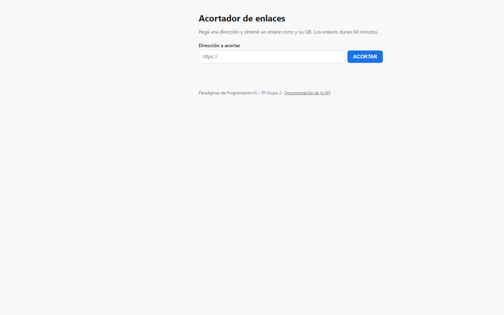
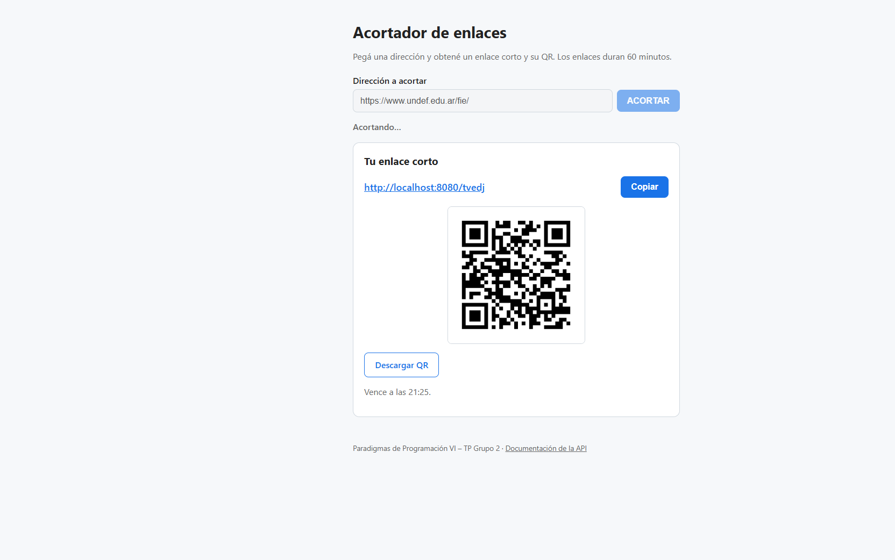
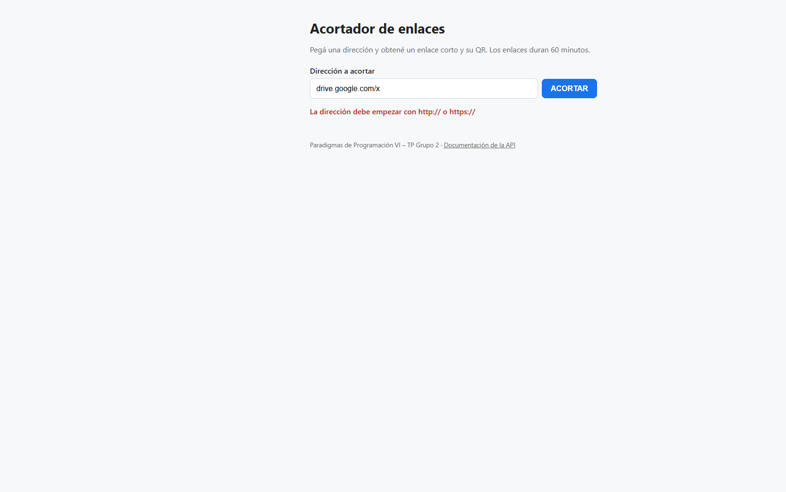
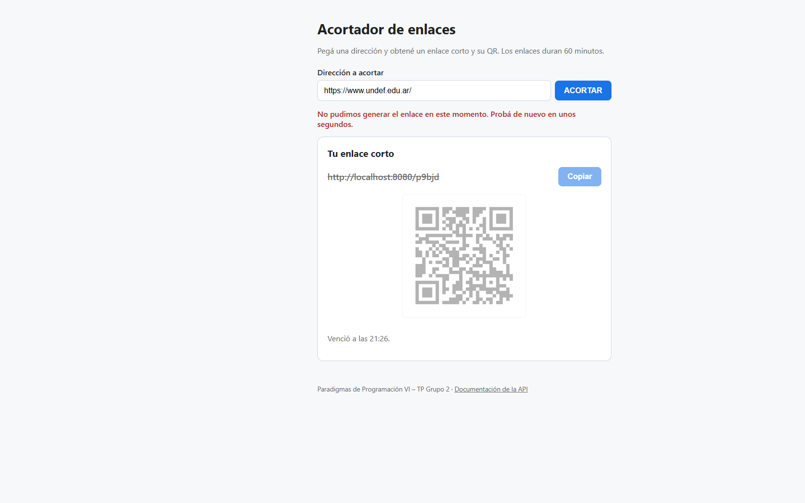
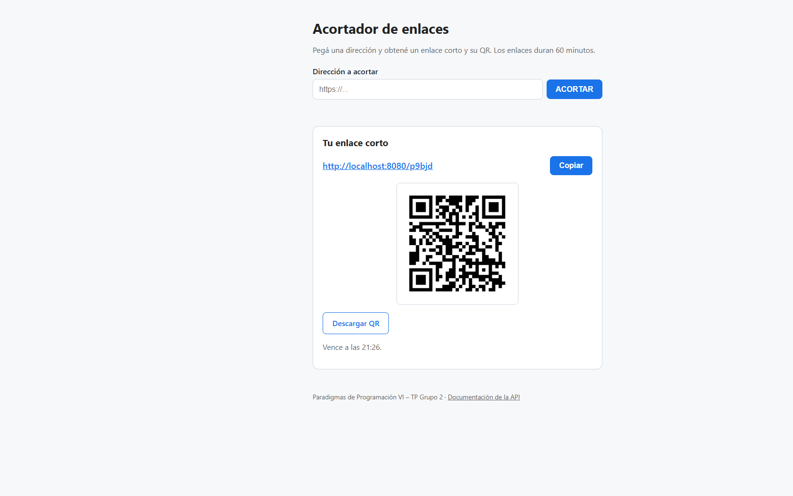
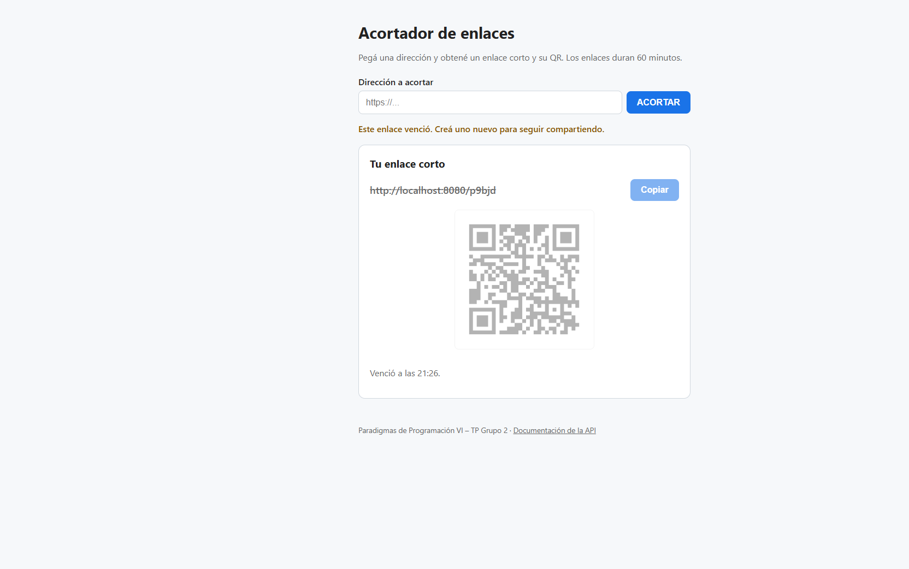
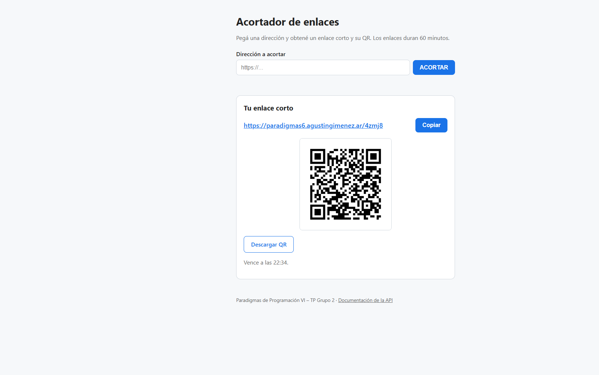

# Bitácora – TP PP6 Link Shortener

## Paso 0 – Proyecto base (05/10/2026)

> **Superado por "Paso 0 (revisión)" del 09/10/2026** (al final de este archivo). Esta entrada se conserva como historia: se escribió antes de conocer las respuestas del Cliente y la consolidación de `contexto.md`.

### Objetivo
Dejar un proyecto Spring Boot que compila, arranca y tiene la estructura y la configuración sobre la que se construyen los pasos siguientes. Cubre la base técnica del enunciado (Java + Spring Boot + JPA/Hibernate) y los dos entornos pedidos: staging (local) y producción (`https://paradigmas6.agustingimenez.ar`).

### Estado ANTERIOR
El repositorio solo tenía documentación (`README.md`, `TP_PP6_v1.0.md`, `propuesta-etapa1.md`). No había código.

### Qué es NUEVO
| Archivo | Acción | Para qué sirve |
|---|---|---|
| `settings.gradle`, `build.gradle` | nuevo | Proyecto Gradle: Spring Boot 3.4.3, Java 21, web, data-jpa, validation, HSQLDB, springdoc (Swagger), ZXing (QR), JaCoCo |
| `gradlew`, `gradlew.bat`, `gradle/wrapper/*` | nuevo | Gradle wrapper (8.14.3): nadie necesita instalar Gradle |
| `ShortenerApplication.java` | nuevo | Punto de entrada; `@ConfigurationPropertiesScan` registra `AppProperties` |
| `config/AppProperties.java` | nuevo | Configuración tipada y validada (`app.base-url`, `app.link.ttl`, `app.alias.*`) |
| `config/ClockConfig.java` | nuevo | Bean `Clock` (UTC) para inyectar el tiempo |
| `application.properties` | nuevo | Valores comunes y perfil por defecto `staging` |
| `application-staging.properties` | nuevo | Local: `localhost:8080`, HSQLDB en archivo, SQL visible |
| `application-prod.properties` | nuevo | Producción: dominio HTTPS, base por variables de entorno, detrás de proxy |
| `static/index.html` | nuevo | Página inicial provisoria (el cliente web real es el Paso 6) |
| `*/package-info.java` | nuevo | Paquetes vacíos de la arquitectura (sección 4.2 de la propuesta) |
| `ShortenerApplicationTests.java` | nuevo | Test de carga de contexto y de la configuración |
| `.env.example` | nuevo | Plantilla de variables de prod, sin valores reales |
| `.gitignore`, `README.md` | modificado | Ignorar `data/` y `.env`; instrucciones de compilación y ejecución |

### Qué se MODIFICÓ y por qué
- `.gitignore`: se agregó `.env` (secretos de prod) y `data/` (base HSQLDB local, descartable).
- `README.md`: se agregó la sección "Compilar y ejecutar".

### Cómo funciona (explicado simple)
1. `./gradlew bootRun` arranca la app. Como no se indica perfil, Spring usa `spring.profiles.default=staging`.
2. Spring carga primero `application.properties` (lo común) y después `application-staging.properties`, que pisa o completa valores.
3. Los valores `app.*` se copian a `AppProperties`. Si falta uno obligatorio o es inválido (por ejemplo, `app.alias.length=0`), la app **no arranca** y dice qué propiedad está mal.
4. En el servidor se arranca con `SPRING_PROFILES_ACTIVE=prod`: el mismo JAR toma `application-prod.properties` y lee la base de datos de las variables `DB_URL`, `DB_USER` y `DB_PASSWORD`.

**¿Qué es un perfil de Spring?** Un nombre (`staging`, `prod`) que activa un archivo `application-<perfil>.properties` extra. Permite tener **un solo código** y cambiar solo la configuración según dónde corre.

### Decisiones de diseño
- **Perfiles en lugar de ramas o `if` en el código:** separar entornos por configuración evita "funciona en mi máquina". El código no sabe en qué entorno está.
- **Secretos fuera del repo:** en prod, las credenciales llegan por variables de entorno (`${DB_URL}`). `.env.example` documenta cuáles hacen falta.
- **`@ConfigurationProperties` + `@Validated` (records):** configuración tipada (`Duration` para el TTL), validada al arrancar, y un único lugar para leerla. Se descartó `@Value` disperso por las clases.
- **`Clock` inyectable:** los tests podrán simular "pasaron 61 minutos" sin esperar (se usa desde el Paso 2).
- **HSQLDB en modo archivo en staging:** cualquiera del grupo lo levanta sin instalar un servidor de base de datos.
- **Alfabeto sin caracteres ambiguos** (`0 O o 1 l I`): suposición por defecto de la pregunta P1, configurable.
- **`server.forward-headers-strategy=framework` en prod:** detrás de Nginx, Spring reconoce que la petición original fue HTTPS.
- No se incluyó todavía `jpql-console-starter` del ejemplo del profesor: se agrega cuando haya entidades (Paso 1), con las coordenadas del proyecto del profesor.

### Cómo probarlo
```bash
./gradlew build                 # compila y corre el test de contexto
./gradlew bootRun               # staging en http://localhost:8080
curl -i http://localhost:8080/  # 200 con la página inicial
```
Test: `ShortenerApplicationTests.contextLoadsWithStagingDefaults` (usa HSQLDB en memoria para no ensuciar `./data`).

### Preguntas probables del profesor (con respuesta)
- **¿Por qué dos perfiles y no un solo `application.properties`?** → Porque staging y prod difieren en URL, base de datos y logs. Con perfiles, el código es el mismo y solo cambia la configuración.
- **¿Dónde está la contraseña de la base de prod?** → En ningún archivo del repo: es una variable de entorno del servidor.
- **¿Qué pasa si alguien configura mal el TTL?** → `@Validated` hace fallar el arranque con un mensaje claro, en lugar de fallar más tarde en runtime.
- **¿Por qué inyectar `Clock` en lugar de usar `Instant.now()`?** → Para poder testear la expiración controlando el tiempo.

### Preparado para cambios
- Cambiar TTL, largo o alfabeto del alias: solo se edita `application.properties`.
- Cambiar de base (PostgreSQL/MySQL): driver en `build.gradle` y variables `DB_*`, sin tocar código.
- Agregar otro entorno (por ejemplo `test` o `demo`): un `application-<perfil>.properties` nuevo.

---

## Paso 0 (revisión) – Alineación con `contexto.md` (09/10/2026)

**Estado:** completo en local, pendiente **A** (aceptación de un integrante que no construyó el paso: Sofía, como Probadora).

### Objetivo
Adaptar el Paso 0 del 05/10 a `contexto.md` v0.1 (07/10), que consolidó las tres propuestas y las respuestas del Cliente. El Paso 0 original se había hecho antes de esas respuestas y contradecía varias de ellas. Cubre el Paso 0 de `contexto.md` §16 y §18.4.

### Estado ANTERIOR
Proyecto que compilaba y arrancaba, pero desalineado con `contexto.md`:

| Tema | Antes (05/10) | Qué decía `contexto.md` |
|---|---|---|
| Java / Spring Boot / Gradle | 21 / 3.4.3 / 8.14.3 | Java 25 (C16), con Spring Boot y Gradle compatibles (R11) |
| Configuración | Perfiles `staging` y `prod`, prod con HTTPS en `paradigmas6.agustingimenez.ar` | Un solo `application.properties` + `APP_BASE_URL` (D34); entrega local (C12), sin HTTPS (C14) |
| Paquete raíz | `com.pp6.shortener` | Recomendación `ar.edu.undef.fie.pp6.shortener` (E6) |
| Alfabeto del alias | 56 caracteres, mayúsculas y minúsculas | 31: minúsculas y dígitos sin ambiguos (D8) |
| Propiedades | Faltaban `reserved`, `max-attempts`, `cleanup.cron` | §12.2 |
| Paquete del cron | No existía | `infrastructure/scheduling` (§8.2) |
| Consola HQL del profesor | No incluida | Incluida (D37) |
| ADR | No había | ADR-0001 a 0006 (§14.3) |
| README | Indicaba `git add .` y Java 21 | Nunca `git add .` (R18, §19.2) |

### Qué es NUEVO
| Archivo | Acción | Para qué sirve |
|---|---|---|
| `docs/adr/0001` a `0006` | nuevo | Decisiones difíciles de revertir, con contexto, alternativas y consecuencias |
| `infrastructure/scheduling/package-info.java` | nuevo | Paquete donde va a vivir la tarea de limpieza (Paso 5) |
| `build.gradle` | modificado | Java 25, Spring Boot 4.1.1, starters de test de Boot 4, springdoc 3.1.1, ZXing 3.5.4, consola HQL, JaCoCo 0.8.15 |
| `settings.gradle` | modificado | Plugin `foojay-resolver-convention`: si alguien no tiene JDK 25, Gradle lo descarga |
| `gradlew.bat`, `gradle/wrapper/*` | modificado | Wrapper actualizado a Gradle 9.8.1, la última versión (Java 25 está soportado desde Gradle 9.1) |
| `application.properties` | modificado | Único archivo con los valores de §12.2 |
| `application-staging.properties`, `application-prod.properties` | eliminado | Ya no hay perfiles (D34) |
| `AppProperties.java` | modificado | Agrega `alias.reserved`, `alias.maxAttempts` y `cleanup.cron` |
| Todos los `.java` | movido | De `com.pp6.shortener` a `ar.edu.undef.fie.pp6.shortener` (con `git mv`, se conserva el historial) |
| `ShortenerApplicationTests.java` | modificado | Verifica los valores de §12.2 y que la app no arranque sin `app.base-url` (D33) |
| `.env.example` | modificado | Solo documenta `APP_BASE_URL` |
| `README.md` | modificado | Java 25, configuración única, aviso sobre `java -jar`, regla de `git add` |

### Qué se MODIFICÓ y por qué

**`application.properties`** (antes repartido en 3 archivos):
```properties
# ANTES (application.properties + perfiles)
spring.profiles.default=staging
app.alias.alphabet=23456789ABCDEFGHJKLMNPQRSTUVWXYZabcdefghijkmnpqrstuvwxyz
# application-staging.properties: app.base-url=http://localhost:8080
# application-prod.properties:    app.base-url=https://paradigmas6.agustingimenez.ar

# DESPUÉS (un solo archivo)
app.base-url=${APP_BASE_URL:http://localhost:8080}
app.alias.alphabet=abcdefghjkmnpqrstuvwxyz23456789
app.alias.reserved=api,admin,static,assets,error,expired,health,actuator,swagger,favicon.ico,index
app.alias.max-attempts=10
app.cleanup.cron=0 0 3 * * *
```
Por qué: el Cliente dijo que esta entrega es local (C12) y sin HTTPS (C14). Con un solo entorno, los perfiles eran complejidad sin uso. `${APP_BASE_URL:http://localhost:8080}` significa "usá la variable de entorno si existe; si no, localhost".

**`AppProperties.java`:**
```java
// ANTES
public record Alias(@Min(1) @Max(16) int length, @NotBlank String alphabet) {}

// DESPUÉS
public record Alias(
		@Min(1) @Max(16) int length,
		@NotBlank String alphabet,
		@NotNull List<String> reserved,
		@Min(1) int maxAttempts) {}
public record Cleanup(@NotBlank String cron) {}
```

**`build.gradle`:** `spring-boot-starter-web` pasó a `spring-boot-starter-webmvc`, que es el nombre en Spring Boot 4. Se agregaron `spring-boot-starter-webmvc-test` y `spring-boot-starter-data-jpa-test`, porque en Boot 4 MockMvc y `@DataJpaTest` vienen en módulos separados (se usan en los Pasos 1 y 3).

### Cómo funciona (explicado simple)
1. `gradlew bootRun` compila con Java 25 (si no está instalado, Gradle lo baja) y arranca la app.
2. Spring lee `application.properties` y copia los valores `app.*` al record `AppProperties`.
3. `@Validated` revisa las anotaciones: si `app.base-url` está vacío, o el largo del alias es 0, la app **no arranca** y dice qué propiedad está mal.
4. Para correr en el VPS, el mismo JAR se arranca con `APP_BASE_URL=http://...`, y esa variable pisa el valor por defecto. No se toca código ni se recompila.

### Decisiones de diseño
- **Un solo archivo + variable de entorno en lugar de perfiles** (D34, ADR-0005): hoy hay un solo entorno. Si el despliegue en el VPS necesita más diferencias, se agrega un perfil `vps` (R10).
- **Spring Boot 4.1.1 en lugar de 3.5.x:** la última versión estable que soporta Java 25; la línea 3.5 ya está fuera de soporte OSS.
- **Alfabeto de 31 caracteres** (D8): sin `0 o 1 l i`, para que el alias se pueda dictar o copiar a mano sin confusiones (C2). 31⁵ ≈ 28,6 millones de combinaciones.
- **Palabras reservadas desde ya** (D10): con largo 5 y este alfabeto ninguna es generable, pero la regla protege ante un cambio de largo o ante el alias personalizado.
- **Consola HQL del profesor** (D37): se verificó que el starter `v1.1.0` arranca con Spring Boot 4.

### Cómo probarlo
```bash
gradlew.bat build          # compila con Java 25 y corre los tests
gradlew.bat bootRun        # http://localhost:8080
curl -i http://localhost:8080/                       # 200
curl -i http://localhost:8080/v3/api-docs            # 200 (OpenAPI)
curl -i http://localhost:8080/swagger-ui/index.html  # 200
```
Tests:
- `contextLoadsWithDefaultConfiguration`: los valores de §12.2 y el `Clock` en UTC.
- `failsToStartWithoutBaseUrl`: con `app.base-url=` vacío, el contexto falla (D33).

### Evidencias de cierre
| Código | Evidencia |
|---|---|
| **T** | `gradlew clean build` → `BUILD SUCCESSFUL`, 2 tests, 0 fallos (Gradle 9.8.1, JVM 25) |
| **M** | Mutación: se quitó `@NotBlank` de `baseUrl` → `failsToStartWithoutBaseUrl() FAILED`. Se restauró desde una copia → verde |
| **E2E** | No aplica (todavía no hay cliente web) |
| **V** | `java -jar shortener.jar` con JDK 25: arranca en 5,8 s; `/`, `/v3/api-docs` y `/swagger-ui/index.html` responden 200; se crea `./data` (ignorado por git) |
| **A** | ⛔ Pendiente: aceptación de Sofía |
| **D** | Esta entrada + ADR-0001 a 0006 |

**Hallazgo:** con `java -jar` falla con `UnsupportedClassVersionError` si el `java` del PATH es 21 (pasa en Windows con Oracle `javapath` primero en el PATH, aunque `JAVA_HOME` apunte al 25). Queda documentado en el README.

### Preguntas probables del profesor (con respuesta)
- **¿Por qué Spring Boot 4 si su ejemplo usa 3.4.3?** → Porque usted confirmó Java 25 (C16) y Spring Boot 3.4.3 no lo soporta. 4.1.1 es la última versión estable que sí lo hace.
- **¿Por qué no hay perfiles de entorno?** → Porque esta entrega es solo local (C12). La única diferencia con un VPS futuro es el dominio, y eso se resuelve con la variable `APP_BASE_URL` sin tocar código.
- **¿Por qué el alfabeto no tiene `0`, `o`, `1`, `l` ni `i`?** → Usted pidió un alias fácil de recordar (C2). Esos caracteres se confunden al dictarlos o copiarlos a mano.
- **¿Qué es un ADR?** → Un registro corto de una decisión difícil de revertir: contexto, decisión, alternativas descartadas y consecuencias. Si la decisión cambia, se escribe un ADR nuevo que reemplaza al anterior, sin borrar el viejo.
- **¿Cómo sabe que el test de `base-url` sirve?** → Se rompió la regla a propósito (se quitó `@NotBlank`) y el test falló. Un test que nunca puede fallar no protege nada.

### Preparado para cambios
- Desplegar en el VPS: `APP_BASE_URL` por variable de entorno, sin recompilar.
- Cambiar TTL, largo, alfabeto, palabras reservadas, intentos o frecuencia del cron: solo `application.properties`.
- Alias personalizado (futuro): las palabras reservadas ya existen en la configuración.

### Prompts utilizados (registro de IA)
| Prompt | Resumen de la respuesta | Qué se validó o corrigió |
|---|---|---|
| "¿Coinciden los diagramas con lo planteado por el profesor? ¿Qué hay de nuevo en el repo?" | Los diagramas cubren la consigna y `contexto.md`; se detectaron 2 observaciones en el diagrama del QR (`shortUrl` armada en dos lugares, QR dentro de `ResolveLinkService`) y que el Paso 0 de `dev/agustin` contradecía `contexto.md` | Se revisó el HTML de los diagramas y los archivos del Paso 0 contra `contexto.md` |
| "Adaptar mi Paso 0 a `contexto.md`" + elección del paquete `ar.edu.undef.fie.pp6.shortener` (E6) | Migración a Java 25 / Boot 4.1.1 / Gradle 9.8.1, configuración única, ADR, README y esta entrada | Build y tests corridos de verdad, app levantada con JDK 25, mutación del test de `base-url` |

---

## Despliegue anticipado en el VPS (09/10/2026)

**Estado:** completo en el VPS (`https://paradigmas6.agustingimenez.ar`). Adelanta **BL-007**: el despliegue no es obligatorio en la Etapa 1 (C12), pero hacerlo temprano detecta problemas de infraestructura antes de la entrega.

### Objetivo
Que el Paso 0 revisado corra en el servidor de Agustín (responsable del despliegue según `contexto.md` §19.1), con el mismo JAR que en local y sin tocar código.

### Estado ANTERIOR
El VPS ya corría el **Paso 0 del 05/10** (Java 21, perfil `prod`):

| Pieza | Antes |
|---|---|
| Nginx | `paradigmas6.agustingimenez.ar`: HTTP → HTTPS y proxy a `127.0.0.1:8080` (en `/etc/nginx/sites-available/fie-materias.conf`), detrás de Cloudflare |
| Servicio | `pp6-shortener.service` (systemd, usuario `pp6`, `WorkingDirectory=/var/lib/pp6-shortener`) con `/opt/jdk-21` |
| Variables | `/etc/pp6-shortener/shortener.env` con `SPRING_PROFILES_ACTIVE=prod`, `SERVER_ADDRESS`, `PORT`, `DB_URL`, `DB_USER`, `DB_PASSWORD` |
| JAR | `/opt/pp6-shortener/shortener.jar` (Paso 0 viejo) |

### Qué es NUEVO / qué se MODIFICÓ
| Pieza | Acción | Detalle |
|---|---|---|
| `/opt/jdk-25` | nuevo | Temurin 25.0.4.1 (`/opt/jdk-21` se conserva) |
| `pp6-shortener.service` | modificado | `ExecStart` usa `/opt/jdk-25/bin/java` (mismos límites de memoria: `-Xmx256m`, SerialGC) |
| `shortener.env` | modificado | Ahora solo: `APP_BASE_URL=https://paradigmas6.agustingimenez.ar`, `SERVER_ADDRESS=127.0.0.1`, `SPRING_JPA_SHOW_SQL=false`, `HQLCONSOLE_ENABLED=false` |
| `shortener.jar` | modificado | JAR del commit `8ce2e8d` (SHA-256 `e4a932ad…6173047`, verificado antes y después de copiar) |
| Backups | nuevo | `*.bak-20261009-081003` junto al JAR, al `.env` y al `.service` |

Nginx no se tocó: ya hacía de reverse proxy con HTTPS.

### Cómo funciona (explicado simple)
1. Cloudflare recibe `https://paradigmas6.agustingimenez.ar` y lo manda al VPS.
2. Nginx termina el HTTPS y reenvía la petición a `127.0.0.1:8080`.
3. Spring Boot escucha **solo en 127.0.0.1** (`SERVER_ADDRESS`): desde internet no se puede llegar al 8080 salteando Nginx.
4. La URL corta se arma desde `APP_BASE_URL` (I4), no desde los headers que pone el proxy.
5. La base HSQLDB queda en `/var/lib/pp6-shortener/data` (ruta relativa `./data` + `WorkingDirectory`), fuera de la carpeta del JAR: sobrevive a los redeploys (C13).

### Decisiones de diseño
- **Mismo JAR que en local, distinta configuración por variables de entorno** (D34): el código no sabe dónde corre.
- **Variables de Spring por entorno** (relaxed binding): `SPRING_JPA_SHOW_SQL=false` pisa `spring.jpa.show-sql`, y `HQLCONSOLE_ENABLED=false` pisa `hql-console.enabled`. La consola HQL es una herramienta para la defensa en local.
- **HTTPS en el VPS:** `contexto.md` dice "sin HTTPS" (C14) porque el Cliente no lo exige, no porque lo prohíba. El servidor ya lo tenía resuelto en Nginx, así que se mantiene. ⚠️ Hay que avisarle al grupo para actualizar §13 y E3.

### Cómo probarlo
```bash
curl -I https://paradigmas6.agustingimenez.ar/                       # 200
curl -I https://paradigmas6.agustingimenez.ar/v3/api-docs            # 200
ssh VPS-DonWeb "systemctl status pp6-shortener"                      # active (running)
ssh VPS-DonWeb "journalctl -u pp6-shortener -n 50 --no-pager"        # logs
```

**Volver atrás:** restaurar los tres `*.bak-20261009-081003`, `systemctl daemon-reload` y `systemctl restart pp6-shortener`.

### Evidencias de cierre
| Código | Evidencia |
|---|---|
| **V** | Servicio `active` con `/opt/jdk-25`; log `Started ShortenerApplication in 8.71 seconds`; ~228 MB de RSS; `curl` local al 8080 → 200; desde internet `/`, `/v3/api-docs` y `/swagger-ui/index.html` → 200 por HTTPS |
| **A** | ⛔ Pendiente: verificación de otro integrante |

### Preguntas probables del profesor (con respuesta)
- **¿Qué cambió en el código para desplegar?** → Nada. El mismo JAR corre en local y en el VPS; solo cambian las variables de entorno.
- **¿Por qué el 8080 no está expuesto a internet?** → Porque la app escucha solo en `127.0.0.1`. Todo entra por Nginx, que maneja el HTTPS.
- **¿Se pierden los enlaces al redeployar?** → No: la base está en `/var/lib/pp6-shortener/data`, separada del JAR.

### Preparado para cambios
- Redeploy: copiar el JAR nuevo y `systemctl restart pp6-shortener`. Candidato a script cuando haya funcionalidad para desplegar seguido (E5).
- Cambiar a PostgreSQL (ya instalado en el VPS): `SPRING_DATASOURCE_URL` y driver, sin tocar código.

### Prompts utilizados (registro de IA)
| Prompt | Resumen de la respuesta | Qué se validó o corrigió |
|---|---|---|
| "¿Podés actualizarlo en el servidor paradigmas6.agustingimenez.ar?" | Inspección de solo lectura del VPS, plan con backups, instalación de JDK 25, ajuste del servicio y de las variables, despliegue del JAR | Hash del JAR, log de arranque, `curl` local y público |

---

## Paso 1 – Dominio y persistencia (09/10/2026)

**Estado:** completo en local y en el VPS, pendiente **A** (aceptación de Sofía).

### Objetivo
Tener la entidad `ShortLink` con su regla de vencimiento, el puerto `ShortLinkRepository` y su implementación con `EntityManager` + JPQL. Cubre el requerimiento 3 de la consigna (persistencia con JPA/Hibernate) y el Paso 1 de `contexto.md` §16 y §18.4. Todavía no hay endpoints: este paso es la base sobre la que el Paso 3 crea enlaces y el Paso 4 redirige.

### Estado ANTERIOR
Proyecto base del Paso 0: compila, arranca y tiene los paquetes vacíos. `domain/model`, `domain/port`, `domain/exception` e `infrastructure/persistence` solo tenían su `package-info.java`. No había tablas.

### Qué es NUEVO
| Archivo | Acción | Para qué sirve |
|---|---|---|
| `domain/model/ShortLink.java` | nuevo | Entidad JPA (tabla `short_link`): alias como PK, URL original, `createdAt`, `expiresAt` indexado. Regla `isExpired(now)` |
| `domain/port/ShortLinkRepository.java` | nuevo | Puerto (interfaz): `persist`, `findByAlias`, `deleteByAlias`, `deleteExpiredBefore` |
| `domain/exception/AliasAlreadyTakenException.java` | nuevo | Excepción del dominio cuando el alias ya existe (I2) |
| `infrastructure/persistence/JpaShortLinkRepository.java` | nuevo | Adaptador: implementa el puerto con `EntityManager` + JPQL (estilo del profesor) |
| `ShortLinkTest.java` | nuevo | 10 tests unitarios: bordes del vencimiento y construcción inválida |
| `JpaShortLinkRepositoryTest.java` | nuevo | 8 tests `@DataJpaTest` contra HSQLDB |
| `ShortLinkPersistenceAcrossRestartTest.java` | nuevo | TC-35: el enlace sobrevive a un reinicio, sobre HSQLDB en modo archivo |
| `scripts/mutation-test.ps1` | nuevo | Mutaciones de las invariantes, repetibles por cualquier integrante |
| `scripts/deploy.ps1` | nuevo | Despliegue con verificación de hash, health check y rollback automático |
| `README.md` | modificado | Sección "Scripts" |

### Qué se MODIFICÓ y por qué
Solo `README.md` (sección nueva). El resto del paso es código nuevo: no se tocó nada del Paso 0.

### Cómo funciona (explicado simple)
```text
Caso de uso (Paso 3)  ──usa──▶  ShortLinkRepository (interfaz, dominio)
                                        ▲
                                        │ implementa
                         JpaShortLinkRepository (infraestructura)
                                        │ EntityManager + JPQL
                                        ▼
                                 HSQLDB · tabla short_link
```
1. **La entidad se protege sola.** El constructor no deja crear un `ShortLink` sin alias, sin URL, sin fechas o con `expiresAt` anterior o igual a `createdAt`. JPA usa un constructor `protected` vacío; el resto del código no puede.
2. **¿Venció?** `isExpired(now)` devuelve `!now.isBefore(expiresAt)`. En el instante exacto `expiresAt` el enlace ya venció (intervalo semiabierto, D3). El "ahora" lo pasa quien llama (en los próximos pasos, desde el `Clock`), así la regla se testea sin esperar.
3. **Guardar** (`persist`): inserta y hace `flush` en el momento. Si el alias ya existe, la base rechaza el INSERT por la clave primaria y el adaptador lo traduce a `AliasAlreadyTakenException`. Nunca sobrescribe (I2).
4. **Buscar** (`findByAlias`): `EntityManager.find` por clave primaria.
5. **Borrar uno** (`deleteByAlias`): busca, borra y hace `flush`. Si no existe, no hace nada.
6. **Limpiar** (`deleteExpiredBefore(now)`): `delete from ShortLink s where s.expiresAt <= :now`, JPQL parametrizado. Devuelve cuántos borró. Usa `<=` y no `<` porque en `expiresAt` el enlace ya venció (I6).
7. **Las escrituras exigen transacción** (`@Transactional(propagation = MANDATORY)`). Si alguien llama sin transacción, falla en el momento en lugar de comportarse distinto de lo esperado.

DDL generado por Hibernate (verificado en el log):
```sql
create table short_link (alias varchar(16) not null, created_at timestamp(6) not null,
  expires_at timestamp(6) not null, original_url varchar(2048) not null, primary key (alias))
create index idx_short_link_expires_at on short_link (expires_at)
```

### Decisiones de diseño
- **Puerto en el dominio, implementación en infraestructura** (D31, hexagonal liviano): los casos de uso dependen de la interfaz. Cambiar a Spring Data o a otra base es otra implementación del puerto, sin tocar los servicios. `JpaShortLinkRepository` es package-private: desde afuera solo se ve la interfaz.
- **`EntityManager` + JPQL** y no Spring Data (R8, 🟡): es el estilo del proyecto del profesor y deja las consultas a la vista.
- **Alias como clave primaria + `persist`, nunca `merge`** (D30, D32, ADR-0003): la base garantiza la unicidad aunque lleguen dos pedidos a la vez.
- **`flush` dentro de `persist`:** el alias duplicado se detecta adentro de `persist`, donde el caso de uso lo puede capturar, y no recién en el commit.
- **Entidad sin setters:** un enlace no cambia después de creado. Se reconstruye o se borra.
- **`equals`/`hashCode` por alias:** es la identidad del enlace (su PK, asignada antes de persistir).

#### ⚠️ Desvío de `contexto.md` (para revisar en grupo)
`contexto.md` (D32, I2, TC-31, mutación de §15.4) dice que el reintento se hace "ante `DataIntegrityViolationException`". Se usó **`AliasAlreadyTakenException`**, una excepción del dominio, por dos motivos verificados:
1. **El dominio no debe depender de Spring.** `DataIntegrityViolationException` es de Spring (`org.springframework.dao`). El puerto vive en el dominio y no debería nombrarla.
2. **La traducción de Spring no es confiable en todos los contextos.** En el test `@DataJpaTest` la traducción automática de excepciones no estaba activa y llegó la `ConstraintViolationException` cruda de Hibernate (el test falló así la primera vez). Traducir explicitamente en el adaptador funciona igual en tests y en producción.

La regla de fondo (I2: nunca sobrescribir, reintentar con otro alias) no cambia. **Propuesta:** actualizar D32, I2 y §15.4 de `contexto.md` con el nombre nuevo.

#### Nota para el Paso 3
Después de una `AliasAlreadyTakenException`, Hibernate deja la sesión inutilizable. El reintento con otro alias **no puede ocurrir dentro de la misma transacción**: el bucle de reintentos tiene que quedar afuera de la transacción, con una transacción nueva por intento. Quedó escrito en el Javadoc del puerto.

#### Nota para el Paso 2
La columna es `timestamp(6)` (microsegundos). Si el `Clock` devuelve nanosegundos, el valor guardado y el que está en memoria difieren por debajo del microsegundo. Conviene que `ExpirationPolicy` trunque los instantes (por ejemplo a milisegundos) para que la respuesta de la API y la base coincidan exactamente.

### Cómo probarlo
```powershell
gradlew.bat test                                                              # 21 tests
powershell -ExecutionPolicy Bypass -File scripts\mutation-test.ps1 -Step 1    # 4 mutaciones
```
| Test | Qué verifica |
|---|---|
| `ShortLinkTest` (10) | Vigente en `createdAt` y en `expiresAt − 1 ms`; vencido en `expiresAt` y después; rechaza alias/URL vacíos, fechas nulas y `expiresAt <= createdAt`; igualdad por alias |
| `persistsAndFindsByAlias` | Guarda y recupera con todos los campos, después de limpiar el contexto (lee de la base, no de memoria) |
| `findByAliasReturnsEmptyWhenMissing` | Alias inexistente → vacío |
| `deleteByAliasRemovesTheLink` / `...IgnoresMissingAlias` | Borra; borrar algo inexistente no falla |
| `expiredAliasCanBeDeletedAndReassignedInTheSameTransaction` | D6: un alias vencido se borra y se reasigna en la misma transacción |
| `deleteExpiredBeforeRemovesOnlyLinksExpiredAtOrBeforeNow` | I6: con vencimientos en `now − 1 s`, `now` y `now + 1 s`, borra exactamente 2 y deja el futuro |
| `writesRequireAnExistingTransaction` | Escribir sin transacción falla con `IllegalTransactionStateException` |
| `persistNeverOverwritesAnExistingAlias` | I2 con **transacciones reales**: el segundo `persist` del mismo alias falla y el primero queda intacto |
| `tc35_linksSurviveAnApplicationRestart` | TC-35 / C13: se levanta la app sobre un archivo HSQLDB temporal, se guarda, se apaga, se vuelve a levantar y el enlace sigue ahí |

### Evidencias de cierre
| Código | Evidencia |
|---|---|
| **T** | TDD: los tests se escribieron primero y fallaron por compilación (rojo). Después de implementar: `gradlew clean build` → `BUILD SUCCESSFUL`, **21 tests, 0 fallos** |
| **M** | `scripts\mutation-test.ps1 -Step 1` → **4/4 detectadas**: I1 (`!isBefore` → `isAfter`) por `isExpiredAtExactExpirationInstant`; I2 (`persist` → `merge`) por `persistNeverOverwritesAnExistingAlias`; I6 (`<=` → `<`) por `deleteExpiredBefore...`; D6 (sin `flush`) por `deleteByAliasRemovesTheLink`. Hash de los archivos idéntico al original después de restaurar |
| **E2E** | No aplica (sin interfaz) |
| **V** | DDL real en el log de arranque: tabla con `alias` como PK y el índice `idx_short_link_expires_at`. **En el VPS:** `scripts\deploy.ps1` desplegó el commit `7c57b91` (build + tests, hash verificado, health check 200, `https://paradigmas6.agustingimenez.ar/` → 200); `/opt/pp6-shortener/DEPLOYED` = `7c57b91 20261009-082641`; la tabla y el índice figuran en `/var/lib/pp6-shortener/data/shortener.log` (HSQLDB los pasa al `.script` en el próximo checkpoint) |
| **A** | ⛔ Pendiente: aceptación de Sofía |
| **D** | Esta entrada |

**Hallazgos durante el paso (corregidos):**
- La primera versión del test de reinicio pasaba la base con `SpringApplicationBuilder.properties(...)`, que define propiedades **por defecto** (las de menor prioridad): `application.properties` le ganaba y el test escribía en `./data` del proyecto. Se corrigió pasándolas como argumentos de línea de comandos y se borró `./data` (base local de desarrollo, descartable).
- Un comentario inicial en `deleteByAlias` decía que sin `flush` la reasignación violaría la PK. **La mutación D6 demostró que era falso** (Hibernate 7 resuelve ese orden). El `flush` se mantiene por otro motivo, verificado por el test que sí falló: sin él, el DELETE queda pendiente y se pierde si el contexto se limpia. Se corrigió el comentario.

### Preguntas probables del profesor (con respuesta)
- **¿Por qué no usaron Spring Data (`JpaRepository`)?** → Para seguir su estilo con `EntityManager` y JPQL a la vista. Igual queda detrás de una interfaz: si mañana conviene Spring Data, se cambia una clase.
- **¿Por qué el alias es la clave primaria y no un `id` numérico?** → Porque es lo que identifica al enlace y la base garantiza que no se repita, incluso con pedidos simultáneos. Como los vencidos se borran (ADR-0002), no hace falta un historial con `id` propio.
- **¿Por qué `persist` y no `merge`?** → `merge` con un alias existente lo **actualiza**: pisaría en silencio un enlace vigente. `persist` falla, y eso es lo que queremos. Lo prueba la mutación I2.
- **¿Qué pasa en el minuto 60 exacto?** → Ya venció: `isExpired` usa `!now.isBefore(expiresAt)`. Lo prueba `isExpiredAtExactExpirationInstant`, y la mutación I1 demuestra que el test detecta el error.
- **¿Por qué la regla de vencimiento está en la entidad y no en el servicio?** → Porque es una regla del enlace. Así el redirect, el QR y la limpieza usan la misma, sin copiarla.
- **¿Cómo prueban que los datos sobreviven a un reinicio?** → TC-35 levanta la aplicación completa sobre un archivo, guarda, la apaga y la vuelve a levantar.
- **¿Qué es `Propagation.MANDATORY`?** → Que el método exige una transacción ya abierta. La transacción la define el caso de uso, no el repositorio.

### Preparado para cambios
- **Historial o estadísticas** (si revierten ADR-0002): se cambia la implementación del puerto y la tabla, no los casos de uso.
- **PostgreSQL** (ya instalado en el VPS): driver + `spring.datasource.*`; el JPQL y los tipos son estándar.
- **Alias personalizado:** `persist` ya rechaza un alias tomado con una excepción clara, que el Paso 3 traducirá a un error HTTP.
- **Enlaces permanentes** (`expiresAt` nulo): hoy la columna es `not null`. Habría que relajarla y que `deleteExpiredBefore` ignore los nulos (`contexto.md` §14.2).

### Prompts utilizados (registro de IA)
| Prompt | Resumen de la respuesta | Qué se validó o corrigió |
|---|---|---|
| "Vamos al siguiente paso, paso a paso, documentando, commiteando y desplegando; que quede profesional y escalable" | Paso 1 con TDD (tests primero), entidad + puerto + adaptador JPA, mutaciones versionadas, script de despliegue con rollback | Rojo → verde real; se corrigieron 2 errores propios detectados por los tests (prioridad de propiedades en el test de reinicio; comentario falso sobre el `flush`) y se registró el desvío `AliasAlreadyTakenException` |

---

## Paso 2 – Estrategias: validar URL, generar alias, calcular vencimiento (09/10/2026)

**Estado:** completo en local y en el VPS, pendiente **A** (aceptación de Sofía).

### Objetivo
Las tres reglas de negocio que pueden cambiar con un "volantazo" del cliente quedan detrás de una interfaz cada una (patrón **Strategy**): qué URL se acepta, cómo se arma el alias y cuándo vence el enlace. Es el Paso 2 de `contexto.md` §16 y §18.4. Todavía no hay endpoints: el Paso 3 las usa para crear enlaces.

### Estado ANTERIOR
Paso 1: entidad `ShortLink`, puerto `ShortLinkRepository` y su adaptador JPA. `infrastructure/validation`, `infrastructure/alias` e `infrastructure/expiration` solo tenían su `package-info.java`. El `Clock` devolvía nanosegundos.

### Qué es NUEVO
| Archivo | Acción | Para qué sirve |
|---|---|---|
| `domain/port/UrlValidator.java` | nuevo | Puerto: `validate(url)`; lanza `InvalidUrlException` |
| `domain/port/AliasGenerator.java` | nuevo | Puerto: `generate()` propone un alias candidato |
| `domain/port/ExpirationPolicy.java` | nuevo | Puerto: `expirationFor(createdAt)` |
| `domain/exception/InvalidUrlException.java` | nuevo | Error del dominio con mensaje para el usuario final |
| `infrastructure/validation/RegexUrlValidator.java` | nuevo | D16–D19: http/https, con host, hasta 2048 caracteres; acepta el propio dominio, localhost e IPs privadas (C1) |
| `infrastructure/alias/RandomAliasGenerator.java` | nuevo | D8–D10: `SecureRandom`, largo y alfabeto desde config, saltea palabras reservadas |
| `infrastructure/expiration/FixedTtlExpirationPolicy.java` | nuevo | `createdAt + app.link.ttl` (60 min) |
| `RegexUrlValidatorTest`, `RandomAliasGeneratorTest`, `FixedTtlExpirationPolicyTest`, `ClockConfigTest` | nuevos | 35 tests (ver tabla abajo) |

### Qué se MODIFICÓ y por qué
| Archivo | Cambio | Por qué |
|---|---|---|
| `config/ClockConfig.java` | `Clock.systemUTC()` → `Clock.tick(Clock.systemUTC(), Duration.ofMillis(1))` | Cierra la "Nota para el Paso 2": la columna guarda microsegundos; con nanosegundos, lo que devuelve la API y lo que queda en la base no coincidirían |
| `ShortenerApplicationTests.java` | test `wiresTheConfiguredStrategies` | Verifica que Spring arma las tres estrategias con la configuración real |
| `scripts/mutation-test.ps1` | 6 mutaciones del Paso 2 | Ver Evidencias |

### Cómo funciona (explicado simple)
```text
                    ┌── UrlValidator ──────▶ RegexUrlValidator
Caso de uso (Paso 3)├── AliasGenerator ────▶ RandomAliasGenerator ◀── app.alias.*
                    └── ExpirationPolicy ──▶ FixedTtlExpirationPolicy ◀── app.link.ttl, Clock
```
1. **Validar la URL**, en este orden; el primer error gana y su mensaje llega al usuario:
   - vacía o nula → "Ingresá la dirección que querés acortar";
   - más de 2048 caracteres → "La dirección no puede superar los 2048 caracteres";
   - no empieza con `http://` o `https://` (sin importar mayúsculas) → **"La dirección debe empezar con http:// o https://"** (D18; `ftp://` cae acá);
   - `java.net.URI` no la puede interpretar, no tiene host o el puerto pasa de 65535 → "La dirección no tiene un formato válido".
   No se filtra el destino: el propio dominio, `localhost` y las IPs privadas son válidos (C1).
2. **Generar el alias:** elige `length` caracteres al azar del alfabeto (31 caracteres, sin `0 o 1 l i`). Si sale una palabra reservada (`api`, `admin`, `index`…, comparando sin mayúsculas) sortea otra; después de 100 intentos falla con un error de configuración. **No** consulta la base: que el alias esté libre lo garantiza `persist` (Paso 1) y el reintento lo hace el caso de uso (Paso 3).
3. **Calcular el vencimiento:** `createdAt + ttl`. El "ahora" lo da el `Clock` inyectable, truncado a milisegundos.

### Decisiones de diseño
- **Una interfaz por regla variable** (Strategy, D31): cambiar una regla es escribir otra implementación y registrarla, sin tocar los casos de uso.
- **`SecureRandom`** y no `Random`: los alias no deben ser predecibles (no se puede adivinar el siguiente). Para testear, un constructor package-private recibe un `RandomGenerator`, y el test fuerza qué alias sale (así se prueba TC-26 sin depender del azar).
- **Fallar al arrancar si la configuración es inválida:** un alfabeto con símbolos que no sirven en una ruta (`-`, `_`, `/`), con caracteres repetidos (sesgarían la distribución) o un TTL ≤ 0 tiran la aplicación al iniciar, con un mensaje que nombra la propiedad (`app.alias.alphabet`, `app.link.ttl`). Es mejor que descubrirlo en producción.
- **Prefijo con regex + `java.net.URI` para el resto:** el chequeo de prefijo da el mensaje exacto de D18; `URI` valida la sintaxis (espacios, host, puerto) sin escribir una regex gigante.
- **Los mensajes de error están en el validador**, no en el controlador: la extensión, la web y la API reciben el mismo texto.

#### ⚠️ Ajuste respecto de la nota del Paso 1
La nota proponía que `ExpirationPolicy` truncara los instantes. Se truncó en el **`Clock`**: así queda alineado todo lo que pida "ahora" (creación, vencimiento, redirect, limpieza), no solo el vencimiento.

#### Cómo se agregaría el alias personalizado sin tocar código existente (`contexto.md` §18.4)
1. El DTO de creación (Paso 3) suma un campo opcional `alias`.
2. Una clase nueva `CustomAliasValidator` valida el alias del usuario con las mismas reglas que el generador: alfabeto, largo máximo `ShortLink.MAX_ALIAS_LENGTH` y que no sea reservado.
3. En el caso de uso: si viene un alias, se usa ese y **no** se reintenta. Si `persist` lanza `AliasAlreadyTakenException`, se responde 409. Si no viene, sigue el flujo actual con `AliasGenerator`.

`ShortLink`, el repositorio, `RandomAliasGenerator` y la base no cambian: `persist` ya rechaza un alias tomado (I2).

### Cómo probarlo
```powershell
gradlew.bat test                                                              # 57 tests
powershell -ExecutionPolicy Bypass -File scripts\mutation-test.ps1 -Step 2    # 6 mutaciones
```
| Test | Qué verifica |
|---|---|
| `RegexUrlValidatorTest` (23 casos) | TC-10, 11, 15, 17, 19 aceptadas; TC-12, 13 (con el texto exacto de D18), 14, 16, 18 rechazadas con su mensaje; mayúsculas/usuario/puerto/fragmento aceptados; espacios y puerto 99999 rechazados |
| `RandomAliasGeneratorTest` (7) | TC-20: 1000 alias de 5 caracteres del alfabeto, casi sin repetidos; alfabeto sin ambiguos. TC-26: con un azar forzado que produce `index` (y `INDEX`), se descarta y sale el siguiente. Alfabeto inválido o repetido falla al construir. Si todo sale reservado, error claro en vez de bucle infinito |
| `FixedTtlExpirationPolicyTest` (3) | 60 min por defecto, TTL configurable, TTL 0 o negativo rechazado |
| `ClockConfigTest` (2) | UTC y 1000 lecturas sin fracción por debajo del milisegundo |
| `wiresTheConfiguredStrategies` | Spring crea las tres estrategias con `application.properties` |

**Alcance:** TC-10 a TC-19 piden en `contexto.md` una respuesta **201/400**. Acá se prueba la regla (acepta/rechaza y el mensaje). El código HTTP se prueba en el Paso 3, cuando exista el endpoint.

### Evidencias de cierre
| Código | Evidencia |
|---|---|
| **T** | TDD: los tests se escribieron primero y fallaron por compilación (rojo). Primera corrida en verde: 56/57, falló `https://example.com:99999/`, porque `java.net.URI` acepta cualquier puerto numérico. Se agregó el chequeo `<= 65535` → **57 tests, 0 fallos** |
| **M** | `scripts\mutation-test.ps1 -Step 2` → **6/6 detectadas**: D17 (`>` → `>=`) por TC-15; D16 (aceptar `ftp`) por TC-12; D19 (sin chequeo de host) por TC-18; D10 (sin reservadas) por los dos TC-26; TTL (sin sumar) por los 2 tests de vencimiento; CLK (sin truncar) por `ClockConfigTest`. La mutación de I1 que pide §18.4 para este paso ya está cubierta desde el Paso 1 |
| **E2E** | No aplica (sin interfaz) |
| **V** | `wiresTheConfiguredStrategies` levanta el contexto real con las tres estrategias. **En el VPS:** `scripts\deploy.ps1` desplegó `276610d` (build + 57 tests, hash verificado, health check OK); `/opt/pp6-shortener/DEPLOYED` = `276610d 20261009-084049`; servicio `active`; `https://paradigmas6.agustingimenez.ar/` → 200 |
| **A** | ⛔ Pendiente: aceptación de Sofía |
| **D** | Esta entrada |

### Preguntas probables del profesor (con respuesta)
- **¿Qué es el patrón Strategy y dónde lo usan?** → Una interfaz con varias implementaciones intercambiables. Hay tres: `UrlValidator`, `AliasGenerator` y `ExpirationPolicy`. Si piden, por ejemplo, TTL distinto por usuario, se escribe otra `ExpirationPolicy`.
- **¿Por qué `SecureRandom`?** → Con `Random` el siguiente alias se podría predecir a partir de unos cuantos, y alguien podría recorrer enlaces ajenos.
- **¿Cuántos alias posibles hay?** → 31⁵ ≈ 28,6 millones. Con enlaces de 60 minutos que se borran, las colisiones son rarísimas, y si ocurren `persist` las detecta y se reintenta (Paso 3).
- **¿Por qué no se generan alias con `0`, `o`, `1`, `l`, `i`?** → Se confunden al leerlos o dictarlos (D8).
- **¿Por qué el generador no consulta la base para ver si el alias está libre?** → Porque entre la consulta y el INSERT otro pedido podría tomarlo. La única garantía real es la clave primaria. Consultar antes es un paso extra que no protege nada.
- **¿Por qué aceptan URLs a `localhost` o a su propio dominio?** → Lo decidió el cliente (C1). Las reglas están en una sola clase, así que si cambia se modifica ahí.
- **¿Cómo prueban algo aleatorio?** → Inyectando el generador de números: en los tests se fuerza la secuencia y el resultado es determinista.

### Preparado para cambios
- **Alias personalizado:** ver arriba, sin tocar las clases existentes.
- **Alias más largo o con mayúsculas:** se cambia `app.alias.*`, sin recompilar. El arranque rechaza configuraciones inválidas.
- **TTL elegido por el usuario:** nueva `ExpirationPolicy` (o un parámetro en el DTO), con tope desde config.
- **Bloquear dominios (lista negra) o exigir HTTPS:** otra `UrlValidator`, o un decorador que envuelva la actual.

### Prompts utilizados (registro de IA)
| Prompt | Resumen de la respuesta | Qué se validó o corrigió |
|---|---|---|
| "Ir creando pull request y yo seguir trabajando en mi rama dev/agustin solo, pero ir dejando el historial de commits y pull request, sigamos" | Ramas de entrega `paso/N` + PR documentados en el README; Paso 2 con TDD: 3 puertos, 3 estrategias, `Clock` truncado, 6 mutaciones | El test de puerto 99999 detectó que `java.net.URI` no limita el puerto (corregido); se truncó en el `Clock` y no en la política (justificado arriba) |
| "Pero ¿por qué creás tantas ramas? Hacé todo en dev/agustin y que alguien apruebe para ir a main" | Se borraron `paso/0-1` y `paso/2` (no tenían PRs y sus commits ya estaban en `dev/agustin`); README simplificado a un PR `dev/<nombre>` → `main` | Antes de borrar se verificó con la API de GitHub que no hubiera PRs y con `git merge-base --is-ancestor` que no se perdiera ningún commit |

---

## Paso 3 – Crear enlaces: `POST /api/v1/links` (09/10/2026)

**Estado:** completo en local y en el VPS, pendiente **A** (aceptación de Sofía).

### Objetivo
Primer endpoint real: recibe una URL y devuelve el enlace corto con su vencimiento. Junta las piezas de los Pasos 1 y 2 en un caso de uso (`ShortenLinkService`) y define el formato de errores de toda la API (ProblemDetail). Es el Paso 3 de `contexto.md` §16 y §18.4 y cubre el requerimiento 1 de la consigna (API REST).

### Estado ANTERIOR
Dominio, persistencia (Paso 1) y estrategias (Paso 2) probados por separado. No había ningún endpoint: `application`, `web/api` y `web/error` solo tenían su `package-info.java`.

### Qué es NUEVO
| Archivo | Acción | Para qué sirve |
|---|---|---|
| `application/ShortenLinkService.java` | nuevo | Caso de uso: valida, genera alias con reintentos (D6, D11, D13, I2) y guarda |
| `application/LinkUrls.java` | nuevo | Arma `shortUrl` y `qrUrl` **siempre** desde `app.base-url` (I4, D23) |
| `domain/exception/AliasUnavailableException.java` | nuevo | Se agotaron los 10 intentos (D11) → 503 |
| `web/api/LinkApiController.java` | nuevo | `POST /api/v1/links` → `201 Created` + header `Location`, documentado en Swagger |
| `web/api/ShortenRequest.java` / `ShortLinkResponse.java` | nuevos | DTOs del contrato §10.1; la entidad nunca sale por la API (D28) |
| `web/error/GlobalExceptionHandler.java` | nuevo | Errores en ProblemDetail: 400 (URL inválida o JSON mal formado) y 503 con `Retry-After` |
| `ShortenLinkServiceTest`, `LinkApiControllerTest`, `LinkUrlsTest` | nuevos | 19 tests (ver tabla abajo) |
| `support/ScriptedAliasGenerator.java` (test) | nuevo | Generador de test que devuelve alias forzados, para provocar colisiones a voluntad |

### Qué se MODIFICÓ y por qué
Solo `scripts/mutation-test.ps1` (5 mutaciones del Paso 3). Nada del código de los pasos anteriores cambió: el caso de uso se armó **solo con las interfaces** que ya existían.

### Cómo funciona (explicado simple)
```text
POST /api/v1/links {"url": "..."}
  └─ LinkApiController ─▶ ShortenLinkService.shorten(url)
                             1. UrlValidator.validate(url)          ✗ → 400 (nada se guarda)
                             2. now = clock.instant()
                             3. hasta 10 veces:
                                  alias = AliasGenerator.generate()
                                  ¿shortUrl(alias) == url? → otro alias        (D13)
                                  ── transacción NUEVA ──────────────────────
                                  ¿existe y vigente?  → otro alias             (I2)
                                  ¿existe y vencido?  → se borra               (D6)
                                  persist(alias, url, now, now + 60 min)
                                  PK duplicada (otro pedido ganó) → otro alias (I2)
                                  ───────────────────────────────────────────
                             4. 10 fallidos → 503                              (D11)
  ◀─ 201 Created + Location + JSON (shortUrl armada desde app.base-url)
```
Respuesta real (con `app.base-url=https://sho.rt` y reloj fijo, del test TC-61):
```json
{ "alias": "xt3se", "shortUrl": "https://sho.rt/xt3se",
  "originalUrl": "https://drive.google.com/drive/folders/1a2b3c4d5e6f7g8h9?usp=sharing",
  "createdAt": "2026-10-08T12:00:00Z", "expiresAt": "2026-10-08T13:00:00Z",
  "secondsRemaining": 3600, "qrUrl": "https://sho.rt/api/v1/links/xt3se/qr" }
```
Error real del VPS (ProblemDetail, `Content-Type: application/problem+json`; Spring omite `type` cuando es el valor por defecto `about:blank`):
```json
{ "detail": "La dirección debe empezar con http:// o https://",
  "instance": "/api/v1/links", "status": 400, "title": "URL inválida" }
```

### Decisiones de diseño
- **Una transacción por intento, no una para todo el método** (cierra la "Nota para el Paso 3"): si otro pedido toma el alias al mismo tiempo, la base rechaza el INSERT y Hibernate deja la sesión inutilizable. Por eso `shorten` **no** es `@Transactional`: cada intento abre la suya con `TransactionTemplate`. El fallo se descarta y el siguiente intento empieza limpio.
- **Primero `findByAlias`, después `persist`:** la lectura sirve para dos cosas, saltear un alias vigente sin provocar un error y detectar un vencido que el cron todavía no borró (D6). La garantía contra carreras sigue siendo la clave primaria: la lectura sola no alcanza, y TC-31 lo prueba.
- **`LinkUrls` aparte:** la regla "las URLs públicas salen de `app.base-url`" está en un solo lugar y la usan el servicio (D13), la respuesta y el QR (Paso 5).
- **`ShortenRequest` sin `@NotBlank`/`@Pattern`:** si estuviera, habría dos fuentes de reglas y mensajes. Todo lo decide `UrlValidator`, así la API, la web y la extensión reciben el mismo texto.
- **El handler de errores se limita a la API** (`basePackageClasses = LinkApiController.class`): el redirect del Paso 4 tiene que responder una página HTML de 404, no JSON.
- **`503` con `Retry-After: 1`:** le dice al cliente que reintente en un segundo. Agotar 10 intentos con 28,6 millones de alias posibles solo pasaría con la base casi llena o por un error.
- **`Location: <shortUrl>`** en el 201: es lo que el estándar HTTP pide para "recurso creado".
- **`secondsRemaining`** se calcula con el mismo `Clock` (D24) y **redondeando hacia arriba**: al crear da 3600, y vale más que 0 si y solo si el enlace sigue vigente (ver hallazgos).

#### ⚠️ Recordatorio del desvío del Paso 1
`contexto.md` (D32, I2, §15.4) dice "reintento ante `DataIntegrityViolationException`". El servicio reintenta ante **`AliasAlreadyTakenException`** (motivos en el Paso 1). La mutación "quitar el reintento" de §15.4 se aplicó sobre ese `catch` y TC-31 la detectó.

### Cómo probarlo
```powershell
gradlew.bat test                                                              # 79 tests
powershell -ExecutionPolicy Bypass -File scripts\mutation-test.ps1 -Step 3    # 6 mutaciones
# A mano, con la app levantada:
curl.exe -i -X POST http://localhost:8080/api/v1/links -H "Content-Type: application/json" -d "{\"url\":\"https://ejemplo.com\"}"
```
También desde Swagger UI: `http://localhost:8080/swagger-ui.html` → **Enlaces** → **Try it out**.

| Test | Qué verifica |
|---|---|
| `createsAndPersists...` | Alias, `createdAt` = reloj, `expiresAt` = +60 min, guardado en la base |
| `tc21_...` | TC-21: alias vigente → se reintenta y el enlace existente **no cambia** (I2) |
| `tc22_...` | TC-22: alias vencido sin borrar → se reasigna en la misma transacción; queda una sola fila (D6) |
| `tc23_...` (servicio y API) | TC-23: siempre colisiona → exactamente 10 intentos, `AliasUnavailableException` y **503** ProblemDetail con `Retry-After` |
| `tc24_...` | TC-24 / C3: la misma URL dos veces da dos alias, cada uno con sus 60 min |
| `tc25_...` | TC-25 / D13: el alias que redirigiría a sí mismo se descarta |
| `tc30_...` (servicio y API) | TC-30: URL inválida → no se genera alias y no se guarda nada |
| `tc31_...` | TC-31 / I2 con **dos hilos y transacciones reales**: los dos leen el alias libre (sincronizados con una barrera), los dos intentan el INSERT, uno pierde contra la PK, reintenta y ambos terminan con alias distintos |
| `tc61_...` | TC-61 / D28: `201`, `Location`, y el JSON tiene **exactamente** los 7 campos de §10.1 con sus valores |
| `tc60_...` | TC-60 / D24: con reloj fijo, `secondsRemaining == 3600` y `expiresAt == createdAt + 60 min` |
| `tc33_...` | TC-33 / I4: con `Host` y `X-Forwarded-Host` falsos, `shortUrl` y `qrUrl` empiezan con `app.base-url` |
| `tc13_...`, `tc14_...`, JSON mal formado | 400 en ProblemDetail con el mensaje en español |
| `endpointIsDocumentedInOpenApi` | `/v3/api-docs` incluye `/api/v1/links` |
| `LinkUrlsTest` (2) | Arma las URLs desde la base, con o sin `/` final |
| `ShortLinkResponseTest` (3) | `secondsRemaining`: 3600 aunque la respuesta se arme 1 a 999 ms después de crear; 1 un milisegundo antes de vencer; 0 al vencer y después |

### Evidencias de cierre
| Código | Evidencia |
|---|---|
| **T** | TDD: los tests se escribieron primero y fallaron por compilación (rojo). Después de implementar: 76 tests en verde. El bug de `secondsRemaining` encontrado en el VPS se reprodujo primero con `ShortLinkResponseTest` (rojo, 2 fallos) y después se corrigió → **79 tests, 0 fallos** |
| **M** | `scripts\mutation-test.ps1 -Step 3` → **6/6 detectadas**: I2 (quitar el reintento) por TC-31; I4 (`shortUrl` desde la petición con `ServletUriComponentsBuilder`) por TC-33 y TC-61; D13 (sin chequeo de bucle) por TC-25; D6 (sin borrar el vencido) por TC-22; D11 (`<=` → `<`, 9 intentos) por TC-23; D24 (`ceilDiv` → `floorDiv`) por `ShortLinkResponseTest`. La mutación I2 `persist` → `merge` sigue cubierta desde el Paso 1 |
| **E2E** | No aplica (sin interfaz; la web llega en el Paso 6) |
| **V** | **En el VPS**, `POST https://paradigmas6.agustingimenez.ar/api/v1/links` con una URL válida → `201`, `Location` y `shortUrl` con el dominio de producción (sale de `APP_BASE_URL`); con `drive.google.com/x` → `400` `application/problem+json` con el mensaje de D18. Después de la corrección: `/opt/pp6-shortener/DEPLOYED` = `4d3d99b 20261009-091448` y la respuesta trae `"secondsRemaining": 3600` |
| **A** | ⛔ Pendiente: aceptación de Sofía |
| **D** | Esta entrada |

**Hallazgos durante el paso (corregidos):**
- La mutación del reintento **no se aplicó** la primera vez: el texto a buscar tenía "transacción" con tilde y PowerShell 5 lee el script con otra codificación. Se cambió por un texto sin acentos. El script ya avisa "NO APLICADA" en ese caso, así que no pasó como detectada.
- En una corrida, al cortar la salida del script antes de tiempo, el proceso terminó sin pasar por el `finally` y `LinkUrls.java` quedó con la mutación I4 puesta. Se detectó revisando el código y se restauró a mano antes de commitear. **Regla:** no cortar ni interrumpir `mutation-test.ps1` mientras corre.
- **Bug encontrado al probar en el VPS:** la primera versión desplegada (`96698db`) respondía `"secondsRemaining": 3599`. El controlador lee el reloj unos milisegundos después de crear el enlace y `Duration.toSeconds()` redondea hacia abajo. Los tests no lo vieron porque usaban un reloj fijo. Además, en el último segundo habría mostrado 0 con el enlace todavía vigente. Se cambió a redondeo hacia arriba (`Math.ceilDiv`), con un test de bordes y una mutación nueva (D24). **Lección:** un reloj fijo en los tests esconde el tiempo que pasa entre dos lecturas; los bordes se prueban moviendo el "ahora" a mano.

### Preguntas probables del profesor (con respuesta)
- **¿Qué pasa si dos personas generan el mismo alias al mismo tiempo?** → Los dos intentan guardarlo; la base acepta uno (el alias es clave primaria) y rechaza el otro. El rechazado reintenta con otro alias, en una transacción nueva. Lo prueba TC-31 con dos hilos reales.
- **¿Por qué no `@Transactional` en el servicio?** → Porque después de un error de clave duplicada Hibernate no deja seguir usando la misma sesión. Con una transacción por intento, cada reintento empieza limpio.
- **¿Por qué no consultan primero y listo?** → Entre la consulta y el INSERT otro pedido puede tomar el alias. La consulta evita errores en el caso común; la clave primaria es la garantía.
- **¿De dónde sale el dominio de `shortUrl`?** → De `app.base-url`, nunca de la petición. Si se armara con el header `Host`, alguien podría hacer que la respuesta apunte a otro sitio. Lo prueba TC-33.
- **¿Qué es ProblemDetail?** → Un formato estándar (RFC 7807) para errores HTTP: `type`, `title`, `status`, `detail`. Todos los errores de la API tienen la misma forma.
- **¿Por qué 201 y no 200?** → 201 significa "se creó un recurso" y va con el header `Location`.
- **¿Por qué la respuesta trae `secondsRemaining` si ya trae `expiresAt`?** → El reloj del celular o de la PC puede estar desfasado. Con los segundos restantes, la cuenta regresiva no depende de ese reloj (D24).

### Preparado para cambios
- **Alias personalizado:** campo opcional en `ShortenRequest`; el servicio usa ese alias sin reintentar y `AliasAlreadyTakenException` → 409 (un `@ExceptionHandler` más). Ver el Paso 2.
- **Otro formato de respuesta o `/api/v2`:** DTO y controlador nuevos; el servicio no cambia.
- **Límite de pedidos por IP:** un filtro delante del controlador, sin tocar el caso de uso.
- **CORS para la extensión (D45):** se agrega cuando llegue la extensión; el endpoint ya está bajo `/api/**`.

### Prompts utilizados (registro de IA)
| Prompt | Resumen de la respuesta | Qué se validó o corrigió |
|---|---|---|
| "Ok sigamos entonces con el paso 3 dentro de dev/agustin" | Caso de uso con una transacción por intento, `LinkUrls`, controlador, DTOs, ProblemDetail; 19 tests y 5 mutaciones | La mutación del reintento no se aplicaba por la codificación (corregido); un archivo quedó mutado al interrumpir el script (restaurado y documentado); al probar en el VPS apareció `secondsRemaining: 3599` (test de bordes + corrección + mutación) |

---

## Paso 4 – Redirección `GET /{alias}` (09/10/2026)

**Estado:** completo en local y en el VPS, pendiente **A** (aceptación de Sofía).

### Objetivo
Que el enlace corto funcione en el navegador: si existe y no venció, **302** al destino; si no, **404** con la página "Este enlace expiró o no existe". Es el Paso 4 de `contexto.md` §16 y §18.4 y cubre el requerimiento 2 de la consigna (redirigir mientras esté vigente).

### Estado ANTERIOR
El Paso 3 creaba enlaces por API, pero abrir `https://paradigmas6.agustingimenez.ar/xxxxx` daba el 404 genérico de Spring. `web/redirect` solo tenía su `package-info.java`.

### Qué es NUEVO
| Archivo | Acción | Para qué sirve |
|---|---|---|
| `application/ResolveLinkService.java` | nuevo | Caso de uso: normaliza el alias a minúsculas, lo busca y descarta el vencido (I1, Q7). Loguea redirecciones y 404 (D36) |
| `web/redirect/RedirectController.java` | nuevo | `GET /{alias:[A-Za-z0-9]{1,16}}` → 302 + `Location`, o 404 + página HTML. `Cache-Control: no-store` en ambos casos |
| `static/enlace-no-disponible.html` | nuevo | "Este enlace expiró o no existe" + botón "Crear un enlace nuevo"; se adapta al celular |
| `ResolveLinkServiceTest`, `RedirectControllerTest` | nuevos | 13 tests (ver tabla abajo) |
| `support/MutableClock.java` (test) | nuevo | Reloj que se adelanta a mano: simula el paso de los 60 minutos sin esperar |

### Qué se MODIFICÓ y por qué
Solo `scripts/mutation-test.ps1` (3 mutaciones del Paso 4). No se tocó código de pasos anteriores: la regla de vencimiento ya estaba en `ShortLink.isExpired` desde el Paso 1.

### Cómo funciona (explicado simple)
```text
GET /XT3SE
  └─ RedirectController (solo si el path es 1-16 letras o dígitos)
       └─ ResolveLinkService.resolve("XT3SE")
            1. "XT3SE" → "xt3se"                       (Q7)
            2. findByAlias("xt3se")
            3. ¿existe y now < expiresAt?              (I1, se evalúa en cada pedido)
       sí → 302 Found, Location: https://destino..., Cache-Control: no-store
       no → 404, enlace-no-disponible.html, Cache-Control: no-store
```

### Decisiones de diseño
- **302 y no 301** (D20, I3): un 301 significa "se mudó para siempre" y el navegador lo **guarda en caché**. Después del minuto 60 el navegador seguiría redirigiendo sin consultar al servidor, y el vencimiento dejaría de cumplirse. Con 302 cada visita pasa por el servidor, que vuelve a evaluar el vencimiento. `307` no aporta nada porque la redirección es siempre `GET`.
- **`Cache-Control: no-store`** además del 302: garantiza que ni el navegador ni un intermediario (el VPS está detrás de Cloudflare) guarden la respuesta. Sin esto, un 302 se puede cachear si alguien agrega headers de caché más adelante.
- **Vencido e inexistente responden igual** (D7): misma página, mismo status. Con borrado físico no hay forma de distinguirlos, y así nadie puede averiguar qué alias existieron.
- **El vencimiento se evalúa al leer** (D2, ADR-0001): el enlace deja de redirigir en el milisegundo exacto en que vence, aunque el cron no haya corrido. Lo prueba TC-04.
- **Patrón `[A-Za-z0-9]{1,16}`** (D15): sin puntos ni barras, así que `/index.html`, `/swagger-ui.html` y `/api/...` nunca llegan a este controlador.
- **La página se lee una vez al arrancar** y se devuelve como bytes: el 404 no depende del servidor de archivos estáticos. Si el archivo faltara, la aplicación no arranca.
- **`@Hidden` en Swagger:** el redirect es para navegadores, no forma parte de la API REST.

### Cómo probarlo
```powershell
gradlew.bat test                                                              # 92 tests
powershell -ExecutionPolicy Bypass -File scripts\mutation-test.ps1 -Step 4    # 3 mutaciones
# A mano (la app levantada): crear un enlace y pedir solo los headers
curl.exe -s -X POST http://localhost:8080/api/v1/links -H "Content-Type: application/json" -d "{\"url\":\"https://ejemplo.com\"}"
curl.exe -I http://localhost:8080/<alias>      # 302 + Location
curl.exe -I http://localhost:8080/zzzzz        # 404
```
| Test | Qué verifica |
|---|---|
| `tc01_...` (servicio) / `tc01_tc32_...` (HTTP) | TC-01 / TC-32: en `createdAt` → **302** (no 301) con `Location` exacto y `no-store` |
| `tc02_...` | TC-02: un milisegundo antes de vencer → 302 |
| `tc03_...` | TC-03 / I1: en `expiresAt` exacto → 404, sin `Location`, página HTML con el texto y el botón |
| `tc04_...` | TC-04: a los 61 minutos → 404, **con la fila todavía en la base** (el cron no corrió) |
| `tc04_tc05_...` | TC-04 + TC-05 / D7: el vencido y el inexistente devuelven **el mismo cuerpo**, byte a byte |
| `tc06_...` | TC-06 / Q7: `XT3SE` y `Xt3Se` redirigen a `xt3se` |
| `tc36_...` | TC-36 / I7: `GET /api/v1/links` → 405, sin alias ni URLs en la respuesta |
| `staticPagesAreNotTreatedAsAliases` | `/` e `/index.html` siguen respondiendo 200 |

### Evidencias de cierre
| Código | Evidencia |
|---|---|
| **T** | TDD: los tests se escribieron primero y fallaron por compilación (rojo). Después de implementar: **92 tests, 0 fallos** |
| **M** | `scripts\mutation-test.ps1 -Step 4` → **3/3 detectadas**: I1 (ignorar `isExpired` en `ResolveLinkService`, la segunda mutación de I1 en §15.4) por TC-03 y TC-04; I3 (302 → 301) por TC-01/TC-32, TC-02 y TC-06; Q7 (sin pasar a minúsculas) por TC-06. La primera mutación de I1 (`!isBefore` → `isAfter`) sigue cubierta desde el Paso 1 |
| **E2E** | Parcial: el redirect se prueba con `curl -I` en el VPS (abajo). La prueba en navegador llega con la web (Paso 6) |
| **V** | **En el VPS** (`/opt/pp6-shortener/DEPLOYED` = `d30d28f 20261009-092439`), con `curl -I` a través de Cloudflare: alias recién creado `kdz4x` → `302 Found`, `location: https://github.com/martincrespo77/PP6-TPGrupo2`, `Cache-Control: no-store`, `cf-cache-status: DYNAMIC` (Cloudflare no lo cachea); `KDZ4X` → 302 al mismo destino; `zzzzz` → `404`, `text/html;charset=UTF-8`, `no-store`; `GET /api/v1/links` → `405` |
| **A** | ⛔ Pendiente: aceptación de Sofía |
| **D** | Esta entrada |

### Preguntas probables del profesor (con respuesta)
- **¿Por qué 302 y no 301?** → El navegador guarda un 301 para siempre y no vuelve a preguntar: el enlace seguiría funcionando después de vencer. Con 302 cada clic pasa por el servidor. La mutación I3 demuestra que los tests lo detectan.
- **¿Qué pasa en el minuto 60 exacto?** → 404. El intervalo es `[createdAt, expiresAt)`. TC-02 (59:59.999 → 302) y TC-03 (60:00.000 → 404) lo prueban sin esperar, con un reloj que se adelanta a mano.
- **Si el cron corre una vez por día, ¿un enlace vencido redirige hasta que se borre?** → No. El vencimiento se evalúa en cada pedido. El cron solo libera espacio en la base (TC-04).
- **¿Por qué el mismo mensaje para vencido e inexistente?** → Con borrado físico no se pueden distinguir, y así tampoco se filtra información sobre qué alias existieron.
- **¿Cómo evitan que `/index.html` se tome como un alias?** → El patrón de la ruta solo acepta letras y dígitos; el punto lo excluye.
- **¿Por qué funciona en mayúsculas?** → Los alias se generan en minúsculas, así que se normaliza antes de buscar. Así un alias dictado o copiado a mano funciona igual.

### Preparado para cambios
- **Contador de visitas o estadísticas:** se agrega en `ResolveLinkService` (o con un evento) sin tocar el controlador.
- **Página de "vencido" distinta de "no existe":** requeriría guardar historial (revertir ADR-0002); el controlador ya separa los dos caminos de respuesta.
- **Alias con mayúsculas significativas:** quitar la normalización y ampliar el alfabeto en la configuración.
- **Página de aviso antes de redirigir** (contra phishing): otra respuesta en el controlador, sin tocar el caso de uso.

### Prompts utilizados (registro de IA)
| Prompt | Resumen de la respuesta | Qué se validó o corrigió |
|---|---|---|
| "Ok sigamos" | Paso 4 con TDD: `ResolveLinkService`, `RedirectController` (302/404, `no-store`), página de no disponible, reloj de test que se adelanta a mano, 3 mutaciones | Verde al primer intento; las 3 mutaciones detectadas confirman que los tests no pasan por casualidad |

---

## Paso 5 – Borrado programado de enlaces vencidos (09/10/2026)

**Estado:** completo en local y en el VPS, pendiente **V** (log de la primera corrida en el VPS, 10/10 a las 03:00) y **A** (aceptación de Sofía).

### Objetivo
Una tarea programada que borra físicamente los enlaces vencidos una vez por día (D5, ADR-0002). Es el Paso 5 de `contexto.md` §16 y cubre el requerimiento de la consigna de que el alias vencido "queda disponible".

> **Nota de orden:** al cerrar el Paso 4 se anunció el QR como Paso 5. El plan de §16 pone primero la limpieza (Paso 5) y después el QR (Paso 6); se siguió el plan.

### Estado ANTERIOR
`ShortLinkRepository.deleteExpiredBefore(now)` existía desde el Paso 1, pero nadie la llamaba: los vencidos quedaban en la base para siempre (sin efecto visible, porque el redirect ya los ignora). `infrastructure/scheduling` solo tenía su `package-info.java`.

### Qué es NUEVO
| Archivo | Acción | Para qué sirve |
|---|---|---|
| `application/ExpiredLinksCleanupService.java` | nuevo | `purgeExpired()`: borra los vencidos según el `Clock`, en una transacción, y loguea cuántos borró (D36) |
| `infrastructure/scheduling/ExpiredLinksCleanupJob.java` | nuevo | `@Scheduled(cron = "${app.cleanup.cron}")`: llama al servicio |
| `infrastructure/scheduling/SchedulingConfig.java` | nuevo | `@EnableScheduling` |
| `ExpiredLinksCleanupServiceTest.java` | nuevo | 6 tests (ver tabla abajo) |

### Qué se MODIFICÓ y por qué
Solo `scripts/mutation-test.ps1` (4 mutaciones del Paso 5). La consulta de borrado y su test de bordes son del Paso 1 y no cambiaron.

### Cómo funciona (explicado simple)
```text
Todos los días a las 03:00 (hora del servidor; app.cleanup.cron = "0 0 3 * * *")
  └─ ExpiredLinksCleanupJob.run()
       └─ ExpiredLinksCleanupService.purgeExpired()          ← transacción
            └─ delete from ShortLink s where s.expiresAt <= :now   (now = Clock)
            └─ log: "Limpieza de vencidos: N enlace(s) borrado(s)"
```
**Por qué la corrección no depende del cron** (lo pide `contexto.md` §18.4): que un enlace vencido no redirija lo decide `ResolveLinkService` en **cada pedido**, comparando `expiresAt` con el reloj (I1, Paso 4). Si el cron no corre nunca, la aplicación se comporta igual para el usuario; solo crece la tabla. Que el alias se pueda reutilizar tampoco depende del cron: la creación borra en el momento un vencido que choque (D6, Paso 3). El cron es **mantenimiento**, no una regla de negocio.

### Decisiones de diseño
- **Servicio en `application` y disparador en `infrastructure`:** la regla ("borrar lo vencido según el reloj") es un caso de uso que se puede llamar desde un test, un endpoint de administración o la línea de comandos. El `@Scheduled` es solo un detalle de cuándo se llama.
- **Un solo `DELETE` JPQL** en vez de buscar y borrar uno por uno: una sentencia, sin cargar entidades en memoria. Usa el índice `idx_short_link_expires_at` del Paso 1.
- **Cron configurable** (`app.cleanup.cron`): se puede pasar a cada hora sin recompilar. Un cron inválido impide arrancar (Spring lo valida al registrar la tarea).
- **Hora del servidor:** el VPS está en `America/Argentina/Buenos_Aires`, así que corre a las 03:00 de Argentina (06:00 UTC). El horario no afecta la corrección (ver arriba).
- **Sin manejo de errores propio:** si una corrida falla, Spring lo loguea y la tarea sigue programada para el día siguiente. Lo que quedó sin borrar se borra en la próxima corrida.

### Cómo probarlo
```powershell
gradlew.bat test                                                              # 98 tests
powershell -ExecutionPolicy Bypass -File scripts\mutation-test.ps1 -Step 5    # 4 mutaciones
```
| Test | Qué verifica |
|---|---|
| `tc40_...` | TC-40 / D5: borra los vencidos (hace 5 h y hace 1 s) y devuelve 2 |
| `tc41_...` | TC-41 / I6: los vigentes (vencen en 1 s y en 59 min) quedan intactos |
| `tc42_...` | TC-42 / D3 + I6: el que vence **justo ahora** se borra; el que vence 1 ms después no |
| `usesTheClockToDecideWhatIsExpired` | Con el reloj adelantado 30 minutos, el mismo enlace pasa de "no se borra" a "se borra" |
| `jobRunsTheCleanup` | La tarea programada efectivamente llama a la limpieza |
| `jobIsScheduledWithTheConfiguredCron` | Spring registró la tarea con el cron `0 0 3 * * *` de `application.properties` |

### Evidencias de cierre
| Código | Evidencia |
|---|---|
| **T** | TDD: los tests se escribieron primero y fallaron por compilación (rojo). Después de implementar: **98 tests, 0 fallos** |
| **M** | `scripts\mutation-test.ps1 -Step 5` → **4/4 detectadas**: I6 `<=` → `>=` por TC-40, TC-41, TC-42 y 2 más; I6 "sin condición" (borrar todo) por TC-41, TC-42 y el test del reloj; quitar `@Scheduled` por `jobIsScheduledWithTheConfiguredCron`; restar una hora al reloj por TC-40, TC-42 y 2 más. La mutación I6 `<=` → `<` del Paso 1 sigue cubierta |
| **E2E** | No aplica (tarea interna, sin interfaz) |
| **V** | **En el VPS:** `/opt/pp6-shortener/DEPLOYED` = `eec0232 20261009-210248`, servicio `active`. Prueba real de que la corrección no depende del cron: `kdz4x`, creado a las 09:24 en el Paso 4, a las 21:03 responde `404` aunque la limpieza todavía no corrió y la fila sigue en la base. ⛔ **Pendiente:** el log `Limpieza de vencidos: N enlace(s) borrado(s)` de la primera corrida en el VPS (10/10, 03:00 ART); se revisa con `journalctl -u pp6-shortener --since today \| grep Limpieza` |
| **A** | ⛔ Pendiente: aceptación de Sofía |
| **D** | Esta entrada |

### Preguntas probables del profesor (con respuesta)
- **Si el cron corre una vez por día, ¿un enlace vencido redirige hasta que se borre?** → No. El redirect evalúa el vencimiento en cada pedido. El cron solo libera espacio.
- **¿Para qué borrar si igual no redirige?** → El cliente no quiere historial ni estadísticas (C7, C8) y la privacidad es mejor si las URLs viejas no quedan guardadas (C14). Además la tabla no crece sin límite.
- **¿Qué pasa con un alias vencido que todavía no se borró y vuelve a salir sorteado?** → La creación lo borra y lo reasigna en la misma transacción (D6, TC-22 del Paso 3). No hay que esperar al cron.
- **¿Qué pasa si el servidor está apagado a las 3:00?** → Esa corrida se pierde y la próxima borra todo lo acumulado. No hay riesgo para el usuario.
- **¿Por qué `<=` y no `<`?** → En el instante `expiresAt` el enlace ya venció (intervalo semiabierto). TC-42 y las mutaciones lo prueban.
- **¿Por qué no un `@Scheduled` directamente en el repositorio?** → Mezclaría "cuándo" con "qué". Separados, la limpieza se puede probar y llamar sin esperar al reloj.

### Preparado para cambios
- **Historial o estadísticas** (revertir ADR-0002): se desactiva o cambia la tarea, por ejemplo moviendo a una tabla de archivo en vez de borrar.
- **Limpieza más frecuente:** cambiar `app.cleanup.cron` en el `.env` del VPS, sin recompilar.
- **Varias instancias de la aplicación:** cada una correría el cron. El `DELETE` es idempotente, así que no rompe nada; si molestara, se agrega un bloqueo distribuido (por ejemplo ShedLock).

### Prompts utilizados (registro de IA)
| Prompt | Resumen de la respuesta | Qué se validó o corrigió |
|---|---|---|
| "Ok sigamos con el paso 5" | Se corrigió el orden (§16: limpieza antes que QR). Servicio de limpieza + tarea con `@Scheduled` + `@EnableScheduling`, 6 tests, 4 mutaciones | Se verificó la zona horaria del VPS para documentar cuándo corre; queda pendiente el log real de la primera corrida |

---

## Paso 6 – Código QR: `GET /api/v1/links/{alias}/qr` (09/10/2026)

**Estado:** completo en local y en el VPS, pendiente **V** (QR escaneado con un celular) y **A** (aceptación de Sofía).

### Objetivo
Devolver la imagen PNG del QR de un enlace vigente, para que la web y la extensión la muestren y la descarguen (D21, D22, ADR-0004). Es el Paso 6 de `contexto.md` §16 y cubre el requerimiento de la consigna de generar el QR.

### Estado ANTERIOR
La respuesta de creación ya traía `qrUrl` (Paso 3), pero esa dirección daba 404: no había endpoint. `infrastructure/qr` solo tenía su `package-info.java`. ZXing estaba en `build.gradle` desde el Paso 0, sin usar.

### Qué es NUEVO
| Archivo | Acción | Para qué sirve |
|---|---|---|
| `domain/port/QrCodeGenerator.java` | nuevo | Puerto: `byte[] generatePng(String content, int size)` (firma de `contexto.md` §18.4) |
| `infrastructure/qr/ZxingQrCodeGenerator.java` | nuevo | Adaptador con ZXing: PNG cuadrado, corrección de errores M, margen de 2 módulos |
| `application/LinkQrService.java` | nuevo | Caso de uso: valida `size` (128..1024), exige enlace vigente y codifica la `shortUrl` |
| `domain/exception/LinkNotFoundException.java` | nuevo | Alias inexistente o vencido → 404 |
| `domain/exception/InvalidQrSizeException.java` | nuevo | `size` fuera de rango → 400 (E7) |
| `web/api/LinkQrController.java` | nuevo | `GET /api/v1/links/{alias}/qr?size=256&download=false` |
| `ZxingQrCodeGeneratorTest`, `LinkQrControllerTest` | nuevos | 21 tests; **decodifican la imagen** con ZXing, como lo haría un celular |
| `support/QrDecoder.java` (test) | nuevo | Lee un PNG y devuelve el texto del QR |

### Qué se MODIFICÓ y por qué
| Archivo | Cambio | Por qué |
|---|---|---|
| `application/ResolveLinkService.java` | Se separó `findLive(alias)` (normaliza + descarta vencidos) de `resolve` | El QR necesita la **misma** regla de "vigente" que el redirect. Copiarla habría dejado dos reglas que pueden divergir. Las mutaciones del Paso 4 se volvieron a correr: 3/3 detectadas |
| `web/error/GlobalExceptionHandler.java` | 2 handlers: 404 "Este enlace expiró o no existe" y 400 de tamaño | Mismo formato ProblemDetail que el resto de la API |
| `scripts/mutation-test.ps1` | 4 mutaciones del Paso 6 | Ver Evidencias |

### Cómo funciona (explicado simple)
```text
GET /api/v1/links/XT3SE/qr?size=512&download=true
  └─ LinkQrController
       └─ LinkQrService.qrFor("XT3SE", 512)
            1. ¿128 ≤ size ≤ 1024?                       no → 400 (E7)
            2. ResolveLinkService.findLive("XT3SE")      → busca "xt3se", vigente   no → 404 (D7)
            3. contenido = LinkUrls.shortUrl("xt3se")    → https://paradigmas6.agustingimenez.ar/xt3se  (I4)
            4. ZxingQrCodeGenerator.generatePng(contenido, 512)
  ◀─ 200 image/png, Cache-Control: no-store
     + Content-Disposition: attachment; filename="xt3se.png"   (solo con download=true, D22)
```
El QR codifica la **URL corta**, no la original: así, al escanearlo, el celular pasa por el acortador y se respeta el vencimiento. Un QR de la URL original seguiría funcionando para siempre.

### Decisiones de diseño
- **QR en el backend** (D21, ADR-0004): una sola implementación para la web y la extensión, y un solo lugar que probar.
- **Puerto `QrCodeGenerator`:** cambiar ZXing por otra biblioteca, o agregar un logo, es otra clase. El caso de uso no cambia.
- **`size` fuera de rango → 400 y no "ajustar en silencio"** (E7, R17): si alguien pide 2048 y recibe 1024 sin aviso, el error queda escondido. Menos de 128 px no se lee bien; más de 1024 px gasta memoria del VPS (1 GB) sin beneficio.
- **Corrección de errores nivel M (~15 %):** el QR se sigue leyendo con una pantalla con reflejos o una impresión gastada. Niveles más altos agrandan el código sin necesidad para una URL corta.
- **`download=true` → `attachment`** (D22): el atributo HTML `download` no funciona entre orígenes distintos (la extensión es otro origen), así que el header lo tiene que poner el servidor.
- **Errores en JSON aunque el cliente pida `image/png`:** se probó con `Accept: image/png` y Spring igual devuelve el ProblemDetail con 404/400, en lugar de un 406.
- **`Cache-Control: no-store`:** el QR deja de estar disponible cuando el enlace vence; no debe quedar en caché.
- **Alias normalizado en el nombre del archivo:** `XT3SE` descarga `xt3se.png`, que es el alias real.

### Cómo probarlo
```powershell
gradlew.bat test                                                              # 119 tests
powershell -ExecutionPolicy Bypass -File scripts\mutation-test.ps1 -Step 6    # 4 mutaciones
# A mano: crear un enlace y abrir su qrUrl en el navegador (o agregar ?download=true)
```
| Test | Qué verifica |
|---|---|
| `ZxingQrCodeGeneratorTest` (5) | Firma PNG; se decodifica al texto exacto; mide 128, 256 y 1024 px; el alias más largo (16) se lee en 128 px |
| `tc50_qrEncodesExactly...` | TC-50 / I4: decodificado == `https://sho.rt/xt3se` (de `app.base-url`); 256 px por defecto |
| `tc50_ignoresRequestHeaders...` | Con `Host` y `X-Forwarded-Host` falsos, el contenido sigue saliendo de `app.base-url` |
| `uppercaseAlias...` | `XT3SE` devuelve el QR de `xt3se` |
| `honoursTheRequestedSize...` (3) | 128, 512 y 1024 px exactos |
| `tc51_...` / `withoutDownload...` | TC-51 / D22: `attachment; filename="xt3se.png"` solo con `download=true` |
| `tc52_...` (2) | TC-52 / D7: vencido (en `expiresAt` exacto) e inexistente → 404 con el mismo mensaje |
| `tc53_...` (4) | TC-53 / E7: 64, 127, 1025 y 2048 → 400 con el rango en el mensaje (127 y 1025 son los bordes) |
| `nonNumericSize...` | `size=grande` → 400 ProblemDetail |
| `errorsAreReturned...OnlyAcceptsPng` | 404 y 400 llegan aunque el cliente pida solo `image/png` |

### Evidencias de cierre
| Código | Evidencia |
|---|---|
| **T** | TDD: los tests se escribieron primero y fallaron por compilación (rojo). Después de implementar: **119 tests, 0 fallos** |
| **M** | `scripts\mutation-test.ps1 -Step 6` → **4/4 detectadas**: I4 (codificar la URL original) por TC-50 y 2 más; D22 (`attachment` → `inline`) por TC-51; E7 (sin validar tamaño) por los 4 casos de TC-53; I1 (ignorar el vencimiento en `findLive`) por TC-52, lo que prueba que el QR **hereda** la regla del redirect. Mutaciones del Paso 4 re-ejecutadas tras el cambio en `ResolveLinkService`: 3/3 |
| **E2E** | Parcial: la imagen se ve en el navegador abriendo la `qrUrl`. La integración con la web llega en el Paso 7 |
| **V** | **En el VPS** (`/opt/pp6-shortener/DEPLOYED` = `c6b02bd 20261009-211436`): enlace `uuyf6` creado por API; `GET .../uuyf6/qr?size=512&download=true` → `200`, `image/png`, `attachment; filename="uuyf6.png"`, `no-store`, PNG de 843 bytes; `.../zzzzz/qr` → `404` ProblemDetail "Este enlace expiró o no existe"; `size=64` → `400` con el rango. ⛔ **Pendiente:** escanear el QR con un celular y confirmar que abre la URL original (criterio 7 de §15.3) |
| **A** | ⛔ Pendiente: aceptación de Sofía |
| **D** | Esta entrada |

### Preguntas probables del profesor (con respuesta)
- **¿Qué contiene el QR, la URL original o la corta?** → La corta. Así el escaneo pasa por el servidor y respeta el vencimiento. Lo prueba TC-50 decodificando la imagen, y la mutación I4 demuestra que el test lo detecta.
- **¿Por qué se genera en el servidor y no con JavaScript?** → Una sola implementación para la web y la extensión (ADR-0004), probada con tests automáticos que decodifican la imagen.
- **¿Cómo prueban que el QR funciona sin un celular?** → El test lo decodifica con el lector de ZXing, que hace lo mismo que la cámara: lee la imagen y devuelve el texto. Igual se escanea con un celular como verificación final.
- **¿Qué pasa con el QR cuando el enlace vence?** → El endpoint da 404 y, si alguien escanea un QR ya impreso, el redirect da la página de "expiró".
- **¿Por qué 400 y no ajustar el tamaño?** → Ajustar en silencio esconde el error de quien llama (E7).
- **¿Por qué el header `Content-Disposition`?** → Le dice al navegador que descargue con el nombre `{alias}.png`. El atributo `download` de HTML no funciona entre orígenes distintos, como la extensión.

### Preparado para cambios
- **QR con logo o colores:** otra implementación de `QrCodeGenerator` (o un parámetro), sin tocar el caso de uso.
- **SVG además de PNG:** otro método en el puerto y `produces = image/svg+xml`.
- **Rango de tamaños configurable:** pasar `MIN_SIZE`/`MAX_SIZE` a `AppProperties`.
- **Caché del QR:** como el contenido no cambia mientras el enlace vive, se podría cachear hasta `expiresAt` (`Cache-Control: max-age = secondsRemaining`).

### Prompts utilizados (registro de IA)
| Prompt | Resumen de la respuesta | Qué se validó o corrigió |
|---|---|---|
| "Continuá con el PASO 6" | Puerto `QrCodeGenerator` + ZXing, `LinkQrService`, controlador con `size`/`download`, 404/400 ProblemDetail; tests que decodifican la imagen; 4 mutaciones | Se agregó un test para `Accept: image/png` (posible 406, descartado); se extrajo `findLive` en lugar de copiar la regla de vigencia y se re-ejecutaron las mutaciones del Paso 4 |

---

## Paso 7 – Cliente web (09/10/2026)

**Estado:** completo en local y en el VPS, pendiente **V** (Copiar en un navegador real) y **A** (aceptación de Sofía).

### Objetivo
Que una persona sin conocimientos técnicos pueda acortar una dirección desde el navegador y llevarse el enlace y el QR (`contexto.md` §11.1, Paso 7 de §16). La web usa **solo** la API pública de los pasos 3 y 6: no hay endpoints nuevos.

### Estado ANTERIOR
`/` mostraba una página fija del Paso 0 ("El cliente web se incorpora en el Paso 6", que además tenía mal el número de paso). Para acortar había que usar Swagger o `curl`.

### Qué es NUEVO
| Archivo | Acción | Para qué sirve |
|---|---|---|
| `static/index.html` | reescrito | Formulario "Dirección a acortar" + ACORTAR, zona de estado (`role="status"`) y tarjeta de resultado |
| `static/app.js` | nuevo | Llama a `POST /api/v1/links`, muestra los 6 estados, copia el enlace y marca el vencimiento |
| `static/styles.css` | nuevo | Diseño responsivo; colores por tipo de mensaje; estilo "vencido" (tachado, QR en gris) |
| `web/WebClientStaticFilesTest.java` (test) | nuevo | 5 tests: que se sirvan los 3 archivos y los puntos que no se pueden romper sin querer |
| `docs/evidencias/paso-7/*.png` | nuevo | Captura de cada estado |

### Qué se MODIFICÓ y por qué
Nada del backend. Durante la prueba E2E aparecieron 4 problemas, todos corregidos antes del commit:
| Problema | Corrección |
|---|---|
| El texto decía "(dentro de 60 minutos)" fijo | Se quitó: la duración la decide el servidor (`app.link.ttl`), la web solo muestra la hora que recibe |
| La hora salía "9:23 p. m.." (doble punto) | `hourCycle: 'h23'` → "21:23" |
| "Descargar QR" seguía visible al vencer | La clase `.button` tiene `display` propio y le ganaba al atributo `hidden`. Regla global `[hidden] { display: none !important; }` y test que la exige |
| Copiar fallaba por HTTP plano | `navigator.clipboard` solo existe en HTTPS o localhost (C14 permite HTTP). Se agregó una alternativa con `execCommand('copy')` y, si las dos fallan, un mensaje para copiar a mano |

### Cómo funciona (explicado simple)
```text
Usuario escribe la dirección y aprieta ACORTAR
  └─ app.js: estado "cargando" (campo y botón deshabilitados, "Acortando…")
       └─ fetch POST /api/v1/links {"url": "..."}
            201 → tarjeta: enlace + Copiar, QR (qrUrl), Descargar QR (qrUrl?download=true), "Vence a las HH:MM."
                  y setTimeout(secondsRemaining) → estado "vencido"
            400 → muestra el "detail" que manda el servidor (ej. "La dirección debe empezar con http:// o https://")
            503 → "No pudimos generar el enlace en este momento. Probá de nuevo en unos segundos."
            sin red / otro código → mensaje genérico (nunca una traza técnica)
```
La web **no valida** la URL: el campo es `type="text"` con `novalidate`. Si el navegador validara, mostraría su propio mensaje (distinto en cada navegador) y no el del servidor, que es la única regla (D8).

### Decisiones de diseño
- **HTML + JavaScript sin frameworks ni build:** son 3 archivos estáticos que Spring sirve desde `static/`. No hace falta Node ni un paso de compilación, y el profesor lo puede leer de un vistazo.
- **Rutas relativas (`/api/v1/links`):** la misma web funciona en local y en el VPS sin cambiar nada. El test prohíbe URLs absolutas en `app.js`.
- **El vencimiento usa `secondsRemaining`, no `expiresAt`** (D24): si el reloj de la compu del usuario está atrasado 10 minutos, `expiresAt - ahora` daría mal; los segundos restantes los calcula el servidor. `expiresAt` solo se usa para mostrar la hora local.
- **Solo el último enlace** (C8): cada resultado nuevo reemplaza al anterior y cancela su temporizador (`clearTimeout`).
- **Mientras carga, la tarjeta anterior sigue visible:** se reemplaza recién cuando llega la respuesta; si falla, el usuario no pierde el enlace que ya tenía.
- **Accesibilidad:** `lang="es"`, `<label for>`, `role="status"` + `aria-live` para que un lector de pantalla anuncie los mensajes, `alt` en el QR y `aria-disabled` en el enlace vencido.
- **Sin pruebas de mutación en este paso:** las invariantes (I1–I7) viven en el backend y ya tienen sus mutaciones. La lógica del cliente es de presentación y se verificó E2E estado por estado.

### Cómo probarlo
```powershell
gradlew.bat test      # 124 tests
# E2E con vencimiento corto, para ver el estado "vencido" sin esperar una hora:
java -jar build\libs\shortener.jar --app.link.ttl=40s --spring.datasource.url=jdbc:hsqldb:mem:e2e
# abrir http://localhost:8080/
```
| Test (`WebClientStaticFilesTest`) | Qué verifica |
|---|---|
| `rootServesTheWebClient` | `/` entrega `index.html` |
| `homePageHasTheFormWithAccessibleLabelAndStatusRegion` | `lang="es"`, UTF-8, label "Dirección a acortar", ACORTAR, `role="status"`, `app.js` y `styles.css` enlazados |
| `urlFieldDoesNotUseBrowserValidation...` | `novalidate` y sin `type="url"`, para que se vea el mensaje del servidor |
| `scriptCallsTheApiWithARelativePath` | `'/api/v1/links'`, usa `secondsRemaining` y no tiene URLs absolutas |
| `stylesheetIsServedAndHiddenWinsOverDisplayClasses` | Se sirve `styles.css` y contiene la regla de `[hidden]` |

**Estados simulados:** "cargando" y "503" son difíciles de provocar con el servidor real (habría que agotar los alias). Se simularon reemplazando `window.fetch` desde las DevTools: una versión que demora 15 s y otra que responde un ProblemDetail 503. El código de `app.js` no se tocó para la prueba.

### Evidencias de cierre
| Código | Evidencia |
|---|---|
| **T** | **124 tests, 0 fallos** (5 nuevos) |
| **M** | No aplica (ver Decisiones de diseño) |
| **E2E** | Los 6 estados de §11.1 en el navegador, en `docs/evidencias/paso-7/`: inicial, cargando, error 400 con el mensaje del servidor, 503, resultado con QR y vencido. En "vencido" se comprobó en el DOM que "Descargar QR" queda con `display: none` y que el servidor responde 404 para ese alias |
| **V** | **En el VPS** (`DEPLOYED` = `d51b18c`): desde `https://paradigmas6.agustingimenez.ar/` se creó `4zmj8`, con QR, Descargar QR y "Vence a las 22:34." (60 minutos reales). Captura: `docs/evidencias/paso-7/7-vps.png`. ⛔ **Pendiente:** probar **Copiar** en Chrome o Firefox normales. En el navegador automatizado las dos formas de copiar fallan porque la ventana no tiene el foco (`document.hasFocus() = false`), y el navegador no deja escribir en el portapapeles sin foco. En ese caso la web muestra "No se pudo copiar. Seleccioná el enlace y copialo a mano." |
| **A** | ⛔ Pendiente: aceptación de Sofía |
| **D** | Esta entrada |

| Estado | Captura |
|---|---|
| Inicial |  |
| Cargando |  |
| Error 400 |  |
| Sin alias (503) |  |
| Resultado |  |
| Vencido |  |
| En el VPS |  |

### Preguntas probables del profesor (con respuesta)
- **¿Dónde se valida la URL, en la web o en el servidor?** → Solo en el servidor (D8). La web muestra el mensaje que recibe. Así la extensión y la web tienen exactamente la misma regla.
- **¿Cómo sabe la página que el enlace venció?** → Con un `setTimeout` de `secondsRemaining` segundos, que calcula el servidor. No depende del reloj de la compu del usuario.
- **¿Qué pasa si recargo la página?** → Se pierde el resultado: la consigna pide mostrar solo el último enlace (C8) y no hay historial. El enlace sigue funcionando hasta que vence.
- **¿Por qué no usaron React?** → Para una sola pantalla con un formulario alcanza con JavaScript del navegador. Un framework sumaría Node, un build y dependencias sin beneficio.
- **¿Por qué el botón Copiar tiene dos métodos?** → El sitio puede servirse por HTTP plano (C14), y ahí el navegador no ofrece `navigator.clipboard`. Si tampoco funciona `execCommand`, se avisa al usuario en lugar de fallar en silencio.
- **¿Cómo probaron el estado 503 sin romper el servidor?** → Reemplazando `fetch` en la consola del navegador por uno que devuelve un 503. El 503 del servidor ya está probado en el Paso 3 (TC-23); acá se prueba cómo lo muestra la web.

### Preparado para cambios
- **Otro idioma:** los textos están juntos en el objeto `MESSAGES` de `app.js`.
- **Historial de enlaces:** guardar los resultados en `localStorage` y listar varias tarjetas; hoy se reemplaza a propósito (C8).
- **Extensión (Paso 8):** reutiliza el mismo flujo de `fetch` + estados; solo cambia que la URL de la API es absoluta y necesita CORS.

### Prompts utilizados (registro de IA)
| Prompt | Resumen de la respuesta | Qué se validó o corrigió |
|---|---|---|
| "Continuemos con el paso 7" | `index.html` + `app.js` + `styles.css` con los 6 estados de §11.1; test de archivos estáticos; E2E en el navegador con TTL de 40 s y estados simulados por DevTools | En la E2E se corrigieron el "60 minutos" fijo, la hora con doble punto, "Descargar QR" visible al vencer y el copiado por HTTP. El test de "sin localhost" fallaba por un comentario y se cambió por "sin URLs absolutas", que es lo que importa |

---

## Paso 8 – Extensión Chrome/Firefox + CORS + `.zip` (09/10/2026)

**Estado:** backend completo en local y en el VPS. Pendiente **E2E** de la extensión cargada en Chrome y Firefox (con capturas) y **A** (aceptación de Sofía).

### Objetivo
Acortar la página que se está viendo con un clic, sin copiar y pegar la dirección (C10, `contexto.md` §11.2, Paso 8 de §16). La extensión usa la misma API pública que la web.

### Estado ANTERIOR
No existía `browser-extension/`. La API no tenía CORS: cualquier llamada desde otro origen, como el de una extensión, la bloqueaba el navegador.

### Qué es NUEVO
| Archivo | Acción | Para qué sirve |
|---|---|---|
| `browser-extension/manifest.json` | nuevo | Manifest V3. Permiso único `activeTab`; `host_permissions` hacia el VPS y `localhost:8080`; id de Firefox en `browser_specific_settings.gecko` (D42) |
| `browser-extension/config.js` | nuevo | Constante `apiBaseUrl` (D44). Apunta al VPS |
| `browser-extension/popup.html` / `popup.css` / `popup.js` | nuevos | Popup de 340 px: URL de la pestaña, ACORTAR, estado y la misma tarjeta que la web |
| `config/CorsConfig.java` | nuevo | CORS en `/api/**` solo para `chrome-extension://*` y `moz-extension://*`, métodos GET/POST (D45) |
| `scripts/package-extension.ps1` | nuevo | Genera `build/extension/acortador-pp6-1.0.0.zip`; con `-ApiUrl` arma otro zip sin tocar el código |
| `CorsConfigTest` (8) y `BrowserExtensionFilesTest` (4) | nuevos | 12 tests |

### Qué se MODIFICÓ y por qué
| Archivo | Cambio | Por qué |
|---|---|---|
| `scripts/mutation-test.ps1` | 4 mutaciones del Paso 8 | Ver Evidencias |
| `README.md` | Sección "Extensión para Chrome y Firefox" y el script nuevo | Q4: el README explica cómo cargarla en los dos navegadores |

**Desvío de `contexto.md`:** D44 decía `http://localhost:8080` en `config.js`. BL-006 indicaba cambiarlo "al desplegar en el VPS", y el VPS ya está funcionando, así que la constante apunta a producción. Para trabajar en local: `package-extension.ps1 -ApiUrl http://localhost:8080`.

### Cómo funciona (explicado simple)
```text
Usuario abre el popup (clic en el ícono)
  └─ popup.js: tabs.query({active, currentWindow})  → URL de la pestaña (activeTab lo permite tras el clic)
       ├─ no es http/https (chrome://, about:, pestaña nueva)
       │     → ACORTAR deshabilitado + "Esta página no se puede acortar (solo http/https)"
       └─ es http/https → POST {apiBaseUrl}/api/v1/links  (origen: chrome-extension://<id>)
             └─ navegador: preflight OPTIONS → CorsConfig responde "este origen puede" → POST real
                   201 → enlace, Copiar, QR, Descargar QR, "Vence a las HH:MM." (+ estado vencido)
                   400 / 503 / sin red → los mismos mensajes que la web
```
**¿Qué es CORS?** Por seguridad, el navegador no deja que una página de un origen (por ejemplo `chrome-extension://abc…`) lea respuestas de otro (`https://paradigmas6…`), salvo que el servidor diga explícitamente "a este origen sí". Eso es CORS: unos headers `Access-Control-*` en la respuesta. Antes de un `POST` con JSON, el navegador pregunta primero con un `OPTIONS` (el "preflight").

### Decisiones de diseño
- **Un solo código para los dos navegadores** (D42): `const ext = globalThis.browser ?? globalThis.chrome`. En Manifest V3 las dos API devuelven promesas.
- **Permiso mínimo `activeTab`** en lugar de `tabs`: la extensión solo ve la URL de la pestaña cuando el usuario hace clic en el ícono, no su historial de navegación. Al instalarla, el navegador no muestra el aviso de "leer tu historial".
- **CORS con lista cerrada:** solo orígenes de extensión, solo GET/POST, solo `/api/**`, sin credenciales. `*` habría abierto la API a cualquier sitio web. La redirección `/{alias}` no necesita CORS porque el navegador la sigue como una navegación normal.
- **`Location` y `Retry-After` expuestos:** por defecto JavaScript no puede leer esos headers en una respuesta de otro origen.
- **Acorta al abrir** (§11.2): un clic en el ícono alcanza. ACORTAR queda para reintentar después de un error o de que el enlace venza.
- **Descargar QR con `target="_blank"`:** el atributo `download` no funciona entre orígenes, así que el servidor manda `Content-Disposition: attachment` (D22, Paso 6) y el navegador descarga `{alias}.png`.
- **Copiar sin alternativa:** el popup es una página de la extensión (contexto seguro) y tiene el foco cuando el usuario hace clic, así que `navigator.clipboard` funciona. Si falla, aparece el mismo mensaje que en la web.
- **Zip armado a mano:** `Compress-Archive` de PowerShell 5 guarda rutas con `\` y Firefox rechaza esos zip. El script escribe las entradas con `/` y `manifest.json` en la raíz.
- **El zip no se versiona:** queda en `build/` (ignorado por git), se regenera con el script y se adjunta a la entrega.

### Cómo probarlo
```powershell
gradlew.bat test                                                              # 136 tests
powershell -ExecutionPolicy Bypass -File scripts\mutation-test.ps1 -Step 8    # 4 mutaciones
powershell -ExecutionPolicy Bypass -File scripts\package-extension.ps1        # zip para el VPS
# Cargarla: ver README, sección "Extensión para Chrome y Firefox"
```
| Test | Qué verifica |
|---|---|
| `preflightFromTheExtensionIsAllowed` (2) | Chrome y Firefox: 200, `Allow-Origin` = el origen, POST y `content-type` permitidos, sin credenciales |
| `createdLinkResponseExposesLocationToTheExtension` | El `POST` real devuelve 201 con `Allow-Origin` y expone `Location` y `Retry-After` |
| `otherOriginsAreRejected` (3) | Un sitio ajeno, `localhost:3000` y un dominio que empieza con "chrome-extension" → 403 sin `Allow-Origin` |
| `deleteIsNotAllowedEvenFromTheExtension` | `DELETE` desde la extensión → 403 |
| `corsOnlyAppliesToTheApiNotToTheRedirect` | `/{alias}` no lleva headers CORS |
| `manifestIsV3WithASinglePermissionAndAFirefoxId` | Manifest V3, permisos exactamente `["activeTab"]`, popup, id de Firefox, versión x.y.z |
| `configuredApiIsCoveredByHostPermissions` | La URL de `config.js` está en `host_permissions` (si no, la extensión no podría llamarla) |
| `popupLoadsTheConfigBeforeTheScriptAndHasNoInlineCode` | `config.js` antes de `popup.js`; sin `<script>` en línea ni `onclick` (Manifest V3 los prohíbe) |
| `scriptUsesTheConfiguredApiAndTheServerCountdown` | Usa `PP6_CONFIG.apiBaseUrl`, `secondsRemaining` y el aviso de §11.2; sin URLs fijas |

### Evidencias de cierre
| Código | Evidencia |
|---|---|
| **T** | TDD: `CorsConfigTest` se corrió antes de `CorsConfig` → 7 de 8 en rojo (el de la redirección pasaba porque no había CORS en ningún lado). Después: verde. Suite completa: **136 tests, 0 fallos** |
| **M** | `mutation-test.ps1 -Step 8` → **4/4 detectadas**: D45-origen (`*` en lugar de la lista) por los 3 casos de `otherOriginsAreRejected`; D45-ruta (`/**`) por `corsOnlyAppliesToTheApi…`; D45-métodos (`*`) por `deleteIsNotAllowed…`; D45-expuestos (sin `exposedHeaders`) por `createdLinkResponseExposes…` |
| **V** | **En el VPS** (`DEPLOYED` = `067337f`), con `curl`: preflight desde `chrome-extension://…` → `200`, `allow-origin` igual al origen, `allow-methods: GET,POST`, `expose-headers: Location, Retry-After`; preflight desde `https://sitio-malicioso.example` → `403` sin `allow-origin`; `POST` desde `moz-extension://…` → `201`, `allow-origin` igual al origen, enlace `ntsmm` con `secondsRemaining: 3600` |
| **E2E** | ⛔ **Pendiente (manual):** el navegador automatizado no puede cargar extensiones. Hay que cargarla en Chrome y en Firefox y capturar: popup con resultado, Copiar funcionando, Descargar QR y el botón deshabilitado en `chrome://extensions` o `about:debugging` |
| **A** | ⛔ Pendiente: aceptación de Sofía |
| **D** | Esta entrada y el README |

### Preguntas probables del profesor (con respuesta)
- **¿Qué es CORS y por qué lo necesitan?** → Una regla del navegador: una página de un origen no puede leer respuestas de otro salvo que el servidor lo autorice con headers. La extensión corre en `chrome-extension://…` y la API en otro dominio.
- **¿Por qué no `allowedOrigins("*")`?** → Cualquier sitio web podría usar la API desde el navegador de sus visitantes. La mutación D45-origen demuestra que el test lo detecta.
- **¿Por qué la web no necesita CORS?** → Se sirve desde el mismo servidor que la API: mismo origen.
- **¿Qué permisos pide la extensión y por qué?** → Solo `activeTab`: lee la URL de la pestaña cuando el usuario hace clic, nada más. Más los `host_permissions` hacia el backend.
- **¿Cómo es el mismo código para Chrome y Firefox?** → Los dos implementan WebExtensions con Manifest V3. Se usa `browser ?? chrome` y `browser_specific_settings.gecko` para el id de Firefox, que Chrome ignora.
- **¿Qué pasa en una pestaña `chrome://`?** → El navegador no deja acortar esas páginas: ACORTAR queda deshabilitado con el aviso de §11.2.
- **¿Cómo cambian el servidor de la extensión?** → Es una constante en `config.js` (C10: no configurable por el usuario). El script de empaquetado genera un zip para otro servidor sin tocar el código, y un test verifica que esa URL esté en `host_permissions`.

### Preparado para cambios
- **Servidor configurable (BL-006):** página de opciones + `storage`, si el Cliente lo pide.
- **Publicar en las tiendas:** firmar con AMO (Firefox) o subir a Chrome Web Store; el `.zip` ya tiene el formato que piden.
- **Íconos propios:** agregar `icons` al manifest (hoy el navegador muestra el ícono genérico).
- **Menú contextual "Acortar este enlace":** permiso `contextMenus` + un service worker, reutilizando la misma llamada a la API.

### Prompts utilizados (registro de IA)
| Prompt | Resumen de la respuesta | Qué se validó o corrigió |
|---|---|---|
| "Continua con el paso 8" | `CorsConfig` con TDD y 4 mutaciones; extensión Manifest V3 (popup que acorta la pestaña activa); script de empaquetado; README de instalación; deploy y verificación de CORS con `curl` en el VPS | `config.js` apunta al VPS en vez de `localhost` (BL-006 ya se cumplió); zip con rutas `/` por la incompatibilidad de `Compress-Archive` con Firefox. La carga en los navegadores queda manual |
